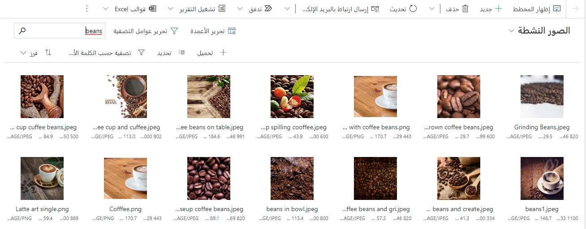
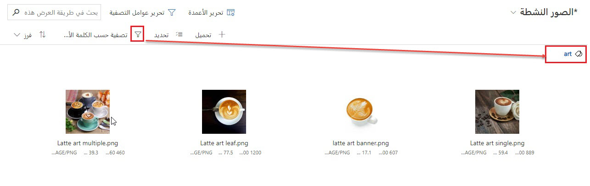

تتيح لك مكتبة الأصول المركزية في الوقت الفعلي تحميل الصور ومقاطع الفيديو والمستندات. يتم وضع علامة على الصور تلقائياً باستخدام الذكاء الاصطناعي. عند تأليف محتوى البريد الإلكتروني، يُمكنك استخدام الاقتراحات القائمة على الذكاء الاصطناعي لمكتبة الأصول للعثور على الصور التي تكمل محتوى البريد الإلكتروني على نحوٍ أفضل.

> [!NOTE]
> تدعم مكتبة الأصول الصور (مثل ملفات JPEG وGIF وPNG) ومقاطع الفيديو (مثل ملفات MP4 وAVI وMPEG) والمستندات (مثل مستندات Word وملفات PowerPoint وملفات Adobe PDFs). تعرف على المزيد حول أنواع الملفات المدعومة: [قم بتحميل ملفات بخلاف الصور ومقاطع الفيديو](/dynamics365/commerce/dam-upload-files/?azure-portal=true).

> [!TIP]
> يتم توفير استخدام مكتبة الأصول مع ترخيص Dynamics 365 Marketing الخاص بك بدون رسوم إضافية باستثناء المناطق التالية: البرازيل والهند والإمارات العربية المتحدة. سيتم تخزين الصور والملفات التي تم تحميلها في هذه المناطق في موقع تخزين Microsoft Dataverse الخاصة بالمستخدم وسيتم احتسابها من موقع تخزين الملفات الخاصة بهم. لمزيد من المعلومات حول سعة تخزين Dataverse، راجع [سعة تخزين Microsoft Dataverse الجديدة](/power-platform/admin/capacity-storage/?azure-portal=true).

إذا كنت في البرازيل أو الهند أو الإمارات العربية المتحدة، لمزيد من المعلومات، راجع [تحميل الصور والملفات واستخدامها في المحتوى عبر الإنترنت](/dynamics365/marketing/upload-images-files/?azure-portal=true).

للوصول إلى مكتبة أصول التسويق في الوقت الحقيقي، انتقل إلى 
**التسويق في الوقت الحقيقي > الأصول > المكتبة**.

يمكنك **تحميل** ملف واحد أو تحميل عدة ملفات مجمعة أو حتى تحميل مجلد كامل.

> [!div class="mx-imgBorder"]
> 

يمكنك استخدام **العلامات** لتنظيم الأصول. يتم تحليل جميع الصور المُحملة إلى المكتبة ووصفها تلقائياً بواسطة الذكاء الاصطناعي (باستخدام علامات الذكاء الاصطناعي). عند تحميل صورتك (صورك)، يمكنك أيضاً إضافة العلامات يدوياً.

> [!div class="mx-imgBorder"]
> 

داخل مكتبه الأصول في الوقت الفعلي، يمكنك استخدام شريط **البحث** للبحث عن اسم الأصل. يمكنك أيضاً استخدام خيار **التصفية** للبحث حسب التاريخ والعلامات المعدلة.

> [!div class="mx-imgBorder"]
> 

> [!div class="mx-imgBorder"]
> 

يمكنك **استبدال** أصولك بإصدارات أحدث كلما دعت الحاجة.

1. تحديد الصورة.

1. حدد **استبدال العناصر الثنائية** في شريط الأوامر.

1. حدد صورة جديدة.

1. سيظهر إصدار جديد من الأصل في مكتبة الأصول. سيظهر الإصدار الجديد أيضاً أينما يتم استخدام الأصل حالياً.

1. إذا فتحت الأصل، يمكنك رؤية رقم الإصدار، لكن لا يمكنك عرض الإصدارات السابقة.

> [!div class="mx-imgBorder"]
> 

يمكنك **تحويل الأصول** من التسويق الصادر إلى مكتبة أصول التسويق في الوقت الحقيقي في بضع خطوات فقط. لنقل الأصول:

1. انتقل إلى **التسويق الصادر** ثم انتقل إلى **‏‫محتوى التسويق‬** > **الصور**.

1. اختر الأصل (الأصول) الذي ترغب في نسخها عن طريق تحديد علامة الاختيار باللون الأزرق في الجزء العلوي الأيمن من الأصل.

1. لنسخ الأصول إلى مكتبة أصول التسويق في الوقت الحقيقي، حدد زر 
**نسخ إلى التسويق في الوقت الحقيقي** في الشريط العلوي.

1. ستظهر نافذة مشروطة وتسألك عما إذا كنت ترغب في نسخ الأصول المحددة إلى التسويق في الوقت الحقيقي. حدد **نسخ الملفات**. سيظهر شريط الحالة في أعلى النافذة تقدم النسخ.

1. وبدلاً من ذلك، إذا كنت ترغب في نسخ *كافة* الأصول من التسويق الصادر إلى مكتبه الأصول، فلا تقم بتحديد أي أصول فردية. سيظهر على الزر الموجود في الشريط العلوي عن طريق النطق **انسخ جميع الملفات إلى التسويق في الوقت الحقيقي**. لنسخ كافة الأصول، حدد الزر واختر **نسخ الملفات** على النافذة المشروطة.

لمزيد من المعلومات، راجع [مكتبة أصول التسويق في الوقت الحقيقي](/dynamics365/marketing/real-time-marketing-asset-library/?azure-portal=true).
