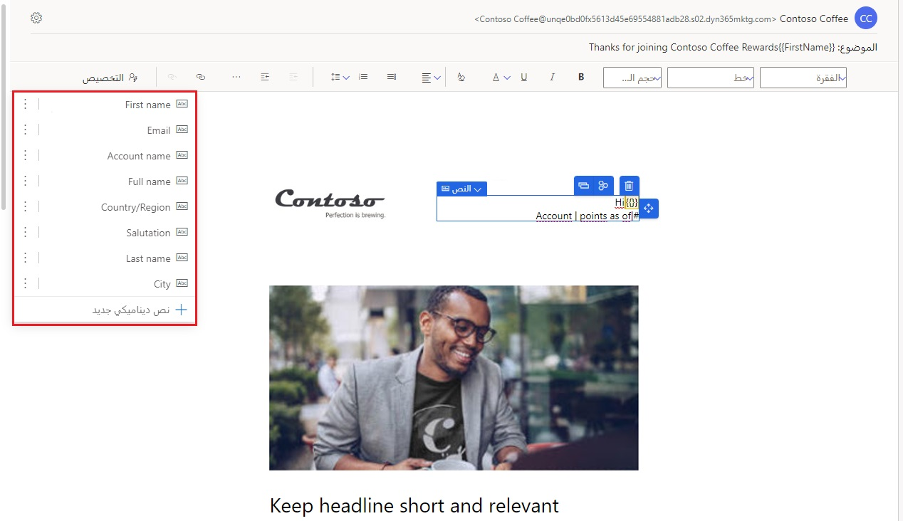
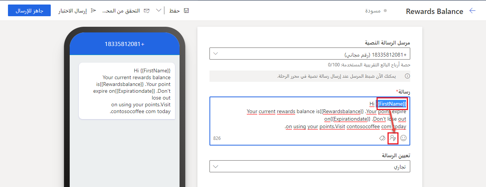
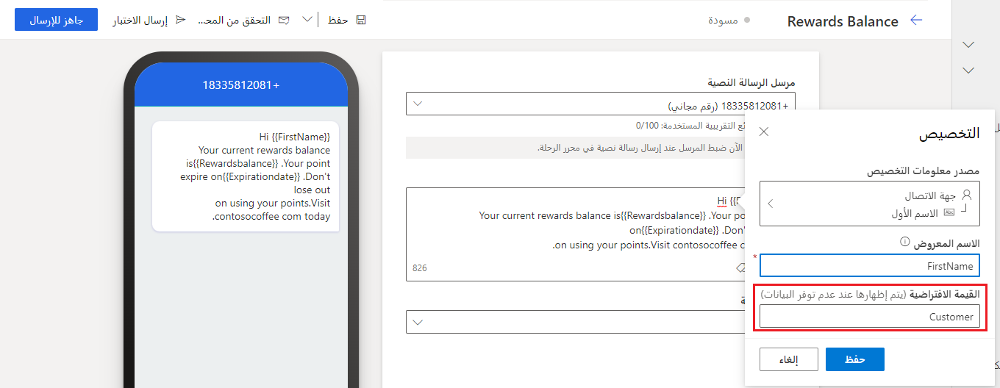
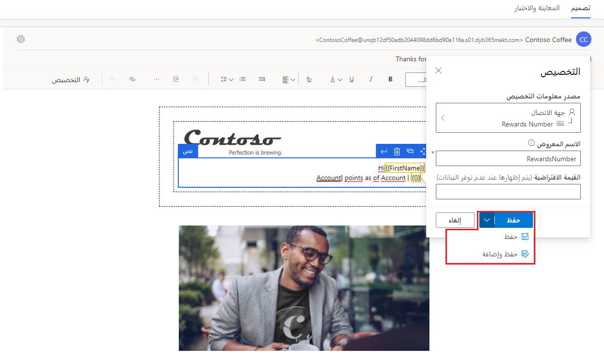
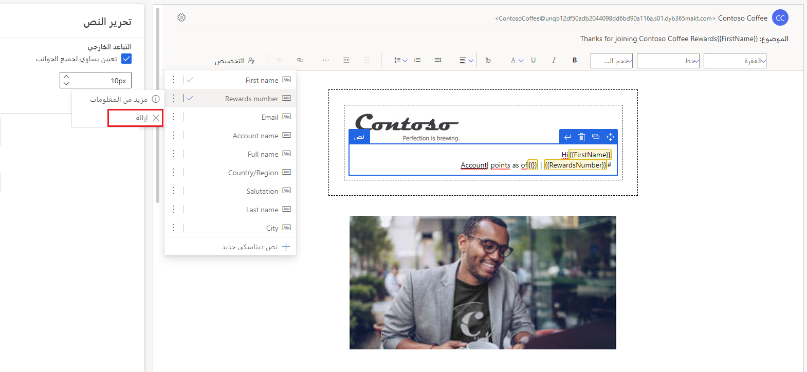

تساعد الرسائل المخصصة المسوقين على زيادة التفاعل. تتمثل إحدى الطرق الشائعة لتخصيص المحتوى في استخدام نص ديناميكي (يعرف أيضاً باسم نص العنصر النائب) يتم استبداله تلقائياً بالتفاصيل الشخصية للمستلمين عند إرسال الرسالة. على سبيل المثال، بدلاً من استخدام تحية عامة مثل "عزيزي العميل"، يمكنك استخدام نص ديناميكي ("عزيزي `{{FirstName}}`) الذي يتم استبداله باسم العميل ("عزيزي جون") عند إرسال الرسالة.

يسمى مثيل نص العنصر النائب مثل `{{Firstname}}` النص الديناميكي المحدد مسبقاً. قبل أن تتمكن من استخدام النص الديناميكي، تحتاج إلى تحديد ثلاثة أجزاء من المعلومات:

1. **ربط البيانات**: من أين ستأتي البيانات البديلة للنص الديناميكي (على سبيل المثال، السمة "الاسم الأول" لجدول "جهة الاتصال").

1. **التسمية**: كيفية الإشارة إلى النص الديناميكي داخل نص الرسالة (على سبيل المثال، {{Firstname}}).

1. **القيمة الافتراضية**: ما النص المطلوب استخدامه إذا كانت بيانات المصدر فارغة.

يتطلب تحديد ربط البيانات بعض الفهم لـ [Dataverse نموذج البيانات](/powerapps/maker/data-platform/data-platform-intro/?azure-portal=true) لتوصيل النص الديناميكي بشكل صحيح بمصدر البيانات الصحيح.

النص الديناميكي المحدد مسبقاً هو نص تم تحديده بالفعل بواسطة شخص آخر وهو جاهز للاستخدام. يأتي التسويق مع مجموعة من القطع شائعة الاستخدام من النص الديناميكي المحدد مسبقاً. يمكن إضافة المزيد من قبلك أو من قبل زملائك في الفريق.

## استخدام نص ديناميكي محدد مسبقاً

حدد **تخصيص** في بريد إلكتروني أو رسالة نصية أو محرر إعلامات دفع لعرض قائمة بأجزاء النص الديناميكي المحددة مسبقاً. بعد ذلك، حدد بعض النصوص الديناميكية المحددة مسبقاً من القائمة لإدراجه في الرسالة:

أثناء قيام المسؤول والمستخدمين الآخرين بإنشاء نص ديناميكي محدد مسبقاً ومشاركته، ستتم إضافة الأجزاء إلى القائمة. يتم فرز أفضل 10 عناصر في القائمة حسب الاستخدام على مستوى المؤسسة. إذا كان هناك أكثر من 10 عناصر في القائمة، فسترى العناصر المتبقية مرتبة حسب الترتيب الأبجدي بعد العناصر العشرة الأولى.

يمكنك التمرير فوق النص الديناميكي في القائمة المحددة مسبقاً للاطلاع على تفاصيله. بدلاً من ذلك، يمكنك تحديد علامات الحذف العمودية بجوار اسم النص الديناميكي ثم تحديد **مزيد من المعلومات**.

> [!div class="mx-imgBorder"]
> 

لمزيد من المعلومات، راجع [استخدام نص ديناميكي محدد مسبقاً](/dynamics365/marketing/real-time-marketing-predefined-dynamic-text?azure-portal=true#using-pre-defined-dynamic-text).

### تغيير القيمة الافتراضية لرسالة حالية

في معظم الأحيان، يجب أن تكون قادراً على استخدام نص ديناميكي محدد مسبقاً كما هو، ولكن في بعض الأحيان قد تحتاج إلى تغيير قيمة افتراضية. على سبيل المثال، قد لا تعمل القيمة الافتراضية "العميل" إذا كان بريدك الإلكتروني لغير العملاء. في هذه الحالة، يمكنك تغيير القيمة الافتراضية عن طريق تحديد النص الديناميكي المحدد مسبقاً في لوحة المحرر ثم تحديد الزر **تخصيص** . أدخل قيمة افتراضية جديدة، ثم حدد **حفظ**. سيؤدي ذلك إلى حفظ إصدار محدث من النص الديناميكي المحدد مسبقاً، *ولكن فقط للرسالة الحالية*.

> [!div class="mx-imgBorder"]
> 

> [!div class="mx-imgBorder"]
> 

لمزيد من المعلومات، راجع [تغيير القيمة الافتراضية للرسالة الحالية](/dynamics365/marketing/real-time-marketing-predefined-dynamic-text?azure-portal=true#changing-the-default-value-for-the-current-message).

### تغيير القيمة الافتراضية عالمياً

إذا كانت القيمة الافتراضية المقدمة غير مناسبة لموقفك (على سبيل المثال، يمكنك الإشارة إلى عملائك باسم "عملاء" أو "ضيوف" بدلاً من "عميل")، يمكنك تغيير القيمة الافتراضية للجميع. لتغيير القيمة الافتراضية العمومية، حدد علامات الحذف العمودية الموجودة بجوار اسم النص الديناميكي المحدد مسبقاً، ثم حدد 
**تحديث النص الديناميكي المحدد مسبقاً**. سيؤدي ذلك إلى تحديث النص الديناميكي المحدد مسبقاً للرسالة الحالية وبشكل عام للاستخدام المستقبلي للنص الديناميكي في الرسائل الجديدة (لا تتأثر الرسائل الموجودة).

> [!IMPORTANT]
> ينطبق الأمر **تحديث النص الديناميكي المعرف مسبقاً** فقط على الرسالة الحالية والرسائل المستقبلية. لا يغير بأثر رجعي الاستخدامات السابقة للنص الديناميكي.

لمزيد من المعلومات، راجع [تغيير القيمة الافتراضية عالمياً](/dynamics365/marketing/real-time-marketing-predefined-dynamic-text?azure-portal=true#changing-the-default-value-globally).

## إنشاء نص ديناميكي محدد مسبقاً ومشاركته

لا تقتصر على النص الديناميكي المحدد مسبقاً والمضمن في تطبيق Marketing. يمكن لأي مستخدم إنشاء أجزاء نص ديناميكية جديدة محددة مسبقاً ومشاركتها مع فريقه عن طريق إضافتها إلى قائمة النصوص الديناميكية المحددة مسبقاً.

لتعريف ومشاركة نص ديناميكي جديد محدد مسبقاً، اتبع الخطوات التالية:

1. افتح أي بريد إلكتروني تسويقي أو رسالة نصية أو إشعار دفع.

1. ضع المؤشر في أي مربع نص، ثم حدد **تخصيص**. يؤدي ذلك إلى فتح قائمة التخصيص المحددة مسبقاً.

1. حدد **نص ديناميكي جديد** في أسفل قائمة النص الديناميكي المحدد مسبقا وأكمل الخطوات لتحديد النص الديناميكي الجديد.

1. حدد القيراط المواجه لأسفل بجوار زر **حفظ** واختر الخيار **حفظ وإضافة**.

1. في النافذة المشروطة، أدخل **اسم مألوف** للرمز المميز.

1. حدد **إضافة إلى محدد مسبقاً**.

> [!div class="mx-imgBorder"]
> 

لمزيد من المعلومات، راجع [إنشاء نص ديناميكي محدد مسبقاً ومشاركته](/dynamics365/marketing/real-time-marketing-predefined-dynamic-text?azure-portal=true#creating-and-sharing-pre-defined-dynamic-text)

## إزالة نص ديناميكي محدد مسبقاً

لإزالة نص ديناميكي محدد مسبقاً:

1. افتح أي بريد إلكتروني تسويقي أو رسالة نصية أو إشعار دفع.

1. ضع المؤشر في أي مربع ثم حدد **تخصيص**.

1. حدد علامات الحذف العمودية بجوار اسم النص الديناميكي.

1. حدد **إزالة** من القائمة.

1. في النافذة المشروطة، حدد **إزالة**.

1. تؤدي إزالة النص الديناميكي إلى إزالته فقط من القائمة المحددة مسبقاً، ولا يؤدي إلى إزالته من الرسائل التي تستخدمه بالفعل.

> [!NOTE]
> تحتوي ميزة النص الديناميكي المحددة مسبقاً على بعض المشكلات المعروفة. لمعرفة المزيد، راجع [المشكلات المعروفة في التسويق في الوقت الفعلي](/dynamics365/marketing/real-time-marketing-known-issues#personalization).

> [!div class="mx-imgBorder"]
> 

لمزيد من المعلومات، راجع [إزالة النص الديناميكي المحدد مسبقاً](/dynamics365/marketing/real-time-marketing-predefined-dynamic-text?azure-portal=true#removing-pre-defined-dynamic-text).
