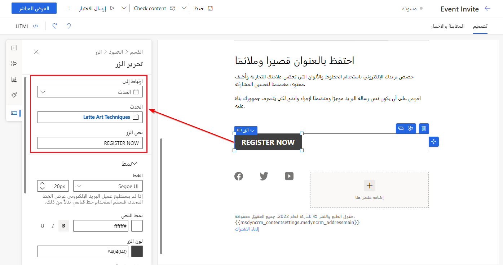
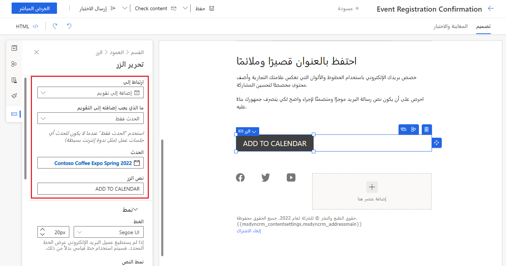
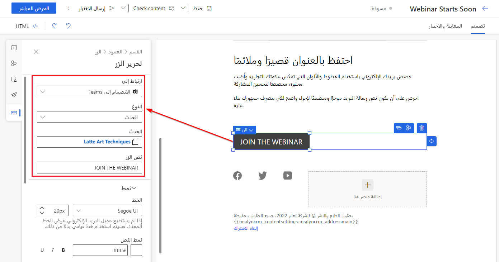

يوفر Dynamics 365 العديد من الأدوات لمساعدتك في الترويج لأحداثك، وتشمل ما يلي:

-   **رسائل الرسالة الإلكترونية التسويقي** - يمكنك إنشاء أي عدد تريده من رسائل الرسالة الإلكترونية التسويقي للحدث. لمزيد من المعلومات، راجع [نظرة عامة على التسويق عبر البريد الإلكتروني](/dynamics365/marketing/prepare-marketing-emails?azure-portal=true) and [Event elements](/dynamics365/marketing/content-blocks-reference?azure-portal=true#event-registration-qr-code-elements).

-   **الشرائح** - أنشئ شريحة للعثور على جهات الاتصال المناسبة لدعوتها إلى الحدث. يمكنك إنشاء شرائح إضافية لإرسال مراسلات موجهة إلى جهات الاتصال التي قامت بالتسجيل للحدث و/أو حضوره. لمزيد من المعلومات، راجع [استخدام الشرائح](/dynamics365/marketing/segmentation-lists-subscriptions?azure-portal=true).

-   **رحلات العميل** - إعداد رحلات العميل التي ترسل رسائل الرسالة الإلكترونية التسويقي إلى جميع جهات الاتصال ذات الصلة، وتسجل تفاعلات الرسائل، وتتفاعل مع تسجيلات الأحداث. لمزيد من المعلومات، راجع [‏‫استخدام رحلات العميل لإنشاء حملات تلقائية](/dynamics365/marketing/customer-journeys-create-automated-campaigns?azure-portal=true).

-   **منشورات وسائل التواصل الاجتماعي** - يمكنك إنشاء منشورات على وسائل التواصل الاجتماعي للترويج لحدثك وتضمين ارتباط إلى موقعك على الويب للأحداث في كل منشور. يمكن للأشخاص استخدام ميزة **عناوين URL لإعادة التوجيه** في Dynamics 365 Marketing لإنشاء عناوين URL قصيرة تسجّل النقرات باستخدام  Dynamics 365 Marketing وتُعيد توجيه جهات الاتصال إلى موقعك على الويب للأحداث على الفور. لمزيد من المعلومات، راجع [جدولة الرسائل ونشرها على مواقع التواصل الاجتماعي](/dynamics365/marketing/social-posting/?azure-portal=true).

-   **عناوين URL لإعادة التوجيه‬** - ‏‫يمكنك إنشاء عنوان URL مختلف لإعادة التوجيه لكل موقع من مواقع التواصل الاجتماعي أو شعار أو رسالة. تُتيح لك هذه الميزة جمع نتائج النقرات المنفصلة لكل عنوان URL حتى تتمكّن من تقييم نجاح كل قناة أو مبادرة.‬ لمزيد من المعلومات، راجع [إعداد عناوين URL لإعادة التوجيه‬](/dynamics365/marketing/register-engagement?azure-portal=true#set-up-redirect-urls).

لمزيد من المعلومات، راجع [دعوة جهات اتصال إلى أحداثك‬](/dynamics365/marketing/invite-register-house-event-attendees?azure-portal=true#invite-contacts-to-your-events).

يمكنك أتمتة مراسلات الأحداث لديك باستخدام الأدوات الموجودة في Dynamics 365. ابدأ بتحديد المراسلات المطلوبة ووتيرتها (أسبوعان قبل الحدث، يوم الحدث، اليوم التالي للحدث، وما إلى ذلك) والجمهور الذي سيتلقاها. بعد توثيق سير العمل، يمكنك البدء في إنشاء المحتوى في Dynamics 365 Marketing. 

تعرض بقية هذه الوحدة إرشادات حول إنشاء محتوى حدث مثل:

- الرسالة الإلكترونية لدعوة حدث
- الرسالة الإلكترونية للتأكيد بعد تسجيل جهة اتصال في الحدث
- رسائل الرسالة الإلكترونية للتذكير قبل تاريخ بدء الحدث
- شرائح الحدث
- رحلات العميل للحدث
- مراسلات بعد الحدث

## إنشاء بريد إلكتروني للدعوة 

تعتبر الدعوة أول مراسلة في رحلة العميل للحدث عادةً، سواء كنت تستضيف حدثاً في الموقع أو ندوة عبر الإنترنت. يُتيح لك Dynamics 365 Marketing الارتباط بصفحة تسجيل الحدث من خلال بريدك الإلكتروني، ومن ثمّ يتم توجيه جهات الاتصال إلى الصفحة مباشرةً لمعرفة المزيد حول الحدث والتسجيل فيه.

يحتوي مصمم الرسالة الإلكترونية في Dynamics 365 Marketing على منطقة اتصال **الأحداث** في **مربع الأدوات** التي تساعدك في إنشاء رسائل بريد إلكتروني ذات صلة بالأحداث. عند إنشاء دعوة الحدث، يتضمن Dynamics 365 عنصراً يرتبط مباشرةً بموقع ويب الحدث. 

أكمل هذه الخطوات لإضافة ارتباط إلى موقع ويب الحدث الخاص بك في بريدك الإلكتروني:

1.  فتح سجل الرسالة الإلكترونية.

1.  اسحب عنصر **الزر** إلى لوحة **المصمم** في بريدك الإلكتروني.

1.  في القائمة المنسدلة **الارتباط إلى**، حدد **حدث**.

1.  في القائمة المنسدلة **حدث**، حدد حدثك.

1.  في نص **الزر**، أضف نصك.

عند إرسال بريدك الإلكتروني، سيتم نشر عنوان URL لموقعك على الويب بشكل ديناميكي، وبالتالي فعندما يحدد الحضور الزر، ستتم إعادة توجيههم إلى موقعك للتسجيل.

> [!div class="mx-imgBorder"]
> 

لمزيد من المعلومات، راجع [تصميم المحتوى الرقمي](/dynamics365/marketing/design-digital-content?azure-portal=true) و[عناصر صفحة التسويق والحدث والاستطلاع](/dynamics365/marketing/content-blocks-reference?azure-portal=true#marketing-page-event-and-survey-elements).

## إنشاء بريد إلكتروني للتأكيد لجهات الاتصال التي تسجل في الحدث 

عندما يسجل الحاضرون لحدث ما، فإنهم يريدون طريقة لتتبع ليس فقط تاريخ الحدث، ولكن الجلسات التي يخططون لحضورها. يتضمن محرر الرسالة الإلكترونية في Dynamics 365 Marketing القدرة على إنشاء ملفات iCalendar مخصصة تلقائياً لتتبع الأحداث والجلسات. باستخدام محرر الرسالة الإلكترونية، يمكنك إضافة زر ملف iCalendar المخصص لجهة اتصال الرسالة الإلكترونية. عندما تحدد جهة الاتصال الزر، يتم تنزيل ملف iCalendar، مما يسمح لجهة الاتصال بإضافته إلى التقويم الذي يختاره.

أكمل هذه الخطوات لإضافة ارتباط تقويم في بريدك الإلكتروني:

1.  فتح سجل الرسالة الإلكترونية.

1.  اسحب عنصر **الزر** إلى لوحة **المصمم** في بريدك الإلكتروني.

1.  في القائمة المنسدلة **الارتباط إلى**، حدد **إضافة إلى التقويم**.

1.  في حقل **ما الذي يجب إضافته إلى التقويم**، حدد المعلومات التي تريد تضمينها في ملف iCalendar باستخدام القائمة المنسدلة **ما الذي يجب إضافته إلى التقويم**. تتضمن الخيارات:

    -   **الحدث فقط**: سيحتوي ملف iCalendar فقط على الحدث الذي تم تسجيل جهة الاتصال له.

    -   **جلسات العمل فقط**: سيحتوي الملف فقط على جلسات عمل الأحداث، التي تم تسجيل جهة الاتصال لها.

    -   **كل من الحدث وجلسات العمل المرتبطة به**: سيحتوي الملف على معلومات عن الحدث والجلسات التي سجلت جهة الاتصال لها.

1.  في القائمة المنسدلة **حدث**، حدد حدثك.

1.  في نص **الزر**، أضف نصك.

> [!div class="mx-imgBorder"]
> 

### إنشاء بريد إلكتروني للتذكير لجهات الاتصال التي تسجل في الحدث

بعد تسجيل الحضور في الحدث، يجب أن ترسل إليهم بريداً إلكترونياً لتأكيد التسجيل وتقديم تفاصيل إضافية حول الحدث. يحتوي Dynamics 365 Marketing على عناصر تصميم، ومنها رموز الاستجابة السريعة (QR)‬ وارتباطات ندوات الإنترنت، لمساعدتك في إنشاء هذه الرسائل.

### إضافة رمز الاستجابة السريعة إلى الرسالة الإلكترونية للتذكير بالحدث في الموقع

كلما تقوم جهة اتصال بالتسجيل لحضور حدث، ينشئ النظام سجلاً جديداً لتسجيل الحدث يحدد جهة الاتصال والحدث وتفاصيل أخرى. ويتضمن هذا السجل أيضاً معرّف تسجيل يتم تخزينه كرمز أبجدي رقمي وكرمز QR يمكن قراءته آلياً.

كما أن تضمين رموز الاستجابة السريعة (QR) في بريد إلكتروني للتأكيد و/أو للتذكير باليوم يساعد في تسهيل تسجيل الدخول على المسجلين باستخدام أجهزتهم المحمولة في الحدث. 

أكمل هذه الخطوات لإضافة شفرة الاستجابة السريعة في بريدك الإلكتروني:

1.  فتح سجل الرسالة الإلكترونية.

1.  اسحب عنصر **شفرة الاستجابة السريعة** إلى لوحة **المصمم** في بريدك الإلكتروني. 

1.  في القائمة المنسدلة **حدث**، حدد حدثك.

ولا توجد إعدادات أخرى مطلوبة.

في يوم الحدث، يمكن للعاملين في الحدث مسح الرمز ضوئياً بسرعة باستخدام تطبيق الهاتف الذكي في Dynamics 365. 

> [!div class="mx-imgBorder"]
> 

لمزيد من المعلومات، راجع [عناصر رمز الاستجابة السريعة لتسجيل الحدث](/dynamics365/marketing/content-blocks-reference?azure-portal=true#event-registration-qr-code-elements).

### إضافة ارتباط عنوان URL الخاص بالحضور إلى الرسالة الإلكترونية للتذكير بندوة الإنترنت

بالنسبة إلى أحداث ندوات الإنترنت، ينبغي أن ترسل إلى الحضور بريداً إلكترونياً للتأكيد يتضمن ارتباط عنوان URL الخاص بهم حتى يمكنهم الانضمام إلى ندوة الإنترنت.
ويرسل بعض موفري ندوات الإنترنت هذا الرسالة الإلكترونية للتأكيد إليك، بينما قد يطلب آخرون أن ترسل الارتباطات (أو قد تفضل أنت إرسال الارتباطات بنفسك). إذا حددت إنشاء بريد إلكتروني لتأكيد الحدث باستخدام Dynamics 365 Marketing، فسوف يتاح لك عدة خيارات تساعدك في تضمين عنوان URL لندوة الإنترنت في بريدك الإلكتروني. 

أما إذا كنت تستضيف ندوة إنترنت باستخدام موفر آخر لندوات الإنترنت، فسوف تعتمد طريقة إضافتك لعنوان URL الفريد للحضور في بريدك الإلكتروني على التكامل.

إذا كنت تستضيف ندوة الإنترنت من خلال Microsoft Teams، فإن مصمم الرسالة الإلكترونية يُتيح لك إضافة عنصر **تسجيل الدخول إلى Teams** إلى بريدك الإلكتروني.
ويُنشئ هذا العنصر عنوان URL فريد لكل مسجل.
عندما يحدد المسجل الزر في غضون 30 دقيقة من وقت بدء الحدث، سيُنشئ Dynamics 365 Marketing سجل تسجيل الدخول الملائم له. أما إذا حدد المسجل الزر على أكثر من 30 دقيقة قبل وقت بدء الحدث، فلن يتم إنشاء سجل تسجيل الدخول.

أكمل هذه الخطوات لإضافة ارتباط الانضمام إلى Teams في بريدك الإلكتروني:

1.  فتح سجل الرسالة الإلكترونية.

1.  اسحب عنصر **الزر** إلى لوحة **المصمم** في بريدك الإلكتروني.

1.  في القائمة المنسدلة **الارتباط إلى**، حدد **إضافة إلى التقويم**.

1.  في حقل **ما الذي يجب إضافته إلى التقويم**، حدد المعلومات التي تريد تضمينها في ملف iCalendar باستخدام القائمة المنسدلة **ما الذي يجب إضافته إلى التقويم**. تتضمن الخيارات:

    -   **الحدث فقط**: سيحتوي ملف iCalendar فقط على الحدث الذي تم تسجيل جهة الاتصال له.

    -   **جلسات العمل فقط**: سيحتوي الملف فقط على جلسات عمل الأحداث، التي تم تسجيل جهة الاتصال لها.

    -   **كل من الحدث وجلسات العمل المرتبطة به**: سيحتوي الملف على معلومات عن الحدث والجلسات التي سجلت جهة الاتصال لها.

1.  في القائمة المنسدلة **حدث**، حدد حدثك.   

1.  في نص **الزر**، أضف نصك.

> [!div class="mx-imgBorder"]
> 

> [!IMPORTANT]
> يستخدم الزر **الانضمام إلى Teams** عنوان URL فريداً لكل مسجل. تؤدي إعادة توجيه بريد إلكتروني باستخدام الزر **الانضمام إلى Teams** إلى الاحتفاظ بعنوان URL الخاص بالمستلم الأصلي. لن يُنشئ الرسالة الإلكترونية المُعاد توجيهه تسجيل وصول جديداً للدعوة المُعاد توجيهها.

> [!TIP]
> أما إذا حدد أحد الحضور الزر **الانضمام إلى Teams** على أكثر من 30 دقيقة قبل وقت بدء الحدث، فلن يتم إنشاء سجل تسجيل الدخول. هذه ميزة مشفرة بشكل ثابت لمنع عمليات تسجيل الوصول غير المقصودة عندما يختبر المستلم الارتباط بعد تلقي الرسالة الإلكترونية.

لمزيد من المعلومات، راجع [دعوة المسجلين لحضور الحدث المباشر عبر الرسالة الإلكترونية](/dynamics365/marketing/teams-webinar#inviting-registrants-to-attend-the-teams-event-through-email).

## إعداد شرائح للحدث 

بعد إنشائك رسائل الرسالة الإلكترونية التسويقي للحدث، سوف يلزمك تحديد الجمهور الذي تريد التواصل معه طوال فترة الحدث. وقد تحتاج إلى شريحة واحدة أو عدة شرائح وفقاً لسير عمل الحدث.

سيُمثّل الجمهور الذي تريد دعوته إلى الحدث الشريحة الأولى في رحلتك، والتي قد تكون ‏‫شريحةً ديناميكيةً تستخدم بيانات الأحداث الديموغرافية أو السابقة لتحديد جهات الاتصال من قاعدة بياناتك، أو شريحةً ثابتةً تضم قائمة محددة من المدعوين. 

إذا كان لديك العديد من مخططات تدفق العمليات في رحلة واحدة أو تعتزم إنشاء رحلات متعددة للحدث، فقد ينبغي عليك إنشاء شرائح إضافية. يمكن استخدام هذه الشرائح لتحديد جهات الاتصال استناداً إلى الإجراءات التي تتخذها بشأن حدثك مثل التسجيل أو تسجيلات الدخول. يوفر Dynamics 365 قوالب شرائح جاهزة تساعدك في إنشاء هذه الشرائح، مثل **حضرت حدثاً** or **سجلت لحدث‬**.

لمزيد من المعلومات، راجع [استخدام الشرائح](/dynamics365/marketing/segmentation-lists-subscriptions?azure-portal=true).

## إعداد رحلات العميل لتنفيذ الحدث 

بعد إنشاء ونشر رسائل الرسالة الإلكترونية التسويقي والشرائح المطلوبة للحدث، تكون مستعداً لإنشاء رحلة (رحلات) العميل التي ستستخدمها لأتمتة سير عمل الحدث. 

يوفر تطبيق Marketing قالب **رحلة عميل لتسويق الحدث** لمساعدتك على الشروع في العمل. ويشمل هذا القالب مجموعة من الإطارات المتجانبة للبريد الإلكتروني غير المكوّنة والفروع **إذا/بعد ذلك** والإطارات المتجانبة **انتظار**. من هذا القالب، يمكنك إضافة المحتوى وتخصيص سير العمل لاستيعاب رسائل الرسالة الإلكترونية التي تعتزم إرسالها وتوقيتها. 

> [!div class="mx-imgBorder"]
> 

> [!TIP]
> إذا كنت تريد استخدام تسجيل الحدث كمشغّل لإرسال جمهورك عبر مسارات مختلفة في رحلة العميل لديك، فسوف ينبغي عليك إضافة حدثك كتبعية في بريدك الإلكتروني التسويقي. 

> [!div class="mx-imgBorder"]
> 

لمزيد من المعلومات، راجع [‏‫استخدام رحلات العميل لإنشاء حملات تلقائية](/dynamics365/marketing/customer-journeys-create-automated-campaigns?azure-portal=true).

## متابعة الحضور بعد الحدث 

قد تحتاج إلى متابعة الحضور لتقييم مدى نجاح حدثك بعد انتهائه. ومن ثمّ، يعد إرسال استطلاع إلى الحضور من الطرق المستخدمة لجمع تعليقاتهم.

يتضمّن Dynamics 365 Marketing دعماً مدمجاً لإضافة الاستطلاعات إلى حملاتك التسويقية. يمكنك إنشاء استطلاعات باستخدام Microsoft Dynamics 365 Customer Voice والوصول إليها مباشرةً من مكونات Marketing، ومنها منشئ الشرائح ومصمم الرسالة الإلكترونية وتصميم رحلة العميل. يمكنك استخدام الاستطلاعات لاتخاذ قرارات تستند إلى البيانات وتطبيق النتائج على مبادراتك التسويقية. ويمكنك أيضاً أتمتة تجارب الاستطلاعات واستخدام البيانات التي تم إنشاؤها من خلالها لعملية تقسيم العملاء إلى شرائح المتقدمة وجمع معلوماتهم.

> [!IMPORTANT]
> ستتطلّب من المسؤول لديك تشغيل الميزة لوظيفة **تكامل Dynamics 365 Customer Voice Marketing** قبل أن تتمكّن من الوصول إليها.

لجمع تعليقات حول الحدث باستخدام الاستطلاع، اتبع الخطوات التالية:

1.  إنشاء الاستطلاع. لمزيد من المعلومات، راجع [إنشاء استطلاع](/dynamics365/customer-voice/create-survey?azure-portal=true).

1.  إنشاء الرسالة الإلكترونية التسويقي. إضافة عنصر **استطلاع Customer Voice** إلى الرسالة الإلكترونية، ثم تحديد الاستطلاع. لمزيد من المعلومات، راجع [ارتباطات استطلاع Dynamics 365 Customer Voice في رسائل الرسالة الإلكترونية](/dynamics365/marketing/customer-voice?azure-portal=true#dynamics-365-customer-voice-survey-links-in-email-messages). 

1.  إنشاء الشريحة. ستحتاج إلى تضمين جهات الاتصال التي قامت بتسجيل الدخول إلى الحدث. يحتوي Dynamics 365 Marketing على قالبين للشرائح لمساعدتك في هذه الخطوة: وهما **‏‫حضرت حدثاً** و **حضرت جلسة عمل**. لمزيد من المعلومات، راجع [إنشاء شريحة جديدة والعرض المباشر لها ](/dynamics365/marketing/segmentation-lists-subscriptions?azure-portal=true#create-and-go-live-with-a-new-segment).

1.  إنشاء رحلة العميل. يمكنك جعل هذه الرحلة جزءاً من رحلة العميل الرئيسية للحدث أو يمكنك إنشاء رحلة منفصلة لمراسلاتك بعد الحدث. لمزيد من المعلومات، راجع [أتمتة Dynamics 365 Customer Voice في رحلات العميل](/dynamics365/marketing/customer-voice?azure-portal=true#dynamics-365-customer-voice-automation-in-customer-journeys).

> [!TIP]
> تذكّر أنه عندما تكون الرحلة مباشرة، لن تتمكّن من تحريرها أو إضافة إطارات متجانبة إليها. ومن ثمّ، يجب إنشاء كل ما تريد تضمينه في الرحلة وإجراء العرض المباشر له قبل إرسال أول مراسلة خاصة بالحدث. وإذا كنت تحتاج مزيداً من الوقت لإنشاء أصول الحدث، فيمكنك إنشاء رحلة عميل منفصلة لمراسلاتك بعد الحدث.
