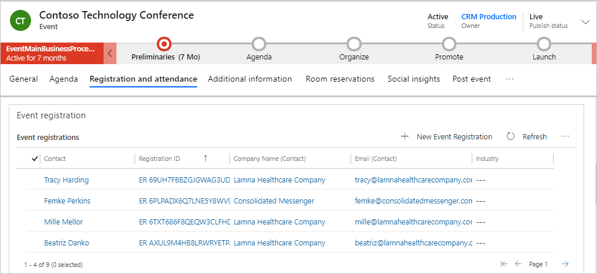
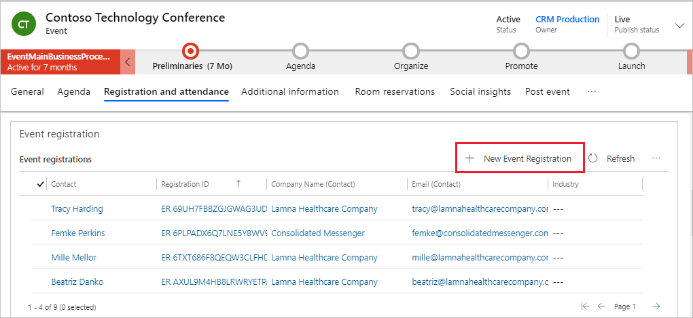
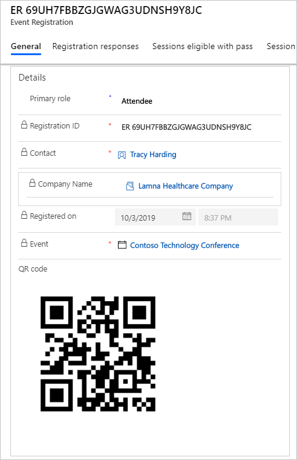

يستطيع مديرو الأحداث استخدام سجلات التسجيل لتقييم عدد الموارد التي سيحتاجون لتوفيرها مسبقًا، التي هي جلسات عمل تتطلب غرفًا أكبر أو حتى ما إذا كان يجب إلغاء جلسة العمل.
كما يساعد التسجيل المسبق الحضور من الوثوق في أن مكانهم محجوز لجميع جلسات العمل التي يرغبون في حضورها.

## عرض تسجيلات الحدث

لعرض تسجيلات جميع الأحداث، افتح منطقه عمل **الأحداث** وانتقل إلى **الحدث > تسجيلات الحدث**.

لعرض التسجيلات الحالية لحدث محدد، انتقل إلى **الحدث > الأحداث**، وافتح سجل الحدث، ثم انتقل إلى علامة تبويب **التسجيل والحضور**.

لمزيد من المعلومات، راجع [‏‫تسجيل الحضور للأحداث وجلسات العمل والبطاقات‬](/dynamics365/marketing/invite-register-house-event-attendees?azure-portal=true#invite-contacts-to-your-events).

## إضافة التسجيلات يدويًا

يُمكن لمستخدمي Dynamics 365 Marketing تسجيل الحضور يدويًا بإنشاء تسجيلات الأحداث وتسجيلات الجلسة وتعيينات البطاقات مباشرة في التطبيق. تُتيح لك هذه الميزة توفير خيارات مثل التسجيل عبر الهاتف.

لإضافة التسجيلات يدويًا، افتح حدث وانتقل إلى علامة تبويب **التسجيل والحضور** . حدد **+ تسجيل حدث جديد**.
حدد **الدور الرئيسي** و **جهة الاتصال**، ثم حدد **حفظ وإغلاق**.

ينتج عن كل تسجيل سجل تسجيل حدث. حيثُ يجمع ملفات المسجلين وبطاقاتهم والجلسات التي يخططون لحضورها، وفي النهاية الجلسات التي حضروها. ويحتوي كل سجل تسجيل على معرّف فريد يقوم النظام بترميزه في شفرة استجابة سريعة يمكنك طباعتها على شارات الحضور وبطاقاتهم للفحص السريع في أثناء الحدث. ستجد شفرة الاستجابة السريعة مضمنة في سجل التسجيل. فيما يخص تسجيل ندوة الإنترنت، يشتمل التسجيل على عنوان URL فريد لندوة الإنترنت يوفره موفر ندوة الإنترنت الخارجي من خلال المزامنة ثنائية الاتجاه أو من خلال تكامل Teams إذا حددت **‏‫أحداث Teams المباشرة‬** أو **‏‫اجتماعات Teams‬** على أنه خيار بث ندوة الإنترنت. 

