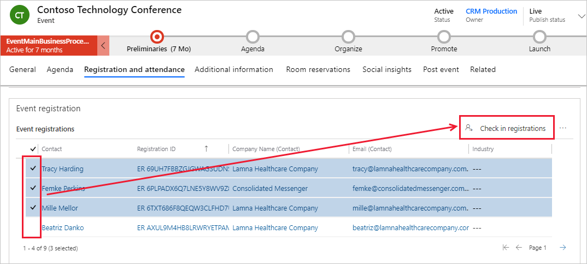
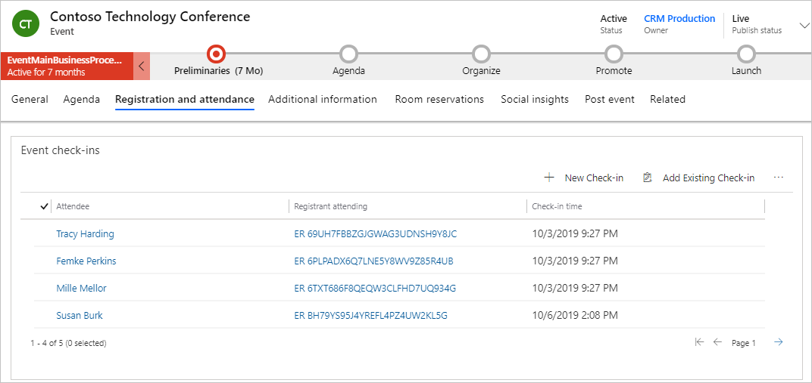

في أثناء تسجيل المستخدمون لحدث، يُنشئ سجل تسجيل حدث. في يوم الحدث، ستريد تحديد أي من هؤلاء المسجلين قد حضر الحدث. يحتوي Dynamics 365 على إمكانات تساعدك في تسجيل عمليات الوصول هذه تلقائياً أو يدويًا.

فيما يخص **أحداث ندوة الإنترنت**، عادة ما تتم عملية تسجيل الوصول بالدمج مع موفر ندوة الإنترنت مثل Microsoft Teams أو ON24. عندما ينضم أحد الحاضرين إلى ندوة الإنترنت بتحديد عنوان URL الحضور الذي تم إرساله إليهم، يُنشئ سجل في النظام الأساسي الخارجي، وتتم مزامنته لاحقًا مع Dynamics 365 Marketing. 

فيما يخص **الأحداث في الموقع**، يُمكنك استخدام وظيفة الاستجابة السريعة التي تتضمنها وحدة **الأحداث** من أجل تجربة تسجيل وصول سلسة للحضور. بعد أن يسجل الضيوف الوصول، يُمكن عرض هذه السجلات داخل سجل الحدث. لمزيد من المعلومات، راجع [عناصر رمز الاستجابة السريعة لتسجيل الحدث](/dynamics365/marketing/content-blocks-reference?azure-portal=true#event-registration-qr-code-elements).

كما يُمكنك تسجيل وصول المسجلين يدويًا مع كلا النوعين من الأحداث.

## عرض تسجيلات الوصول إلى الحدث

لعرض تسجيلات الوصول إلى جميع الأحداث، انتقل إلى **الأحداث > المشاركين > ‏‫تسجيلات الوصول‬**.

لعرض ‏‫تسجيلات وصول‬ حدث معين، انتقل إلى **الأحداث > الحدث > الحدث**، وافتح سجل الحدث، ثم انتقل إلى علامة تبويب **تسجيل وحضور**. يعرض قسم **تسجيلات الوصول** جميع الحضور الحاليين الذين سجلوا الوصول في الحدث.

## تسجيل وصول المسجلين يدويًا

لتسجيل وصول المسجلين يدويًا، اتبع الخطوات التالية:

1.  افتح منطقة عمل **الأحداث** وانتقل إلى **الحدث > الأحداث**.

1.  افتح الحدث.

1.  انتقل إلى علامة تبويب **التسجيل والحضور**.

1.  في قسم **تسجيل الحدث**، حدد عمود علامة الاختيار على يسار جهة (جهات) الاتصال التي تريد تسجيل الوصول لها.

1.  بعد تحديد جهة (جهات) الاتصال التي تريد تسجيل الوصول لها، حدد **تسجيلات الوصول** على اليمين.

1.  تظهر رسالة منبثقة تطلب منك تأكيد رغبتك في تسجيل وصول التسجيلات المحددة. حدد **موافق**.

    

1.  بعد ‏‫تسجيل وصول جهات الاتصال المحددة، يُمكنك التمرير لأسفل إلى قسم **‏‫تسجيلات الوصول إلى الحدث‬** لعرض الحضور الذي سجل الوصول.

    

لمزيد من المعلومات، راجع [‏‫تسجيل الحضور للأحداث وجلسات العمل والبطاقات‬](/dynamics365/marketing/invite-register-house-event-attendees?azure-portal=true#register-attendees-for-events-sessions-and-passes).
