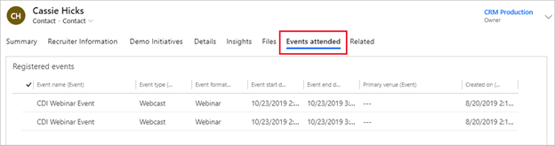

عندما ينتهي الحدث، يُمكنك التواصل مع المبيعات وتحليل نتائج الحدث.

## التسليم للمبيعات

غالباً ما تكون جهات الاتصال التي تهتم بحضور أحداث التسويق جادة في إجراء عملية شراء. وسترغب في المتابعة معهم على الفور لإبقائهم مهتمين. ونظراً لأن Dynamics 365 Marketing يدمج عمليات التسويق والمبيعات، يصل أفراد المبيعات أيضاً إلى جميع جهات الاتصال الجديدة والعملاء المتوقعين الذين قام الحدث بإنشائهم. يستطيع موظفو المبيعات التصرف على الفور بالتواصل مع جهات الاتصال وإعداد فرص جديدة.

وأثناء الحدث، ربما كان أشخاص من المؤسسة الخاصة بك مشغولين في التحدث إلى العملاء المحتملين وتجميع تفاصيل جهة الاتصال الخاصة بهم.
وقد يسجلون هذه التفاصيل في Dynamics 365 Marketing في أثناء وجودهم في الحدث أو يمكنهم إدخال التفاصيل بعد ذلك. إن جهات الاتصال التي سجلت باستخدام موقع ويب الحدث تصبح تلقائياً جهات اتصال في Microsoft Dynamics 365 Customer Engagement. قد تكون قواعد إنشاء العملاء المتوقعين وتسجيل نقاط العملاء المتوقعين في Dynamics 365 Marketing أسفرت عن عملاء متوقعين جاهزين للمبيعات بناءً على عمليات التسجيل والتفاعلات الأخرى. ربما لا يكون العملاء المتوقعون الآخرون مستعدين للمبيعات حتى الآن ولكنهم قد يكونوا مرشحين جيدين لحملة التشجيع التالية لك.

لمزيد من المعلومات، راجع [‏‫التسليم للمبيعات‬](/dynamics365/marketing/followup-after-event?azure-portal=true#hand-off-to-sales).

## عرض نتائج الأحداث وتحليلها

سجلات حضور جلسات العمل والأحداث متوفرة لجميع جهات الاتصال.
قد تكون هذه المعلومات مفيدة لمندوبي المبيعات الذين يحددون العملاء المتوقعين الأكثر استعداداً، أو عندما يستعدون لمكالمة أو اجتماع.

لعرض سجلات الأحداث لجهات الاتصال، افتح سجل جهة اتصال في أي من تطبيقات Dynamics 365 وانتقل إلى علامة تبويب **‏‫أحداث تم حضورها‬** .

> [!div class="mx-imgBorder"]
> 

عندما ينتهي الحدث، ستكون قد أنشأت ثروة من البيانات الجديدة في Dynamics 365. إن النظام مجهز جيداً لمساعدتك على تحليل تلك البيانات باستخدام التحليلات التفصيلية.

تتضمن بعض مواقع البحث عن تحليلات الأحداث ما يلي:

-   **لوحة معلومات إدارة الأحداث** - تقدم لك لوحة المعلومات هذه نظرة عامة كبيرة على العديد من أنشطة تخطيط الأحداث والنتائج من جميع الأحداث. ويُمكنك عرضها بتحديد **لوحة معلومات إدارة الأحداث** من محدد طريقة العرض في أعلى أي صفحة لوحة معلومات في Dynamics
    365. لمزيد من المعلومات، راجع [لوحة معلومات إدارة الأحداث](/dynamics365/marketing/event-management-dashboard?azure-portal=true).

-   **سجلات الأحداث** - انتقل إلى **تخطيط الحدث > الأحداث**، وافتح سجل الأحداث الرئيسي لحدثك لعرض النتائج والتحليلات المرتبطة بهذا الحدث فقط. تقدم هذه النتائج والتحليلات تفاصيل أكثر من التي تقدمها لوحة المعلومات عن العديد من جوانب الحدث.

-   **رحلة عميل الحدث** - انتقل إلى **التسويق الصادر > تنفيذ التسويق > رحلات العميل** وافتح رحلة (رحلات) عميل الحدث المقابلة. عندما يكون الحدث مباشراً، يُمكنك البدء في تحليل كيفية تدفق الحضور عبر البنية الأساسية لبرنامج ربط العمليات التجارية ومؤشرات الأداء الأساسية ذات الصلة. لمزيد من المعلومات، راجع [معلومات رحلة العميل](/dynamics365/marketing/insights?azure-portal=true#customer-journey-insights).

لمزيد من المعلومات، راجع [عرض نتائج الحدث وتحليلها](/dynamics365/marketing/followup-after-event?azure-portal=true#view-and-analyze-event-results).
