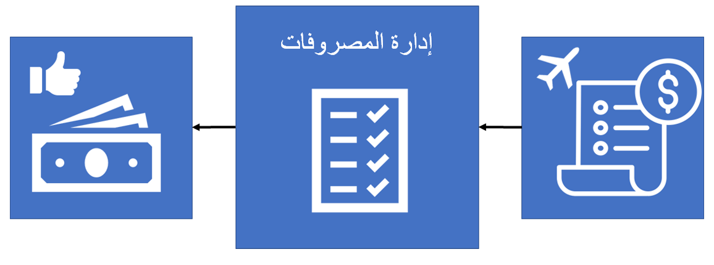

تتيح لك إدارة المصروفات في Microsoft Dynamics 365 Project Operations إعداد السياسات التي يتم فرضها بشكل منهجي لضمان اتباع موظفيك لها.Expense management in Microsoft Dynamics 365 Project Operations lets you set up policies that are systematically enforced to ensure that they are followed by your employees. توفر إدارة المصروفات الوقت وتقلل من احتمالية حدوث خطأ بشري.Expense management saves time and reduces the potential for human error. 

توضح هذه الوحدة النمطية كيفية قيام الموظف بإنشاء تقرير المصروفات، ثم تشرح كيفية قيام المديرين بالتحقق من السياسات والموافقة على التقرير وتعويض الموظف عن المصروفات.This module describes how an employee creates and submits an expense report, and then it will explain how managers will verify policies, approve the report, and reimburse the employee for the expenses.

