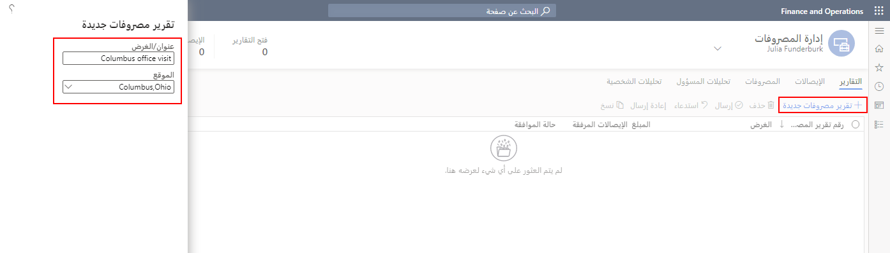
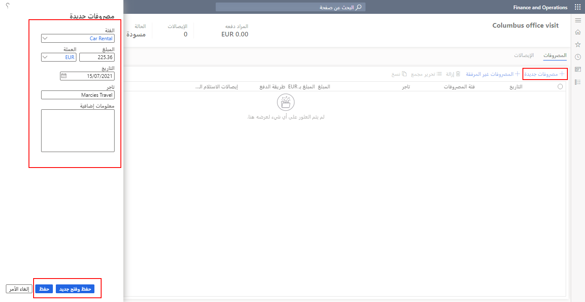

عندما يسافر موظف أو يتكبد مصروفات أخرى نيابة عن الشركة، يجب عليه إنشاء تقرير مصروفات لطلب تعويض عن مصروفاته. يتطلب تقرير المصروفات أن يصف بالتفصيل متى وكيف تم تكبد المصروفات. تساعد سياسات إدارة المصروفات على التأكد من إدخال المصروفات بدقة واتباع النُهج التنظيمية. 

لإنشاء تقرير مصروفات وإضافة معلومات حول المصروفات، اتبع الخطوات التالية:

1.  انتقل إلى **إدارة المصروفات > مساحات العمل > إدارة المصروفات**.
2.  حدد **تقرير مصروفات جديد**.
3.  في حقل **العنوان/الغرض** أدخل الغرض من تقرير المصروفات أو حدده.
4.  قم بإدخال **وصف** لتقرير المصروفات.
5.  أدخل **الموقع** الذي تم فيه تكبد المصروفات.
6.  حدد **إنشاء**.

لإضافة مصروفات إلى تقرير مصروفات، اتبع الخطوات التالية:

1.  في علامة التبويب **مصروفات**، حدد **مصروفات جديدة**.
2.  في حقل **الفئة**، حدد فئة المصروفات.
3.  في حقل **المبلغ**، أدخل الإجمالي الموجود في إيصال المصروفات.
4.  في حقل **العملة**، حدد العملة الموجودة في الإيصال.
5.  أدخل **تاريخ** المصروفات.
6.  في حقل **التاجر**، أدخل الأعمال التي تم تكبد المصروفات فيها.
7.  في مربع النص **‏‏معلومات إضافية**، قم بتوفير المعلومات القابلة للتطبيق المتعلقة بالمصروفات، عند الضرورة.
8.  حدد **حفظ وجديد** لإدخال مصروفات جديدة أو حدد **حفظ** للرجوع إلى التقرير.

