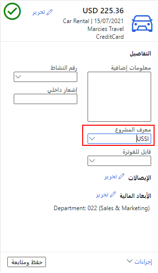

قد يقوم العامل الذي يتم توظيفه من قِبل أحد الكيانات القانونية في إحدى المؤسسات بأداء عمل لكيان قانوني آخر في المؤسسة نفسها. وفي هذه الحالة، يمكنك استخدام ميزة المصروفات بين شركات شقيقة لتعيين مصروفات العامل إلى الكيان القانوني الذي تم إجراء العمل لصالحه. 

يُشار إلى الكيان القانوني الذي يوظف العامل باسم *الكيان القانوني المُقرض*. ويُشار إلى الكيان القانوني الذي يتكبد العامل المصروفات لصالحه باسم *الكيان القانوني المقترض*.

لإنشاء مصروفات مشتركة بين الشركات الشقيقة، اتبع الخطوات التالية:

1.  انتقل إلى **إدارة المصروفات > مساحات العمل > إدارة المصروفات**.
2.  حدد **تقرير مصروفات جديد**.
3.  في حقل **العنوان/الغرض** أدخل الغرض من تقرير المصروفات أو حدده.
4.  قم بإدخال **وصف** لتقرير المصروفات.
5.  أدخل **الموقع** الذي تم فيه تكبد المصروفات.
6.  حدد **إنشاء**.
7.  في علامة التبويب **مصروفات**، حدد **مصروفات جديدة**.
8.  في حقل **الفئة**، حدد فئة المصروفات.
9.  في حقل **المبلغ**، حدد الإجمالي الموجود في إيصال المصروفات.
10. في حقل **العملة**، حدد العملة الموجودة في الإيصال.
11. أدخل **تاريخ** المصروفات.
12. في حقل **التاجر**، أدخل الأعمال التي تمّ تكبد المصروفات فيها.
13. حدد **حفظ**.
14. في تفاصيل بند المصروفات، حدد **الكيان القانوني** لتلك المصروفات.
    
    

15. حدد **حفظ ومتابعة**.

