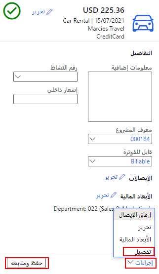
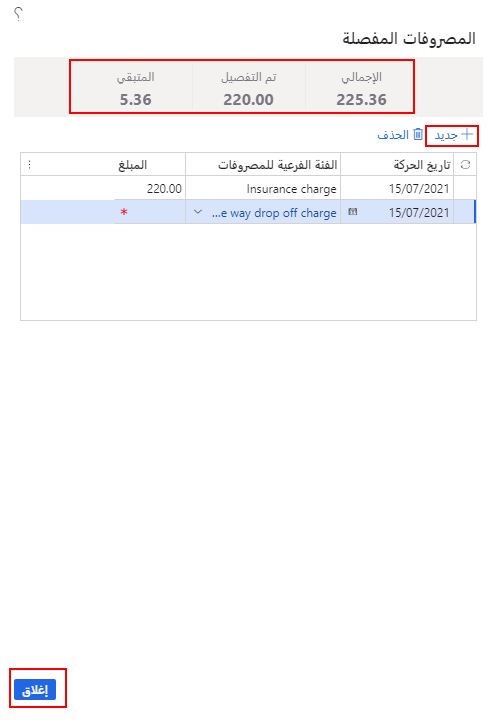

بالنسبة لفئات مصروفات معينة، يمكن لشركتك أن تطلب من الموظفين سرد المصاريف الفردية التي تنتج المبلغ الإجمالي. على سبيل المثال، يمكنك تقسيم رسوم الفندق إلى سعر الغرفة اليومي، وضرائب الغرفة، وخدمة الغرف.

1.  عند إدخال بند مصروفات لفئة تتطلب التفصيل، في الجزء الأيمن السفلي، حدد **الإجراءات > تفصيل**.
 
    
    
    ويظهر إجمالي المصروفات التي تم إدخالها في حقل **الإجمالي**.
2.  حدد **جديد**.
3.  أدخل **تاريخ الحركة** للمصروفات.
4.  حدد **الفئة الفرعية للمصروفات**.
5.  أدخل **مبلغ** الحركة.
6.  أدخل بنوداً جديدة؛ وستتم تعبئة المبالغ الموجودة في حقلي **تفصيل** و **والمتبقي** حسب الحاجة.
7.  عند اكتمال التفصيل، حدد **إغلاق**.
 
    
