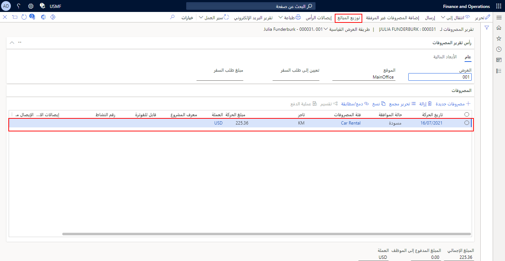

عند إدخال مصروفات في تقرير مصروفات، يمكن توزيع المصروفات عبر العديد من المشاريع أو الأبعاد المالية أو الحسابات في مؤسستك.

علي سبيل المثال، ضع في اعتبارك سيناريو يتضمن مندوب مبيعات سافر من مدينة كولومبس في أوهايو إلى مدينة إنديانابوليس في إنديانا. وفي إنديانابوليس، التقى مندوب المبيعات بمؤسستين لمناقشة مشاريع منفصلة لكل مؤسسة. قضى مندوب المبيعات ثلاثة أيام عمل مع المؤسسة **"أ"** في المشروع **"أ"** وقضى ثلاثة أيام عمل مع المؤسسة **"ب"** في المشروع **"ب"**.

نظراً إلى عمل المندوب على مشروعين منفصلين في إينديانابوليس، يجب توزيع المصروفات بما يتناسب مع كل مشروع. 

1.  لتوزيع المبالغ، انتقل إلى **إدارة المصروفات > مصروفاتي > تقارير المصروفات**.
2.  حدد **تقرير المصروفات** القابل للتطبيق.
3.  ميِّز **سطر المصروفات** القابل للتطبيق.
4.  حدِّد **توزيع المبالغ**.
  
    
5.  حدِّد **تقسيم**.
6.  أدخل معلومات **حساب دفتر الأستاذ** القابل للتطبيق.
7.  حدِّد **توزيع بالتساوي** أو أدخل **النسبة المئوية** التي تريد توزيع المصروفات وفقاً لها.

    

8.  حدِّد **حفظ** ثم أغلق الصفحة.
 
 

