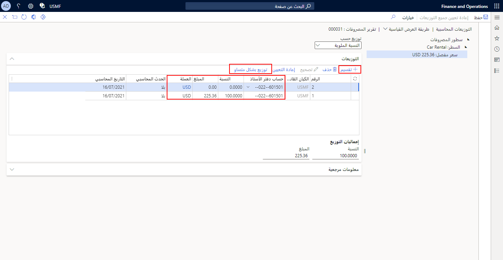

عند إدخال مصروفات في تقرير مصروفات، يمكن توزيع المصروفات عبر العديد من المشاريع أو الأبعاد المالية أو الحسابات في مؤسستك.When you enter expenses on an expense report, you can distribute the expense across multiple projects, financial dimensions, or accounts in your organization.

علي سبيل المثال، ضع في اعتبارك سيناريو يتضمن مندوب مبيعات سافر من مدينة كولومبس في أوهايو إلى مدينة إنديانابوليس في إنديانا.For example, consider a scenario where a sales representative traveled from Columbus, Ohio to Indianapolis, Indiana. وفي إنديانابوليس، التقى مندوب المبيعات بمؤسستين لمناقشة مشاريع منفصلة لكل مؤسسة.In Indianapolis, the sales representative met with two organizations to discuss separate projects for each organization. قضى مندوب المبيعات ثلاثة أيام عمل مع المؤسسة **"أ"** في المشروع **"أ"** وقضى ثلاثة أيام عمل مع المؤسسة **"ب"** في المشروع **"ب"**.The sales representative spent three business days working with organization **A** on project **A**, and three business days working with organization **B** on project **B**.

نظراً إلى عمل المندوب على مشروعين منفصلين في إينديانابوليس، يجب توزيع المصروفات بما يتناسب مع كل مشروع.Because the representative worked on two separate projects when in Indianapolis, the expenses must be distributed as appropriate for each project. 

1.  لتوزيع المبالغ، انتقل إلى **إدارة المصروفات > مصروفاتي > تقارير المصروفات**.To distribute amounts, go to **Expense management > My expenses > Expense reports**.
2.  حدد **تقرير المصروفات** القابل للتطبيق.Select the applicable **Expense report**.
3.  ميِّز **سطر المصروفات** القابل للتطبيق.Highlight the applicable **Expense line**.
4.  حدِّد **توزيع المبالغ**.Select **Distribute amounts**.
  
    
5.  حدِّد **تقسيم**.Select **Split**.
6.  أدخل معلومات **حساب دفتر الأستاذ** القابل للتطبيق.Enter applicable **Ledger account** information.
7.  حدِّد **توزيع بالتساوي** أو أدخل **النسبة المئوية** التي تريد توزيع المصروفات وفقاً لها.Select **Distribute equally** or enter the **Percent** that you want the expense distributed.

    

8.  حدِّد **حفظ** ثم أغلق الصفحة.Select **Save** and then close the page.
 
 

