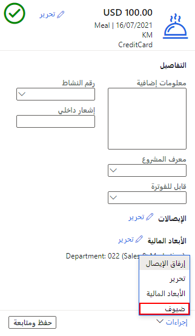
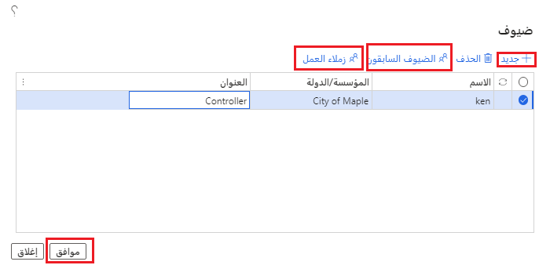

بناءً على نهج شركتك، عند إدخال مصروفات الترفيه أو الوجبات في تقرير مصروفات، قد يلزم إدخال مصروفات أشخاص آخرين. على سبيل المثال، قد تصطحب عميلاً محتملاً لتناول العشاء. 

لذلك، عند إدخال مصروفات الوجبات في تقرير المصروفات، يمكنك أيضاً إضافة ضيفك.

لإضافة ضيف إلى تقرير مصروفاتك، اتبع الخطوات الآتية:

1.  عند إدخال الفئة التي تم تكوينها لإضافة الضيوف، حدد **الإجراءات > الضيوف** في أسفل الجزء الأيسر من الصفحة **الفئة**.

      
2.  حدد **جديد** لإدخال **اسم** النص الحر و **المؤسسة/البلد** و **المسمى الوظيفي**.
3.  يمكنك تحديد **الضيوف السابقين** لعرض قائمة بالضيوف الذين تمت إضافتهم إلى تقارير المصروفات السابقة.
4.  حدد **زملاء العمل** لعرض قائمة بزملاء العمل الموجودين في مؤسستك.

    
