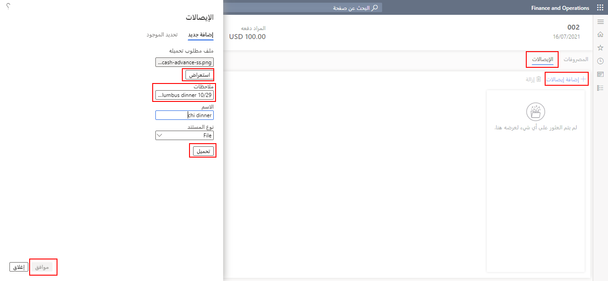
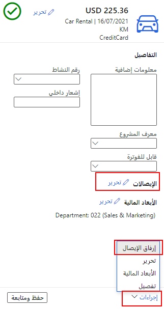
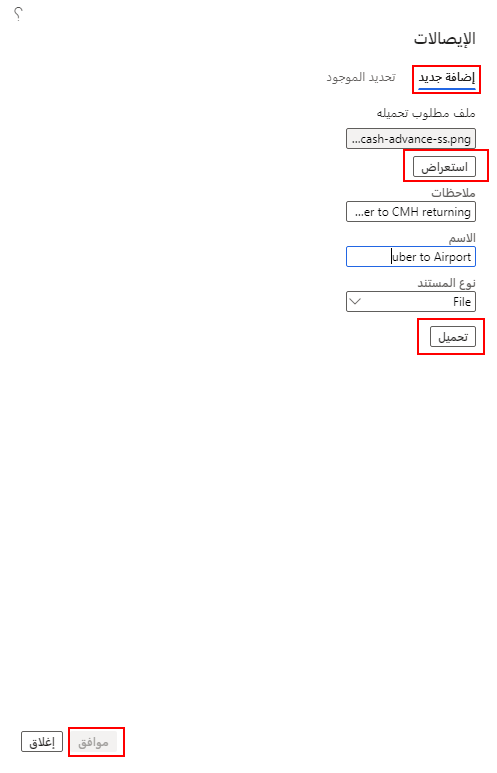
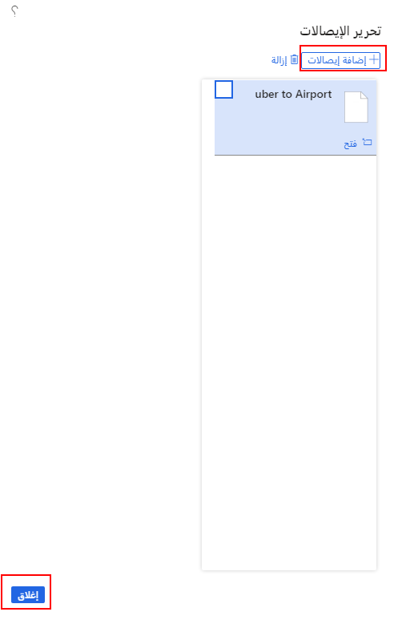

يمكنك إرفاق إيصالات إلكترونية، مثل خط سير الرحلة أو أي مستندات أخرى تتطلبها شركتك، إلى تقرير المصروفات.You can attach electronic receipts, such as a travel itinerary or any other documents that are required by your company, to an expense report. كما يمكنك عرض الإيصالات المرفقة بالفعل.You can also view receipts that are already attached. تتطلب بعض سياسات الشركة إضافة الإيصالات إلى مستوى الرأس في التقارير، بينما تتطلب سياسات أخرى إرفاقها إلى مستوى البند.Some company policies require that receipts are added to the header level of the reports, while others require that they are attached at the line level. يؤدي إرفاق الإيصالات بالتقارير إلى تسهيل التحقق من الموافقة على المصروفات بدلاً من إرسالها بالبريد الفعلي.Attaching receipts to reports makes expense approval easier to validate rather than when they're physically mailed.

## إرفاق الإيصالات إلى رأس تقرير المصروفاتAttach receipts an expense report header
لإرفاق الإيصالات إلى رأس تقرير مصروفات، اتبع الخطوات الآتية:To attach receipts to the header of an expense report, follow these steps:

1.  قبل إرفاق الإيصالات إلى تقرير المصروفات، احفظها على جهاز الكمبيوتر لديك.Before attaching receipts to your expense report, save them to your computer.
2.  حدد علامة التبويب **إيصالات**.Select the **Receipts** tab.
3.  حدد **إضافة إيصالات**.Select **Add receipts**.
4.  حدد **استعراض** لتحديد موقع الملفات الموجودة على جهاز الكمبيوتر لديك.Select **Browse** to locate files on your computer. حدد المستند المناسب.Select the appropriate document.
5.  (اختياري) أدخِل الملحوظات الضرورية في الحقل **ملحوظات**.(Optional) Enter necessary notes in the **Notes** field. 
6.  حدد **تحميل**.Select **Upload**.
7.  حدد **موافق**.Select **OK**.

      

## إرفاق الإيصالات إلى بند تقرير المصروفاتAttach receipts to an expense report line
إذا تطلبت سياسات شركتك إرفاق إيصالات إلى بند تقرير مصروفات، فاتبع الخطوات الآتية:If your company policies require that you attach receipts to an expense report line, follow these steps:

1.  عند فتح بند المصروفات، حدد **تحرير الإيصالات** أو حدد **الإجراءات > إرفاق إيصال** في الجانب الأيمن السفلي من الصفحة **الفئة**.When the expense line is open, select **Receipts Edit** or select **Actions > Attach receipt** in the bottom left of the **Category** page.

    

2.  حدد **إضافة جديد**.Select **Add new**.
3.  حدد **استعراض** لتحديد موقع الملفات الموجودة على الكمبيوتر لديك، ثم حدد المستند المناسب.Select **Browse** to locate files on your computer, and then select the appropriate document.
4.  (اختياري) أدخِل الملحوظات الضرورية في الحقل **ملحوظات**.(Optional) Enter necessary notes in the **Notes** field.
5.  حدد **تحميل**.Select **Upload**.
6.  حدد **موافق**.Select **OK**.

     
 
7.  عند التحميل، تظهر الإيصالات في الصفحة **تحرير الإيصالات**.When uploaded, receipts appear in the **Edit receipts** page. 
8.  تابع تحديد **إضافة إيصالات** حتى يتم تحميل جميع الإيصالات.Continue selecting **Add receipts** until all receipts are uploaded.
9.  حدد **إغلاق**.Select **Close**.

    
