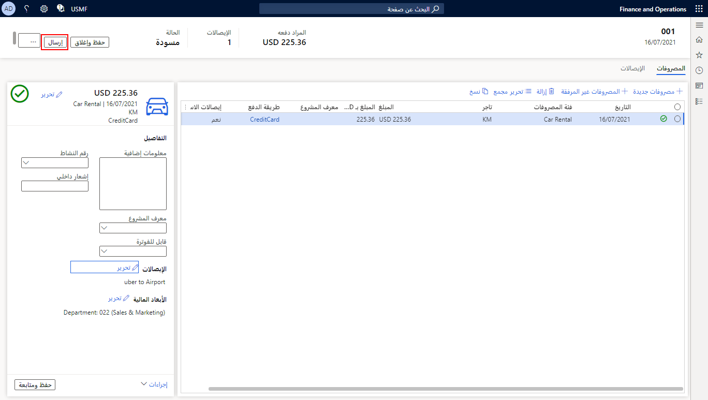

عند الانتهاء من إدخال كافة البنود في تقرير المصروفات والحصول على الإيصالات المرفقة وفقاً لسياسة الشركة، يجب إرسال تقرير المصروفات إلى سير عمل كما يأتي.When you have finished entering all lines on the expense report and have attached receipts according to company policy, you must submit the expense report to a workflow as follows.

1.  في أعلى الزاوية اليمنى من تقرير المصروفات، حدد **إرسال**.In the upper-right corner of the expense report, select **Submit**.

    

2.  أدخل **تعليقاً** للموافق على المصروفات لقراءته.Enter a **Comment** for the expense approver to read.
3.  حدد **إرسال**.Select **Submit**.

    

شاهد الفيديو الآتي للحصول على عرض توضيحي حول كيفية إنشاء تقرير مصروفات والاحتفاظ به وإرساله إلى سير عمل.Watch the following video for a demonstration of how to create, maintain, and submit an expense report to a workflow.

> [!VIDEO https://www.microsoft.com/videoplayer/embed/RE4IO4N]
