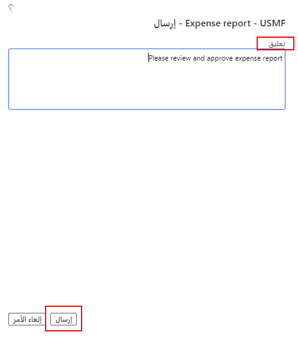

عند الانتهاء من إدخال كافة البنود في تقرير المصروفات والحصول على الإيصالات المرفقة وفقاً لسياسة الشركة، يجب إرسال تقرير المصروفات إلى سير عمل كما يأتي.

1.  في أعلى الزاوية اليمنى من تقرير المصروفات، حدد **إرسال**.

    

2.  أدخل **تعليقاً** للموافق على المصروفات لقراءته.
3.  حدد **إرسال**.

    

شاهد الفيديو الآتي للحصول على عرض توضيحي حول كيفية إنشاء تقرير مصروفات والاحتفاظ به وإرساله إلى سير عمل.

> [!VIDEO https://www.microsoft.com/videoplayer/embed/RE4IO4N]
