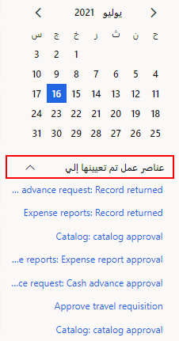
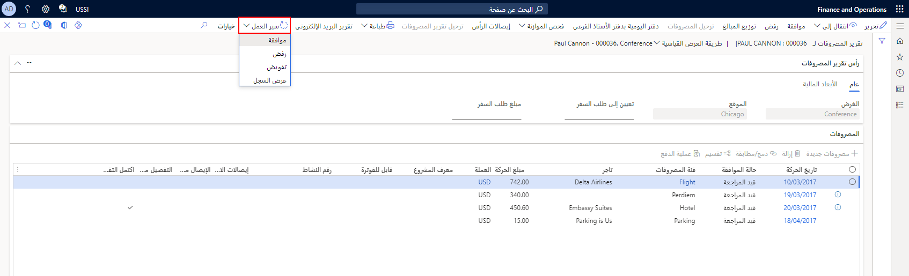

إذا كنت أحد الموافقين على المصروفات، فسيتم إخطارك عندما تتطلب المصروفات انتباهك. قد تحتوي بعض مهام سير العمل للمصروفات على قرارات مشروطة، بناءً على تكوين سير العمل. وقد يحتوي سير العمل أيضاً على مستويات متنوعة من عمليات الموافقة، حيث إنه بعد موافقة الموافق الأول على سير العمل، يتم إرساله إلى الموافق التالي، وهكذا. وإذا قام أحد الموافقين بإرجاع تقرير مصروفات، فستتم إعادة بدء سير المهمة. وتؤدي إعادة البدء إلى إرسال تقرير المصروفات مرة أخرى إلى المنشئ لإجراء التصحيحات التي ينصح بها الموافق الرافض. 

وتظهر الإخطارات على لوحة المعلومات ضمن **عناصر عمل تم تعيينها إليَّ**. 
 
 

كما يمكن للموافقين الوصول إلى قائمة بتقارير المصروفات التي تتطلب اهتماماتهم من خلال الانتقال إلى **إدارة المصروفات > معالجة تقارير المصروفات > تقارير المصروفات التي تم تعيينها إلىَّ**.

لمراجعة تقرير مصروفات للموافقة، اتبع الخطوات الآتية:

1.  حدد تقرير المصروفات القابل للتطبيق.
2.  عند إتمام المراجعة، حدد القائمة المنسدلة **سير العمل**، ثم حدد أحد الخيارات الآتية:
    - **موافقة** – الموافقة على تقرير المصروفات بالكامل.

        إذا كان الكيان القانوني يتطلب منك الموافقة على تقارير المصروفات حسب عنصر البند بدلاً من الموافقة على المستند بأكمله، تظهر خانة **تحديد** بجوار كل حركة في التقرير. حدد خانة الاختيار للموافقة على حركة عنصر البند.
    - **رفض** – إرجاع تقرير المصروفات إلى العامل الذي أرسله. يمكنك تحديد هذا الخيار إذا كانت المعلومات غير مكتملة أو كانت لديك أسئلة حول التقرير.

    - **تفويض** – تعيين تقرير المصروفات إلى مستخدم آخر للموافقة. 

    - **عرض المحفوظات** – فتح الصفحة **تفاصيل محفوظات سير العمل**، حيث يمكنك عرض المحفوظات والتفاصيل الخاصة بتقرير المصروفات في عملية الموافقة.
 

شاهد الفيديو الآتي للاطلاع على عرض توضيحي حول كيفية الموافقة على تقرير المصروفات.
 > [!VIDEO https://www.microsoft.com/videoplayer/embed/RE4IM7E]

