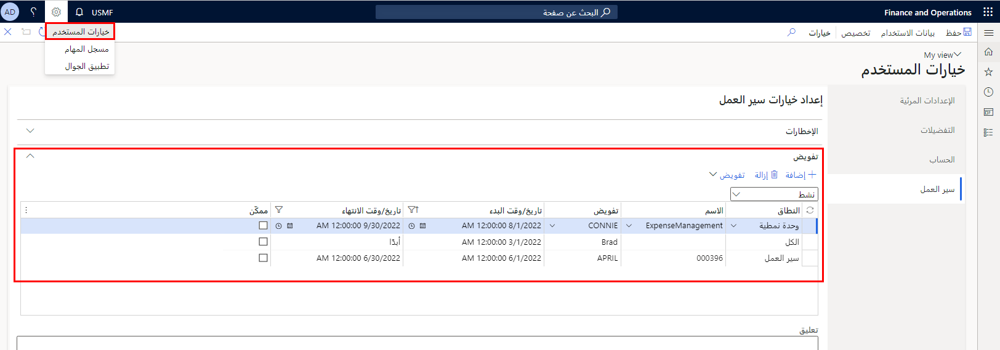
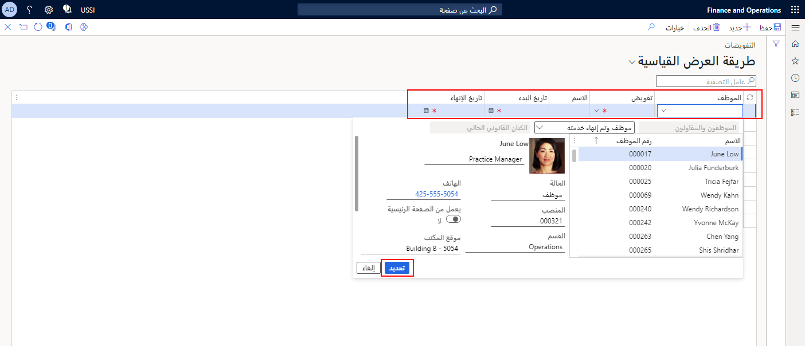

في بعض الأحيان، قد يحتاج الموافق إلى تفويض المهام الخاصة به إلى مستخدم آخر. وقد تكون الأسباب المحتملة لتفويض المهام هو أن الموافق سيكون في إجازة ويحتاج إلى إعداد تفويض لفترة زمنية، أو عندما يوجد لدى موافق آخر معرفة أكثر حول تفاصيل تقرير المصروفات وهناك حاجة إلى التفويض لمرة واحدة. مهما كانت الحالة، يجب أن يتمتع التفويض بحقوق الضمان المطبقة للموافقة على المصروفات.

يمكنك إعداد المستخدمين كمفوضين في صفحة **خيارات المستخدم**. هنا يمكنك إعداد المستخدمين كمفوضين لنطاقات مختلفة. قد يكون هذا لوحدة نمطية معينة، أو سير عمل محدد، أو لجميع مهام سير العمل. عندما يتم إعداد مستخدم كمفوض، يمكنك تفويض عناصر العمل لهذا المستخدم. 

إذا ذهب أحد المعتمدين في إجازة، فيمكنه تفويض سلطة الموافقة الخاصة به إلى مشرف الفريق الذي يتمتع بنفس وصول الأمان. في هذا السيناريو، يمنح المعتمد للمفوض القدرة على إرسال إدخال المصروفات. 

عند تفويض تقرير مصاريف لمرة واحدة، يختار المُوافق **تفويض** في حقل **سير العمل** في صفحة **الموافقة**.

لإعداد مفوض موافق لفترة زمنية على إدخال مصروف معين، اتبع الخطوات التالية:

1.  انتقل إلى **إدارة النفقات> الإعداد> عام> التفويض**.
2.  حدد **جديد**.
3.  في القائمة المنسدلة **الموظف**، حدد الموافق الذي يقوم بتفويض سلطة الموافقة الخاصة به، إذا كان شخصاً غيرك.
4.  في القائمة المنسدلة **تفويض**، حدد الشخص الذي سيقوم بالموافقة على إجراءات سير العمل نيابةً عنك.
5.  حدد **تاريخ بدء** عند بدء التفويض.
6.  حدد **تاريخ الانتهاء** عندما ينتهي التفويض.

شاهد الفيديو التالي للحصول على عرض توضيحي لكيفية تفويض سلطة الموافقة.
> [!VIDEO https://www.microsoft.com/videoplayer/embed/RE4J4c9]
