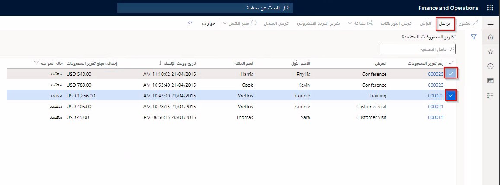

بعد اعتماد تقرير مصروفات وتحويله إلى دفتر اليومية العام، يمكن ترحيله إلى دفتر الأستاذ العام. 

اتبع الخطوات الآتية لنشر سياسة تقرير المصروفات:

1.  انتقل إلى **إدارة المصروفات > معالجة تقارير المصروفات > تقارير المصروفات المعتمدة**.
2.  حدد **تقارير المصروفات** التي ترغب في ترحيلها.
3.  حدد **ترحيل**.

