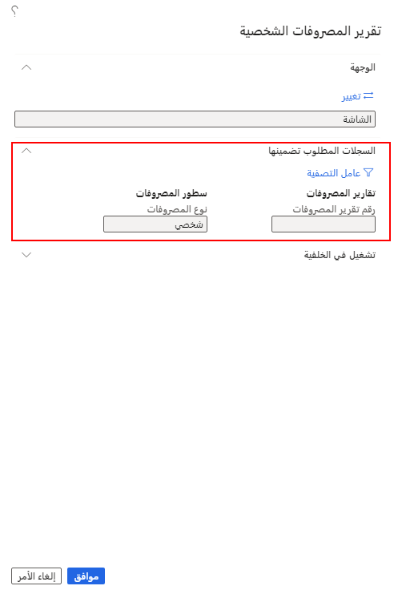
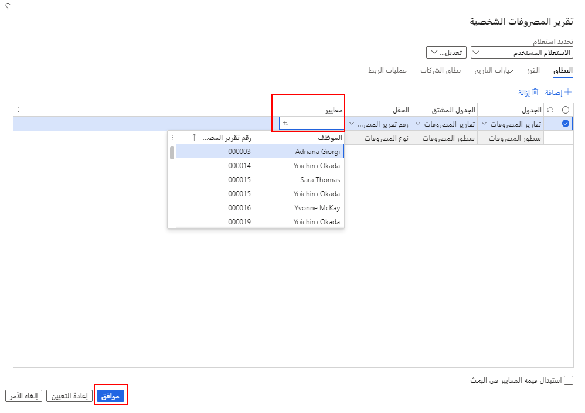
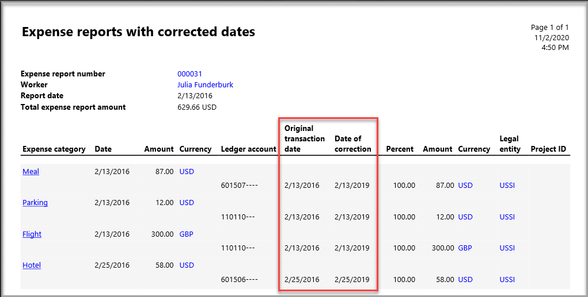
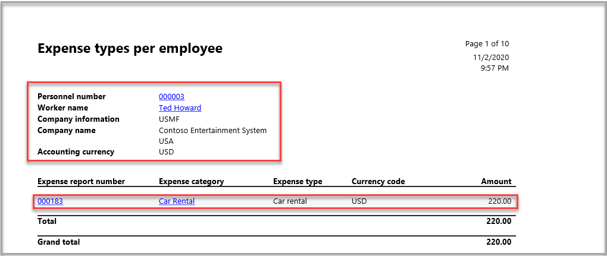
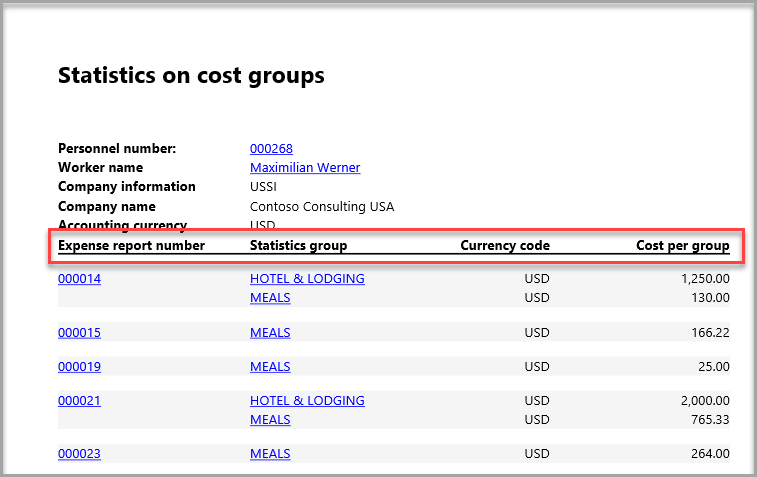
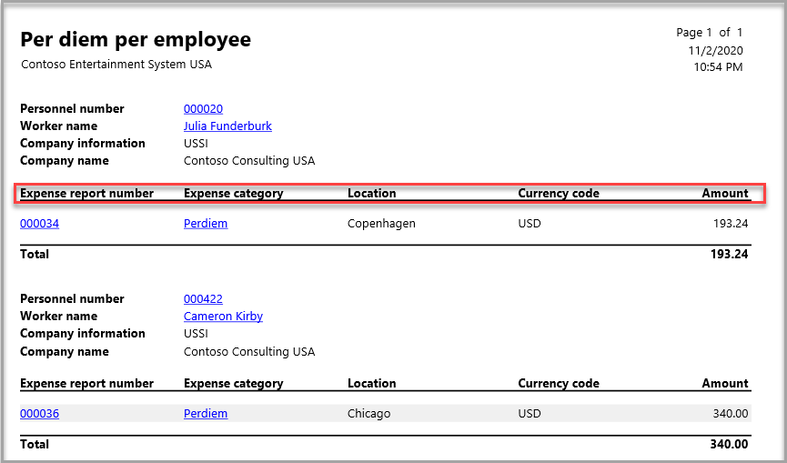
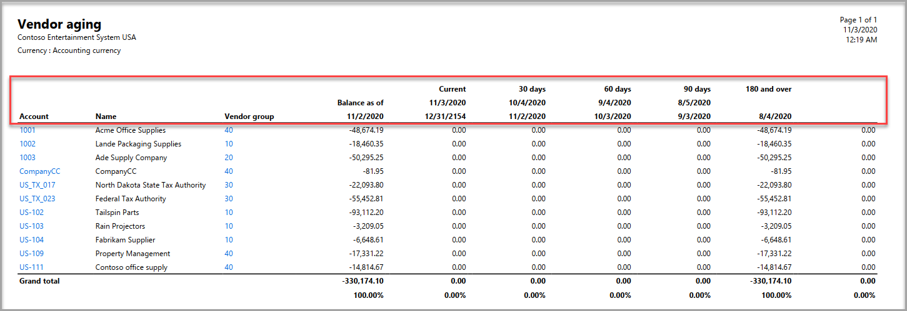
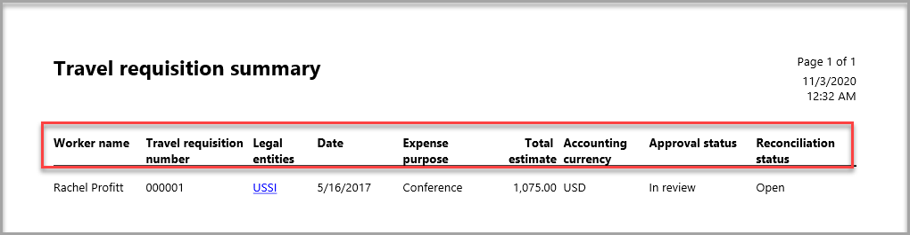

تحتوي الوحدة النمطية لإدارة المصروفات على العديد من خيارات إعداد التقارير والاستعلام. يمكن العثور على التقارير في **إدارة المصروفات > الاستعلامات والتقارير**. عندما تقوم ببدء تشغيل تقرير، يتم عرض صفحة بحيث يمكنك تحديد معايير التقرير.  

بالنسبة للتقارير الواردة في هذه الوحدة، سيتوفر لديك خيار تصفية البيانات لإنتاج تقرير مخصص لما تبحث عنه. يوضح المثال التالي خيارات التصفية **لتقرير المصروفات الشخصية**. 

1.  قم بتوسيع علامة التبويب السريعة **السجلات المطلوب تضمينها**.
 
    

2.  من الرمز **عامل التصفية**، حدد **معايير** التقرير.

    

## تقرير المصروفات الشخصية
يعرض تقرير **المصروفات الشخصية** المصروفات الشخصية التي يتم إدخالها بواسطة أحد الموظفين في تقرير المصروفات. يمكنك التصفية حسب **رقم تقرير المصروفات** في منطقة التصفية **السجلات المطلوب تضمينها**.

## تقرير المصروفات مع التواريخ التي تم تصحيحها
يعثر تقرير **تقارير المصروفات بالتاريخ الصحيح** على تقارير المصروفات التي تم تحرير التواريخ بها. يمكنك تشغيل التقرير لنطاق تاريخ والتصفية حسب **رقم تقرير المصروفات** في منطقة التصفية **السجلات المطلوب تضمينها**.

يحتوي إخراج التقرير على معلومات البند ورأس تقرير المصروفات، مع الأعمدة الإضافية **لتاريخ الحركة الأصلي** و **تاريخ التصحيح**، كما هو موضح في لقطة الشاشة التالية.

## تقرير الحركات المرحلة
ويقوم تقرير **الحركات المرحلة** بالبحث عن حركات المصروفات المرحلة. يمكنك تشغيل التقرير لنطاق تاريخ والتصفية حسب **رقم تقرير المصروفات** أو **عدد الموظفين** أو **تاريخ الترحيل** في منطقة التصفية **السجلات المطلوب تضمينها**.

## تقرير المصروفات مع تقرير استرداد الضريبة
يقوم تقرير **تقرير المصروفات باسترداد الضريبة** بالبحث عن المصروفات المستحقة لاسترداد الضريبة لبلد/منطقة محددة. يمكنك تشغيل التقرير حسب **حاله استرداد الضريبة** و/أو **البلد/المنطقة** في منطقه التصفية **السجلات المطلوب تضمينها**.

## تقرير أنواع المصروفات لكل موظف
يقوم تقرير **أنواع المصروفات لكل موظف** بالبحث عن المصروفات استنادا إلى نوع المصروفات الذي تم إدخاله بواسطة الموظفين. يمكنك تشغيل التقرير حسب **رقم تقرير المصروفات** و **فئة المصروفات** و **الكيان القانوني** في منطقة التصفية **السجلات المطلوب تضمينها**.

يتضمن إخراج التقرير معلومات الرأس التالية:

- **رقم الموظف**
- **اسم العامل**
- **معلومات الشركة** (الكيان القانوني)
- **عملة المحاسبة**

يتضمن إخراج التقرير معلومات البند التالية، استنادا إلى ما أرسله الموظف: 

- **رقم تقرير المصروفات**
- **فئة المصروفات**
- **نوع المصروفات**
- **‏رمز العملة**
- **المبلغ**

## تقرير إحصاءات على مجموعات التكاليف
يعرض تقرير **الإحصائيات الموجودة في مجموعات التكاليف** مبالغ المصروفات المصنفة حسب مجموعة التكلفة. يمكنك تشغيل التقرير حسب **رقم تقرير المصروفات** و **مجموعة الإحصاءات** في منطقة التصفية **السجلات المطلوب تضمينها**.

يتضمن إخراج التقرير معلومات الرأس التالية:

- **رقم الموظف**
- **اسم العامل**
- **معلومات الشركة** (الكيان القانوني)
- **عملة المحاسبة**

يتضمن إخراج التقرير معلومات البند التالية، استنادا إلى ما أرسله الموظف: 

- **رقم تقرير المصروفات**
- **مجموعة الإحصائيات**
- **‏رمز العملة**
- **التكلفة حسب المجموعة**

## تقرير مسافة بالميل لكل موظف
يعرض التقرير **المسافة المقطوعة لكل موظف** المقدار الذي تم إدخاله بواسطة الموظفين. يمكنك تشغيل التقرير حسب **العامل** أو **فئة المصروفات** أو **رقم تقرير المصروفات** في منطقة التصفية **السجلات المطلوب تضمينها**.

يتضمن إخراج التقرير معلومات الرأس التالية:

- **معرف الموظف**
- **اسم الموظف**
- **معلومات الشركة** (الكيان القانوني)
- **عملة المحاسبة**

يتضمن إخراج التقرير معلومات البند التالية، استنادا إلى ما أرسله الموظف: 

- **رقم تقرير المصروفات**
- **‏رمز العملة**
- **المبلغ**
- **المسافة بالميل**
- **العناوين من وإلى**
 

## تقرير المصروف اليومي لكل موظف
يعرض لك تقرير **المصروفات اليومية لكل موظف** العديد من المصروفات التي يتم منحها لأحد الموظفين خلال فترة زمنية أو تقرير مصروفات محدد. يمكنك تشغيل التقرير حسب **تاريخ بداية المصروفات** و **تاريخ نهاية المصروفات** و **رقم تقرير المصروفات** و **فئة المصروفات** في منطقة التصفية **السجلات المطلوب تضمينها**.

يتضمن إخراج التقرير معلومات الرأس التالية:

- **رقم الموظف**
- **اسم العامل**
- **معلومات الشركة** (الكيان القانوني)
- **عملة المحاسبة**

يتضمن إخراج التقرير معلومات البند التالية، استنادا إلى ما أرسله الموظف: 

- **رقم تقرير المصروفات**
- **فئة المصروفات**
- **الموقع**
- **‏رمز العملة**
- **المبلغ**

## تقرير تقادم المورد
يعرض تقرير **فترة تقادم المورد** الأرصدة المستحقة للموردين، والتي تم فرزها حسب فتره التاريخ أو تعريف فتره التقادم.

يوفر قسم **المعلمات** الخاص بتحديد المعايير طرقا عديدة لتشغيل هذا التقرير. تحدد القائمة التالية الإجراء الذي يمثله كل حقل:

- **فتره التقادم بدءا من** - أدخل التاريخ الموجود في الفاصل الزمني الأول أو فترة التقادم ليتم تضمينها في التقرير.
- **الرصيد بدءا من** - أدخل التاريخ المطلوب عرض أرصدة الموردين له.
- **المعايير** - حدد نوع التاريخ الذي سيتم إنشاء التقرير فيه.
    - **تاريخ الحركة** - تاريخ الترحيل للحركات، على سبيل المثال، تاريخ الفاتورة الذي يمثل أساس حساب تاريخ الاستحقاق.
    - **تاريخ الاستحقاق** – تاريخ استحقاق الحركات، استنادا إلى شروط الدفع.
    - **تاريخ المستند** – تاريخ مستند معرف من قبل المستخدم يمثل أساس حساب تاريخ الاستحقاق.
- **فترة التقادم** - حدد تعريف فترة التقادم. 
    - لا يتم استخدام حقل **الفترة** إذا قمت بتحديد تعريف فترة تقادم.
    - لا يمكن استخدام تعريفات فترات التقادم التي تحتوي على أكثر من ست فترات تقادم (أعمدة) في التقرير المطبوع.
- **العملة** - حدد العملة المراد عرضها في التقرير.
    - **عملة المحاسبة** - العملة التي يستخدمها الكيان القانوني لحسابات المبالغ.
    - **عمله التقارير** - العملة المستخدمة لإعداد تقارير العملية.
- **طباعة وصف فترة التقادم** 
    - حدد **نعم** لتضمين أوصاف فترات التقادم أعلى كل عمود فترة تقادم في التقرير. 
    - حدد **لا** لطباعة التقرير بدون رؤوس الأعمدة.
- **الفاصل الزمني** - تحديد الفترة المقرر استخدامها من خلال إدخال عدد وحدات اليوم أو الشهر في كل فترة. 
      على سبيل المثال، قد تقوم بإدخال **15** وتحديد **يوم** في الحقل **اليوم/الشهر** لعرض معلومات فترة التقادم على فترات تبلغ 15 يوماً في التقرير. وبدلا من ذلك، لعرض معلومات فترة التقادم حسب الشهر، أدخل **1** في هذا الحقل، ثم حدد **شهر** في الحقل **اليوم/الشهر**
- **اليوم/الشهر** - يتم استخدام المعلومات المدخلة فقط إذا لم تقم بتحديد تعريف فترة تقادم.
      حدد إما **يوم** أو **شهر** لتحديد الفترة في حقل **الفاصل الزمني**.
- **اتجاه الطباعة** - حدد ما إذا كان سيتم حساب الأرصدة وطباعة تقرير فترة التقادم للفترات الماضية أو المستقبلية، بالنسبة للتاريخ المحدد في الحقل **الرصيد اعتبارا من**. 
    - حدد **للخلف** لإظهار معلومات حول الفترات الماضية. 
    - حدد **للأمام** لإظهار معلومات حول الفترات المستقبلية.
- **التفاصيل** - حدد خانة الاختيار هذه لسرد الحركات المضمنة في الأرصدة المعروضة في التقرير.
- **تضمين المبالغ بعملة الحركة** - حدد خانة الاختيار هذه لتضمين المبالغ بعملة الحركة.
- **الرصيد السالب** - حدد خانة الاختيار هذه لتضمين الأرصدة السالبة.
- **استبعاد الحسابات ذات الرصيد الصفري** - حدد خانة الاختيار هذه لاستبعاد الموردين الذين لديهم رصيد صفري.
- **تحديد موضع الدفع** - حدد خانة الاختيار هذه لتضمين المدفوعات التي لم تتم تسويتها. يتم عرض هذه المدفوعات في العمود الأول من التقرير.
يمكنك تشغيل التقرير حسب **حساب المورد والمجموعة** في منطقة التصفية **السجلات المطلوب تضمينها**.

يعرض تقرير فترة تقادم المورد معلومات الرأس التالية:

- **اسم الشركة**
- **عملة المحاسبة**

يعرض إخراج التقرير معلومات السطر التالية:

- **الحساب، الاسم**
- **مجموعة الموردين**
- **الرصيد اعتباراً من**
- **حالي**
- **30 يوماً**
- **60 يوماً**
- **90 يوماً**
- **180 وأكثر**

## تقرير ملخص طلب السفر

يعرض تقرير **ملخص طلبات السفر** طلبات السفر. يمكنك تشغيل التقرير حسب **التاريخ** و **اسم العامل** و **حالة الموافقة** في منطقة التصفية **السجلات المطلوب تضمينها**.

يعرض ناتج التقرير معلومات السطر التالية للطلبات التي تمت معالجتها:

- **اسم العامل**
- **رقم طلب السفر**
- **الكيانات القانونية**
- **التاريخ‬**
- **الغرض من المصروفات**
- **التقدير الإجمالي**
- **عملة المحاسبة**
- **حالة الموافقة**
- **حالة التسوية**

