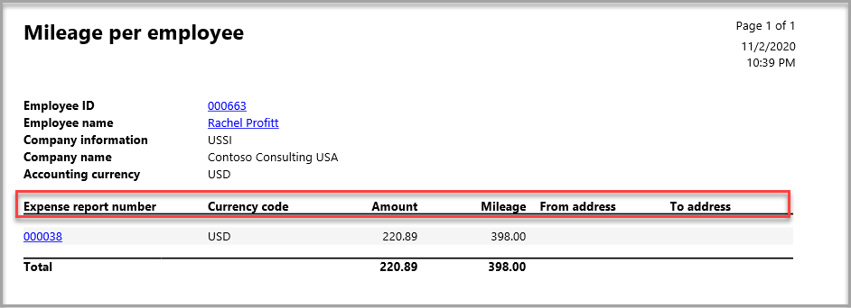

تحتوي الوحدة النمطية لإدارة المصروفات على العديد من خيارات إعداد التقارير والاستعلام.The Expense management module has numerous inquiry and reporting options. يمكن العثور على التقارير في **إدارة المصروفات > الاستعلامات والتقارير**.The reports can be found in **Expense management > Inquiries and reports**. عندما تقوم ببدء تشغيل تقرير، يتم عرض صفحة بحيث يمكنك تحديد معايير التقرير.When you launch a report, you are presented with a page where you can select the report criteria.  

بالنسبة للتقارير الواردة في هذه الوحدة، سيتوفر لديك خيار تصفية البيانات لإنتاج تقرير مخصص لما تبحث عنه.For the reports that are mentioned in this unit, you will have the option to filter the data to produce a report that is specific to what you are looking for. يوضح المثال التالي خيارات التصفية **لتقرير المصروفات الشخصية**.The following example demonstrates the filtering options for the **Personal expenses report**. 

1.  قم بتوسيع علامة التبويب السريعة **السجلات المطلوب تضمينها**.Expand the **Records to include** FastTab.
 
    

2.  من الرمز **عامل التصفية**، حدد **معايير** التقرير.From the **Filter** icon, select the report **Criteria**.

    

## تقرير المصروفات الشخصيةPersonal expenses report
يعرض تقرير **المصروفات الشخصية** المصروفات الشخصية التي يتم إدخالها بواسطة أحد الموظفين في تقرير المصروفات.The **Personal expenses** report shows you the personal expenses that are entered by an employee on an expense report. يمكنك التصفية حسب **رقم تقرير المصروفات** في منطقة التصفية **السجلات المطلوب تضمينها**.You can filter by **Expense report number** in the **Records to include** filter area.

## تقرير المصروفات مع التواريخ التي تم تصحيحهاExpense reports with corrected dates report
يعثر تقرير **تقارير المصروفات بالتاريخ الصحيح** على تقارير المصروفات التي تم تحرير التواريخ بها.The **Expense reports with corrected dates** report finds expense reports where the dates have been edited. يمكنك تشغيل التقرير لنطاق تاريخ والتصفية حسب **رقم تقرير المصروفات** في منطقة التصفية **السجلات المطلوب تضمينها**.You can run the report for a date range and filter by **Expense report number** in the **Records to include** filter area.

يحتوي إخراج التقرير على معلومات البند ورأس تقرير المصروفات، مع الأعمدة الإضافية **لتاريخ الحركة الأصلي** و **تاريخ التصحيح**، كما هو موضح في لقطة الشاشة التالية.The report output has the expense report header and line information, with additional columns for the **Original transaction date** and the **Date of correction**, as shown in the following screenshot.

## تقرير الحركات المرحلةPosted transactions report
ويقوم تقرير **الحركات المرحلة** بالبحث عن حركات المصروفات المرحلة.The **Posted transactions** report finds posted expenses transactions. يمكنك تشغيل التقرير لنطاق تاريخ والتصفية حسب **رقم تقرير المصروفات** أو **عدد الموظفين** أو **تاريخ الترحيل** في منطقة التصفية **السجلات المطلوب تضمينها**.You can run the report for a date range and filter by **Expense report number**, **Personnel number**, or **Posted date** in the **Records to include** filter area.

## تقرير المصروفات مع تقرير استرداد الضريبةExpense report with tax recovery report
يقوم تقرير **تقرير المصروفات باسترداد الضريبة** بالبحث عن المصروفات المستحقة لاسترداد الضريبة لبلد/منطقة محددة.The **Expense report with tax recovery** report finds expenses that are eligible for tax recovery for a selected country/region. يمكنك تشغيل التقرير حسب **حاله استرداد الضريبة** و/أو **البلد/المنطقة** في منطقه التصفية **السجلات المطلوب تضمينها**.You can run the report by **Tax recovery status** and/or **Country/region** in the **Records to include** filter area.

## تقرير أنواع المصروفات لكل موظفExpense types per employee report
يقوم تقرير **أنواع المصروفات لكل موظف** بالبحث عن المصروفات استنادا إلى نوع المصروفات الذي تم إدخاله بواسطة الموظفين.The **Expense types per employee** report finds expenses based on the expense type that was entered by employees. يمكنك تشغيل التقرير حسب **رقم تقرير المصروفات** و **فئة المصروفات** و **الكيان القانوني** في منطقة التصفية **السجلات المطلوب تضمينها**.You can run the report by **Expense report number**, **Expense category**, and **Legal entity** in the **Records to include** filter area.

يتضمن إخراج التقرير معلومات الرأس التالية:The report output includes the following header information:

- **رقم الموظف****Personnel number**
- **اسم العامل****Worker name**
- **معلومات الشركة** (الكيان القانوني)**Company information** (legal entity)
- **عملة المحاسبة****Accounting currency**

يتضمن إخراج التقرير معلومات البند التالية، استنادا إلى ما أرسله الموظف:The report output includes the following line information, based on what the employee submitted: 

- **رقم تقرير المصروفات****Expense report number**
- **فئة المصروفات****Expense category**
- **نوع المصروفات****Expense type**
- **‏رمز العملة****Currency code**
- **المبلغ****Amount**

## تقرير إحصاءات على مجموعات التكاليفStatistics on cost groups report
يعرض تقرير **الإحصائيات الموجودة في مجموعات التكاليف** مبالغ المصروفات المصنفة حسب مجموعة التكلفة.The **Statistics on cost groups** report shows you expense amounts categorized by cost group. يمكنك تشغيل التقرير حسب **رقم تقرير المصروفات** و **مجموعة الإحصاءات** في منطقة التصفية **السجلات المطلوب تضمينها**.You can run the report by **Expense report number** and **Statistics group** in the **Records to include** filter area.

يتضمن إخراج التقرير معلومات الرأس التالية:The report output includes the following header information:

- **رقم الموظف****Personnel number**
- **اسم العامل****Worker name**
- **معلومات الشركة** (الكيان القانوني)**Company information** (legal entity)
- **عملة المحاسبة****Accounting currency**

يتضمن إخراج التقرير معلومات البند التالية، استنادا إلى ما أرسله الموظف:The report output includes the following line information, based on what the employee submitted: 

- **رقم تقرير المصروفات****Expense report number**
- **مجموعة الإحصائيات****Statistics group**
- **‏رمز العملة****Currency code**
- **التكلفة حسب المجموعة****Cost per group**

## تقرير مسافة بالميل لكل موظفMileage per employee report
يعرض التقرير **المسافة المقطوعة لكل موظف** المقدار الذي تم إدخاله بواسطة الموظفين.The **Mileage per employee** report shows you the mileage that was entered by employees. يمكنك تشغيل التقرير حسب **العامل** أو **فئة المصروفات** أو **رقم تقرير المصروفات** في منطقة التصفية **السجلات المطلوب تضمينها**.You can run the report by **Worker**, **Expense category**, or **Expense report number** in the **Records to include** filter area.

يتضمن إخراج التقرير معلومات الرأس التالية:The report output includes the following header information:

- **معرف الموظف****Employee ID**
- **اسم الموظف****Employee name**
- **معلومات الشركة** (الكيان القانوني)**Company information** (legal entity)
- **عملة المحاسبة****Accounting currency**

يتضمن إخراج التقرير معلومات البند التالية، استنادا إلى ما أرسله الموظف:The report output includes the following line information, based on what the employee submitted: 

- **رقم تقرير المصروفات****Expense report number**
- **‏رمز العملة****Currency code**
- **المبلغ****Amount**
- **المسافة بالميل****Mileage**
- **العناوين من وإلى****To and From addresses**
 

## تقرير المصروف اليومي لكل موظفPer diem per employee report
يعرض لك تقرير **المصروفات اليومية لكل موظف** العديد من المصروفات التي يتم منحها لأحد الموظفين خلال فترة زمنية أو تقرير مصروفات محدد.The **Per diem per employee** report shows you the various per diems that are given to an employee over a period of time or on a specific expense report. يمكنك تشغيل التقرير حسب **تاريخ بداية المصروفات** و **تاريخ نهاية المصروفات** و **رقم تقرير المصروفات** و **فئة المصروفات** في منطقة التصفية **السجلات المطلوب تضمينها**.You can run the report by **Per diem from date**, **Per diem to date**, **Expense report number**, and **Expense category** in the **Records to include** filter area.

يتضمن إخراج التقرير معلومات الرأس التالية:The report output includes the following header information:

- **رقم الموظف****Personnel number**
- **اسم العامل****Worker name**
- **معلومات الشركة** (الكيان القانوني)**Company information** (legal entity)
- **عملة المحاسبة****Accounting currency**

يتضمن إخراج التقرير معلومات البند التالية، استنادا إلى ما أرسله الموظف:The report output includes the following line information, based on what the employee submitted: 

- **رقم تقرير المصروفات****Expense report number**
- **فئة المصروفات****Expense category**
- **الموقع****Location**
- **‏رمز العملة****Currency code**
- **المبلغ****Amount**

## تقرير تقادم الموردVendor aging report
يعرض تقرير **فترة تقادم المورد** الأرصدة المستحقة للموردين، والتي تم فرزها حسب فتره التاريخ أو تعريف فتره التقادم.The **Vendor aging** report displays the balances that are due to vendors, sorted by date interval or by aging period definition.

يوفر قسم **المعلمات** الخاص بتحديد المعايير طرقا عديدة لتشغيل هذا التقرير.The **Parameters** section of the criteria selection provides numerous ways to run this report. تحدد القائمة التالية الإجراء الذي يمثله كل حقل:The following list defines what each field represents:

- **فتره التقادم بدءا من** - أدخل التاريخ الموجود في الفاصل الزمني الأول أو فترة التقادم ليتم تضمينها في التقرير.**Aging as of** - Enter a date that is in the first-period interval or aging period to include on the report.
- **الرصيد بدءا من** - أدخل التاريخ المطلوب عرض أرصدة الموردين له.**Balance as of** - Enter the date to view the vendor balances for.
- **المعايير** - حدد نوع التاريخ الذي سيتم إنشاء التقرير فيه.**Criteria** - Select a date type to base the report on.
    - **تاريخ الحركة** - تاريخ الترحيل للحركات، على سبيل المثال، تاريخ الفاتورة الذي يمثل أساس حساب تاريخ الاستحقاق.**Transaction date** – The posting date of the transactions, for example, an invoice date that is the basis for the calculation of the due date.
    - **تاريخ الاستحقاق** – تاريخ استحقاق الحركات، استنادا إلى شروط الدفع.**Due date** – The due date of the transactions, based on the terms of payment.
    - **تاريخ المستند** – تاريخ مستند معرف من قبل المستخدم يمثل أساس حساب تاريخ الاستحقاق.**Document date** – A user-defined document date that is the basis for the calculation of the due date.
- **فترة التقادم** - حدد تعريف فترة التقادم.**Aging period** - Select an aging period definition. 
    - لا يتم استخدام حقل **الفترة** إذا قمت بتحديد تعريف فترة تقادم.The **Interval** field is not used if you select an aging period definition.
    - لا يمكن استخدام تعريفات فترات التقادم التي تحتوي على أكثر من ست فترات تقادم (أعمدة) في التقرير المطبوع.Aging period definitions that have more than six aging periods (columns) cannot be used on the printed report.
- **العملة** - حدد العملة المراد عرضها في التقرير.**Currency** - Select the currency to be displayed on the report.
    - **عملة المحاسبة** - العملة التي يستخدمها الكيان القانوني لحسابات المبالغ.**Accounting currency** - The currency that your legal entity uses for amount calculations.
    - **عمله التقارير** - العملة المستخدمة لإعداد تقارير العملية.**Reporting currency** - The currency that is used for operational reporting.
- **طباعة وصف فترة التقادم****Print aging period description** 
    - حدد **نعم** لتضمين أوصاف فترات التقادم أعلى كل عمود فترة تقادم في التقرير.Select **Yes** to include aging period descriptions at the top of each aging period column on the report. 
    - حدد **لا** لطباعة التقرير بدون رؤوس الأعمدة.Select **No** to print the report without column headers.
- **الفاصل الزمني** - تحديد الفترة المقرر استخدامها من خلال إدخال عدد وحدات اليوم أو الشهر في كل فترة.**Interval** - Define the period to use by entering the number of the day or month units in each period. 
      على سبيل المثال، قد تقوم بإدخال **15** وتحديد **يوم** في الحقل **اليوم/الشهر** لعرض معلومات فترة التقادم على فترات تبلغ 15 يوماً في التقرير.For example, you might enter **15** and select **Day** in the **Day/Mth** field to show aging information at intervals of 15 days on the report. وبدلا من ذلك، لعرض معلومات فترة التقادم حسب الشهر، أدخل **1** في هذا الحقل، ثم حدد **شهر** في الحقل **اليوم/الشهر**Alternatively, to show aging information by month, enter **1** in this field and then select **Month** in the **Day/Mth** field.
- **اليوم/الشهر** - يتم استخدام المعلومات المدخلة فقط إذا لم تقم بتحديد تعريف فترة تقادم.**Day/Mth** - The entered information is used only if you have not selected an aging period definition.
      حدد إما **يوم** أو **شهر** لتحديد الفترة في حقل **الفاصل الزمني**.Select either **Day** or **Month** to define the period in the **Interval** field.
- **اتجاه الطباعة** - حدد ما إذا كان سيتم حساب الأرصدة وطباعة تقرير فترة التقادم للفترات الماضية أو المستقبلية، بالنسبة للتاريخ المحدد في الحقل **الرصيد اعتبارا من**.**Printing direction** - Select whether to calculate balances and print the aging report for past or future periods, relative to the date that is selected in the **Balance as of** field. 
    - حدد **للخلف** لإظهار معلومات حول الفترات الماضية.Select **Backward** to show information for past periods. 
    - حدد **للأمام** لإظهار معلومات حول الفترات المستقبلية.Select **Forward** to show information for future periods.
- **التفاصيل** - حدد خانة الاختيار هذه لسرد الحركات المضمنة في الأرصدة المعروضة في التقرير.**Details** - Select this check box to list the transactions that are included in the balances shown in the report.
- **تضمين المبالغ بعملة الحركة** - حدد خانة الاختيار هذه لتضمين المبالغ بعملة الحركة.**Include amounts in transaction currency** - Select this check box to include the amounts in the transaction currency.
- **الرصيد السالب** - حدد خانة الاختيار هذه لتضمين الأرصدة السالبة.**Negative balance** - Select this check box to include negative balances.
- **استبعاد الحسابات ذات الرصيد الصفري** - حدد خانة الاختيار هذه لاستبعاد الموردين الذين لديهم رصيد صفري.**Exclude zero balance accounts** - Select this check box to exclude vendors who have a zero balance.
- **تحديد موضع الدفع** - حدد خانة الاختيار هذه لتضمين المدفوعات التي لم تتم تسويتها.**Payment positioning** - Select this check box to include payments that are are not settled. يتم عرض هذه المدفوعات في العمود الأول من التقرير.These payments are displayed in the first column of the report.
يمكنك تشغيل التقرير حسب **حساب المورد والمجموعة** في منطقة التصفية **السجلات المطلوب تضمينها**.You can run the report by **Vendor account and Group** in the **Records to include** filter area.

يعرض تقرير فترة تقادم المورد معلومات الرأس التالية:The Vendor aging report displays the following header information:

- **اسم الشركة****Company name**
- **عملة المحاسبة****Accounting currency**

يعرض إخراج التقرير معلومات السطر التالية:The report output displays the following line information:

- **الحساب، الاسم****Account, Name**
- **مجموعة الموردين****Vendor group**
- **الرصيد اعتباراً من****Balance as of**
- **حالي****Current**
- **30 يوماً****30 days**
- **60 يوماً****60 days**
- **90 يوماً****90 days**
- **180 وأكثر****180 and over**

## تقرير ملخص طلب السفرTravel requisition summary report

يعرض تقرير **ملخص طلبات السفر** طلبات السفر.The **Travel requisition summary** report shows travel requisitions. يمكنك تشغيل التقرير حسب **التاريخ** و **اسم العامل** و **حالة الموافقة** في منطقة التصفية **السجلات المطلوب تضمينها**.You can run the report by **Date**, **Worker name**, and **Approval status** in the **Records to include** filter area.

يعرض ناتج التقرير معلومات السطر التالية للطلبات التي تمت معالجتها:The output of the report displays the following line information for processed requisitions:

- **اسم العامل****Worker name**
- **رقم طلب السفر****Travel requisition number**
- **الكيانات القانونية****Legal entities**
- **التاريخ‬****Date**
- **الغرض من المصروفات****Expense purpose**
- **التقدير الإجمالي****Total estimate**
- **عملة المحاسبة****Accounting currency**
- **حالة الموافقة****Approval status**
- **حالة التسوية****Reconciliation status**

