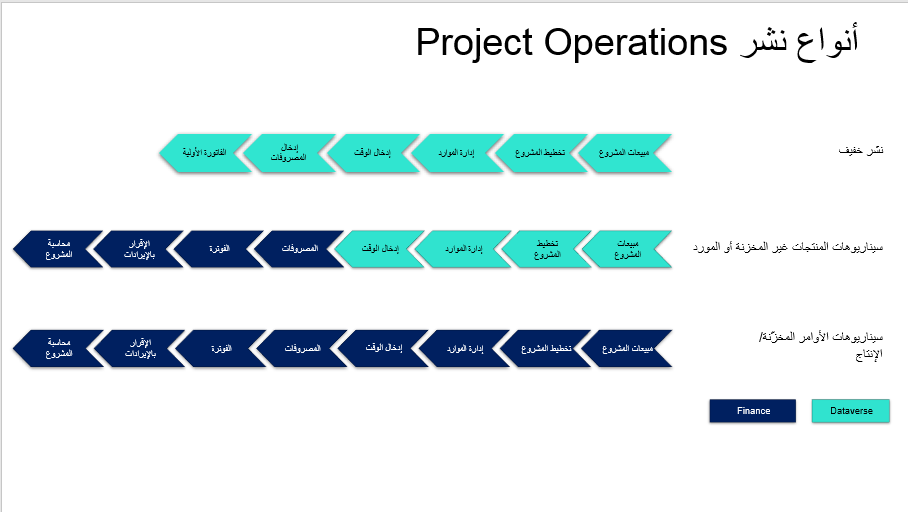

يدعم Microsoft Dynamics 365 Project Operations خيارات نشر متعددة لتتطابق مع متطلباتك. سواء كنت من عملاء Dynamics 365 الحاليين أو الجدد، بإمكان Project Operations دعم احتياجاتك.

> [!div class="mx-imgBorder"]
> 

لمزيد من المعلومات، راجع [أنواع النشر - تعلم | Microsoft Docs](/learn/modules/get-started-project-operations/4-deployment/?azure-portal=true).

## Project Operations للسيناريوهات القائمة على الموارد أو غير المخزنة

يتم نشر Project Operations للسيناريوهات المستندة إلى الموارد أو غير المخزنة من خلال [Microsoft Dynamics 365 Lifecycle Services](https://lcs.dynamics.com/?azure-portal=true) وتستخدم الكتابة المزدوجة لتوصيل الأنظمة.

> [!div class="mx-imgBorder"]
> 

## التوزيع الخفيف - التعامل مع الفواتير الأولية

يتم النشر المخفف من خلال مركز إدارة [Microsoft Power Platform](https://admin.powerplatform.com?azure-portal=true).

> [!div class="mx-imgBorder"]
> 

## Project Operations للسيناريوهات المستندة إلى المنتجات المخزنة أو الإنتاج

يتم نشر Project Operations للسيناريوهات المخزنة أو المستندة إلى الإنتاج من خلال [Microsoft Dynamics 365 Lifecycle Services](https://lcs.dynamics.com/?azure-portal=true).

> [!div class="mx-imgBorder"]
> 
