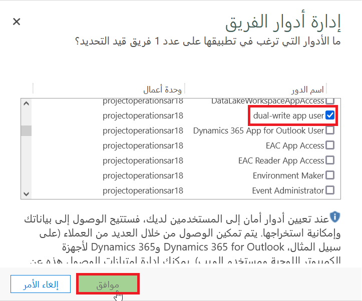

حدد سيناريو Project Operations للمورد أو غير المخزن إذا كنت جديداً في Project Operations وإذا لم تقم بنشر تطبيقات Finance and Operations وتطبيقات Microsoft Dynamics 365 Customer Engagement.

عملية نشر Project Operations لسيناريو مورد أو غير مخزّن كما يلي:

1. استرداد اشتراكات البرامج لـ:

    - Project Operations‏ (CRM)
    - Office 365 Project Operations
    - تطبيقات Finance and Operations
    - تعيين التراخيص للمستخدمين
    - سجل للاشتراك في Microsoft Azure

1. توفير بيئة Finance and Operations:

    - قم بإنشاء مشروع جديد في Lifecycle Services
    - يوافق المسؤول على اشتراك Azure
    - قم بتكوين التحكم في الوصول إلى Azure
    - أضف Azure Connector إلى مشروع Lifecycle Services
    - نشر بيئة Finance and Operations
     
1. إجراءات ما بعد النشر:
    - قم بتأسيس اتصال ثنائي الكتابة.
    - تحديث إعدادات الأمان في بيئة Project Operations.
    - تكوين خرائط جدول ثنائية الكتابة وتشغيلها.
    - استيراد بيانات التكوين والعروض التوضيحية (هذه الخطوة اختيارية.)

## استرداد اشتراكات البرامج

لتحسين تجربة التعلم الخاصة بك في هذه الوحدة، يمكنك الوصول إلى بيئة تجريبية لـ Project Operations عن طريق تحديد **البدء** في الزاوية العلوية اليمنى من صفحة [Dynamics 365 Project Operations](https://dynamics.microsoft.com/project-operations/overview/?azure-portal=true).

## توفير بيئة Finance and Operations

شاهد الفيديو التالي للحصول على عرض توضيحي لكيفية توفير بيئة Finance and Operations باستخدام خدمات دورة الحياة.

> [!VIDEO https://www.microsoft.com/videoplayer/embed/RWzk1O]

## قم بتأسيس اتصال ثنائي الكتابة

يتم إجراء الاتصال تلقائياً عند استخدام Lifecycle Services لنشر Finance and Operations التي تتضمن نشر بيئة Dataverse.

> [!div class="mx-imgBorder"]
> 

يمكنك أيضاً إعداد اتصال الكتابة المزدوجة يدوياً باستخدام معالج في Finance and Operations.

شاهد الفيديو التالي للحصول على عرض توضيحي لكيفية إعداد اتصال الكتابة المزدوجة باستخدام المعالج.

> [!VIDEO https://www.microsoft.com/videoplayer/embed/RWzk24]

## تحديث إعدادات الأمان في بيئة Project Operations

يتطلب **مستخدم التطبيق ثنائي الكتابة** امتيازات **قراءة** و **إلحاق بـ** التي تم تعيينها لـ تنظيم الجداول التالية:

- جدول الحسابات

- نوع سعر صرف العملات

- التقويم المالي

- دفتر الأستاذ

> [!div class="mx-imgBorder"]
> 

يتطلب الفريق الافتراضي تعيين الدور **مستخدم التطبيق ثنائي** الكتابة.

> [!div class="mx-imgBorder"]
> 

شاهد الفيديو التالي للحصول على عرض توضيحي لكيفية تحديث إعدادات الأمان.

> [!VIDEO https://www.microsoft.com/videoplayer/embed/RWzdRL]

## تكوين خرائط جدول ثنائية الكتابة وتشغيلها

لتكوين خرائط الكتابة المزدوجة وتشغيلها، اتبع الخطوات التالية:

1. في صفحة **الكتابة المزدوجة** في Finance and Operations، في مربع **بحث** (الزاوية العلوية اليمنى)، أدخل **دقة المشروع** لتضييق نطاق النتائج.

1. حدد **أدوار موارد المشروع لجميع الشركات (فئات الموارد القابلة للحجز)**، ثم حدد **تشغيل**.

1. في جزء **عمليات الكتابة الأولية وخريطة (خرائط) الجدول ذات الصلة**، تأكد من أن تم مسح خانة **المزامنة الأولية**.

1. حدد **تشغيل**.

شاهد مقطعي الفيديو التاليين للحصول على عروض توضيحية حول كيفية تكوين خرائط جدول الكتابة المزدوجة وتشغيلها.

> [!VIDEO https://www.microsoft.com/videoplayer/embed/RWzdRM]

> [!VIDEO https://www.microsoft.com/videoplayer/embed/RWzdRO]

## استيراد التكوين والبيانات التجريبية

تكوين الاستيراد والبيانات التجريبية اختيارية.

يمكنك اختيارياً استيراد بيانات Microsoft التجريبية إلى بيئتك بحيث يكون لديك بيانات لاستخدامها عند ممارسة التمارين. اتبع هذه الخطوات:

1. افتح علامة تبويب جديدة في متصفح الويب الخاص بك، وانسخ الارتباط التالي في مربع عنوان الويب، ثم اضغط على **Enter** مفتاح: [https://aka.ms/AAbf3j5](https://aka.ms/AAbf3j5/?azure-portal=true)

1. في الجزء السفلي من الشاشة، حدد علامة القطع (**...**) ثم حدد **إظهار في المجلد**.

1. انقر بزر الماوس الأيمن فوق ملف.zip ثم حدد **استخراج الكل...**

1. في مربع الحوار **استخراج المجلدات المضغوطة (المضغوطة)**، قم بإلغاء تحديد خانة الاختيار **إظهار الملفات المستخرجة عند الاكتمال** ثم حدد **استخراج**.

1. في نافذة **File Explorer** الجديدة انقر مرتين فوق ملف **DataMigrationUtility.exe**.

1. في نافذة **ترحيل التهيئة**، حدد **استيراد البيانات** ثم حدد **متابعة**.

1. في نافذة **تسجيل الدخول** حدد **Office 365**، وتأكد من أن **إظهار خيارات متقدمة** تم تحديد خانة الاختيار، أكمل النموذج، ثم حدد **تسجيل الدخول**.

1. في المربع **ملف مضغوط** حدد علامة القطع (**...**)، حدد **SampleSetupAndConfigData.zip** ملف، ثم حدد **فتح**.

1. في نافذة **ترحيل التهيئة** حدد **استيراد البيانات**. ستستغرق عملية الاستيراد ثلاث دقائق تقريباً حتى تكتمل.

شاهد الفيديو التالي للحصول على عرض توضيحي لكيفية استيراد بيانات التكوين والعروض التوضيحية.

> [!VIDEO https://www.microsoft.com/videoplayer/embed/RWzdRQ]
