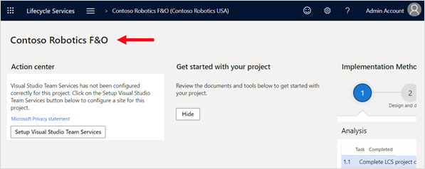
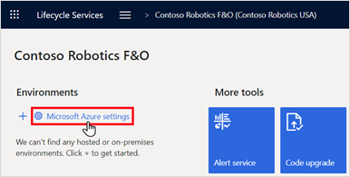
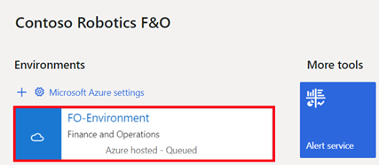
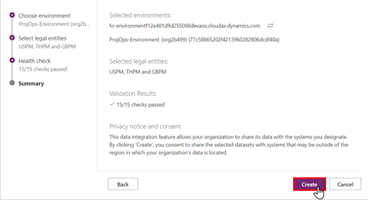
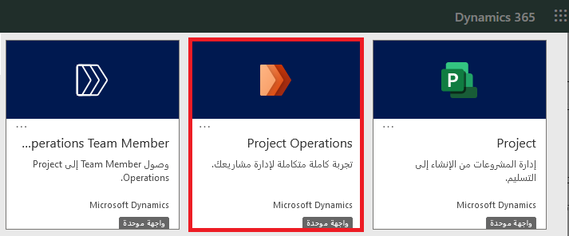

في هذا التمرين، ستقوم بتوفير بيئة مستضافة على السحابة المالية والعمليات باستخدام Microsoft Dynamics Lifecycle Services. ستكون مهمتك الأولى هي إنشاء مشروع جديد في Lifecycle Services، ثم منح موافقة المسؤول على اشتراك Azure.

بعد ذلك، ستقوم بتكوين عنصر التحكم في الوصول إلى اشتراك Azure وإضافة موصل Azure إلى مشروع Lifecycle Services. بعد ذلك، ستقوم بنشر بيئة التمويل والعمليات.

## سجّل الدخول وأنشئ مشروعًا جديدًا في Lifecycle Services

في هذه المهمة، ستقوم بتسجيل الدخول إلى Lifecycle Services وإنشاء مشروع جديد.

1. افتح علامة تبويب جديدة في مستعرض الويب الخاص بك في وضع **InPrivate** أو **Incognito**. في حقل عنوان الويب، أدخل [**lcs.dynamics.com**](https://lcs.dynamics.com/?azure-portal=true)، ثم اضغط على المفتاح **Enter**.

1. في صفحة ويب **Lifecycle Services**، حدد **تسجيل الدخول**.

1. في صفحة **Lifecycle Services**، حدد **قبول**.

1. ضمن قسم **المشاريع الأخيرة**، حدد زر علامة الجمع (**+)**.

1. في جزء **ما الغرض من هذا المشروع**، حدد **الترحيل وإنشاء الحلول والتعلم**.

1. في جزء **إنشاء مشروع**، أكمل الإعدادات التالية، ثم حدد **إنشاء**.

    - **الاسم** - شركة Contoso Robotics F&O

    - **اسم المنتج** و **إصدار المنتج** - التمويل والعمليات

    - **المجال** - خدمات احترافية

    - **المنهجية** - منهجية التنفيذ

    في صفحة مدخل **Lifecycle Services**، يتم عرض اسم المشروع أعلى الجانب الأيسر.

    > [!div class="mx-imgBorder"]
    > 

## منح موافقة المسؤول على اشتراك Microsoft Azure

في هذه المهمة، ستقوم بتكوين إعدادات Microsoft Azure لمنح موافقة المسؤول لـ Dynamics 365 Deployment Services.

1. في صفحة **Contoso Robotics F&O**، قم بالتمرير إلى اليمين، وضمن قسم **البيئات**، حدد **إعدادات Microsoft Azure**.

1. في صفحة **إعدادات المشروع**، ضمن قسم **قائمة المؤسسات**، حدد **تخويل**.

1. في صفحة **منح موافقة المسؤول**، حدد **تخويل**.

1. في نافذة **حساب** **Microsoft**، حدد حساب المستخدم الخاص بك.

1. في مربع الحوار **الإذن المطلوب**، راجع المعلومات ثم حدد **قبول**.

1. في صفحة **منح موافقة المسؤول**، انتظر حتى يتم عرض رسالة **اكتمل التخويل**.

1. اضغط على المفتاح **F5** لتحديث الحالة، ثم حدد **اسم المشروع** للعودة إلى صفحة **المشروع**.

## تكوين عنصر التحكم في الوصول إلى اشتراك Microsoft Azure

في هذه المهمة، ستنتقل إلى مدخل Azure وتعين حسابك ودور مساهم حساب Dynamics Deployment Services لاشتراك Azure الخاص بك.

1. قم بالتبديل إلى علامة تبويب مستعرض الويب إلى صفحة **اشتراكات Azure**.

1. في صفحة **الاشتراكات**، حدد اسم الاشتراك الخاص بك.

1. من جزء التنقل، حدد **عنصر تحكم الوصول (IAM)**، وحدد **+ إضافة**، ثم حدد **إضافة تعيين دور**.

1. في جزء **إضافة تعيين الدور**، في قائمة **الدور**، حدد **المساهم**. في المربع **تحديد**، أدخل **Dynamics**، وحدد **Dynamics Deployment Services [wsfed-enabled]**، ثم حدد **حفظ**.

1. كرر الخطوتين 3 و4 باستخدام **حساب المسؤول**.

1. أغلق علامة تبويب مستعرض الويب لمدخل Azure.

## إضافة موصل Azure إلى مشروع Lifecycle Services

في هذه المهمة، ستضيف موصل Azure الذي سيتم استخدامه لنشر بيئة المالية والعمليات على Azure.

1. قم بتبديل علامة تبويب متصفح الويب إلى صفحة **مشروع** **Lifecycle Services**.

1. في صفحة **Contoso Robotics F&O**، قم بالتمرير إلى قسم **البيئات**، وحدد **إعدادات Microsoft Azure**.

    > [!div class="mx-imgBorder"]
    > 

1. في صفحة **إعدادات المشروع**، ضمن **موصلات Azure**، حدد **+ إضافة**.

1. في جزء **إعداد Microsoft Azure**، أكمل الإعدادات التالية، ثم حدد **التالي**.

    - **الاسم** - موصل Azure

    - **معرف اشتراك Azure** - انسخ والصق معرف اشتراك Azure الذي قمت بحفظه مسبقاً في المفكرة

    - **تكوين لاستخدام Azure Resource Manager ‏(ARM)** - نعم

1. في جزء **إعداد Microsoft Azure**، تأكد من عرض علامة الاختيار **صالح**، ثم حدد **التالي**.

1. في جزء **إعداد Microsoft Azure**، حدد **التالي**.

1. في جزء **إعداد Microsoft Azure**، في قائمة **مناطق Azure**، حدد منطقة، ثم حدد **اتصال**.

1. في صفحة **إعدادات المشروع**، راجع اتصال Azure.

1. في صفحة **إعدادات المشروع**، حدد **Lifecycle Services**.

## تمكين التوفير التلقائي لـ Project Operations

في هذه المهمة، ستقوم بتمكين تدفق التوفير التلقائي لـ Project Operations لمشروع Lifecycle Services الخاص بك.

1. في صفحة **Lifecycle Services**، حدد **معاينة إدارة الميزات**.

1. في صفحة **معاينة إدارة الميزات**، حدد **ميزة Project Operations**، ثم تأكد من تعيين **تمكين معاينة الميزة** إلى **نعم**.

1. حدد **Lifecycle Services** للعودة إلى صفحة **Lifecycle Services** الرئيسية.

## توفير التمويل والعمليات وبيئات Project Operations

في هذه المهمة، ستضيف بنية جديدة في مدخل Lifecycle Services لنشر التمويل والعمليات في بيئة مستضافة على السحابة لجهاز Azure الظاهري. في الوقت نفسه، ستقوم بتكوين الإعدادات لنشر مستأجر Project Operations.

1. في صفحة **Lifecycle Services** الرئيسية، حدد اسم مشروعك.

1. ضمن قسم **البيئات**، حدد علامة الجمع (**+**).

1. في جزء **تحديد التطبيق وإصدار النظام الأساسي**، أكمل الإعدادات ثم حدد **التالي**.

    - **إصدار التطبيق** - ‏10.0.18 أو إصدار أعلى

    - **إصدار النظام الأساسي** - تحديث النظام الأساسي

1. في جزء **تحديد طوبولوجيا البيئة** حدد **DEVTEST**.

1. حدد **التمويل والعمليات - قم بتطوير (10.0.18 مع تحديث المنصة 39)** أو أعلى.

1. في جزء **نشر البيئة**، في مربع **اسم البيئة**، أدخل **بيئة FO**، ثم حدد **إعدادات متقدمة**.

1. في جزء **إعدادات النشر**، حدد **تخصيص** **تكوين قاعدة بيانات SQL**. في قائمة **AX قاعدة البيانات (الجهاز الظاهري للمطور)**، حدد **العرض التوضيحي**.

1. في جزء **إعدادات النشر**، حدد **Dataverse**، أكمل الإعدادات التالية، ثم حدد **تم**.

    - **تكوين بيئة Microsoft Power Platform** - نعم

    - **قالب Microsoft Power Platform** - ‏Project Operations

    - **أوافق** - حدد خانة الاختيار 

1. في جزء **نشر البيئة**، في قائمة **أحجام** الأجهزة الظاهرية، حدد **E2 v3**، وحدد خانة اختيار الاتفاقية، ثم حدد **التالي**.

1. في مربع الحوار **هل أنت متأكد من أنك تريد النشر؟**، حدد **نشر**.

1. في صفحة **Contoso Robotics F&O**، ضمن قسم **البيئات**، لاحظ أن الحالة تكون **في قائمة الانتظار**.

    > [!div class="mx-imgBorder"]
    > 

    > [!NOTE]
    > قد يستغرق نشر التمويل والعمليات أكثر من سبع ساعات حتى يكتمل. اضغط على المفتاح F5 بشكل دوري لتحديث الحالة.

1. عندما تُظهر الحالة **تم النشر**، حدد اسم البيئة لمراجعة تفاصيل النشر.

1. في صفحة تفاصيل **بيئة FO**، لتأكيد نشر البيئة بنجاح، حدد **تسجيل الدخول** و **تسجيل الدخول إلى البيئة** لتأكيد أنها قيد التشغيل.

## قم بتأسيس اتصال ثنائي الكتابة

في هذه المهمة، ستنشئ اتصالًا مزدوجًا للكتابة بين التمويل والعمليات وProject Operations.

1. في صفحة **التمويل والعمليات** الرئيسية، في قائمة التنقل، حدد **مساحات العمل > إدارة البيانات**.

1. في صفحة **إدارة البيانات**، حدد إطار متجانب **الكتابة المزدوجة**.

1. في صفحة **الكتابة المزدوجة**، قم بتحديد **ارتباط جديد إلى البيئة**.

    > [!NOTE]
    > إذا كان لديك بالفعل بيئة ممكّنة للكتابة المزدوجة، فانتقل إلى الخطوة 8.

1. في صفحة معالج **إعداد الارتباط إلى Dataverse**، ضمن قسم **اختيار البيئة**، حدد **بيئة ProjOps**، ثم حدد **التالي**.

1. ضمن قسم **تحديد الكيانات القانونية**، في قائمة **الكيانات القانونية**، حدد **USPM**، و **THPM**، و **GBPM**، ثم حدد **التالي**.

1. ضمن قسم **التحقق من السلامة‬**، راجع قائمة عمليات التحقق من السلامة، وإذا كنت قد اجتزت **15/15 من عمليات التحقق من السلامة**، فحدد **التالي**.

    إذا لم يكن الأمر كذلك، فستحتاج إلى إصلاح الأخطاء المحددة وإعادة تشغيل معالج **إعداد الارتباط إلى Dataverse**.

1. ضمن قسم **الملخص**، راجع المعلومات، ثم حدد **إنشاء**.

    > [!div class="mx-imgBorder"]
    > 

1. في صفحة **الكتابة المزدوجة**، من شريط القوائم، حدد **تطبيق الحل**.

1. على صفحة **تطبيق الحل** حدد أسماء العرض التالية ثم حدد **تطبيق**.

    - Dynamics 365 Project Operations خرائط كيان الكتابة المزدوجة

    - Dynamics 365 للتمويل والعمليات خرائط الكيانات المزدوجة للكتابة

    يجب أن يستغرق تطبيق الحلول أقل من دقيقة واحدة.

في صفحة **الكتابة المزدوجة**، يجب عرض قائمة بكل التعيينات.

## تحديث إعدادات الأمان في بيئة Project Operations

في هذه المهمة، ستقوم بفتح مركز إدارة Microsoft Power Platform وتحديث إعدادات أمان Dynamics 365 في بيئة Project Operations.

1. افتح علامة تبويب مستعرض ويب جديدة. وفي مربع عنوان الويب، أدخل [**https://admin.powerplatform.microsoft.com**](https://admin.powerplatform.microsoft.com/?azure-portal=true)، ثم اضغط على المفتاح **Enter**.

1. في صفة مركز إدارة Microsoft **Power Platform**، حدد **بيئة ProjOps**، ثم حدد **فتح البيئة**. سيتم فتح علامة تبويب مستعرض ويب جديدة إلى صفحة **تطبيق Dynamics 365**.

1. في صفحة **Dynamics 365**، حدد إطار متجانب **Project Operations**.

    > [!div class="mx-imgBorder"]
    > 

1. في صفحة **Project Operations**، حدد رمز الإعدادات، ثم حدد **إعدادات متقدمة**.

1. في صفحة **إدارة الأعمال**، في قائمة العناوين، حدد السهم الموجود بجوار **الإعدادات**، ثم حدد **الأمان**.

1. في صفحة **الأمان**، حدد **أدوار الأمان**.

1. في صفحة **أدوار الأمان**، حدد **مستخدم تطبيق الكتابة المزدوجة**، الذي سيفتح مستعرض ويب جديداً.

1. في صفحة **دور الأمان: مستخدم تطبيق الكتابة المزدوجة**، حدد علامة التبويب **الكيانات المخصصة**، ثم تأكد من أن الكيانات التالية تم تعيين امتيازات **القراءة** و **الإلحاق بـ**  إلى **المؤسسة** لها.

    - دليل الحسابات

    - نوع سعر صرف العملات

    - التقويم المالي

    - دفتر الأستاذ

    > [!NOTE]
    > حدد الدائرة التي تريد تغييرها بين المستخدم، ووحدة الأعمال، والأصل: وحدات الأعمال الفرعية، والمؤسسة.

1. عند الانتهاء، حدد **حفظ وإغلاق** على شريط القوائم.

1. من علامة التبويب مستعرض الويب، في صفحة **أدوار الأمان**، في قائمة العنوان، حدد **الأمان**.

1. في صفحة **الأمان**، حدد **Teams**.

1. من طريقة عرض **فرق مالكي الأعمال المحلية‬**، حدد اسم الفريق الافتراضي.

1. في صفحة **Teams**، من شريط القوائم، حدد **إدارة الأدوار**.

1. في مربع الحوار **إدارة أدوار الفرق**، حدد خانة الاختيار **مستخدم تطبيق الكتابة المزدوجة**، ثم حدد **موافق**.

1. في صفحة **Teams**، حدد رمز الإعدادات، ثم حدد **خيارات**.

1. في صفحة **تعيين الخيارات الشخصية**، في خانة **المنطقة الزمنية**، حدد **‬‏‫(GMT-08:00) توقيت الباسيفيكي (الولايات المتحدة وكندا)‬‏‫**، ثم حدد **موافق**.

1. في صفحة **Teams**، في شريط العناوين، حدد السهم الموجود بجوار **Dynamics 365**، ثم حدد **Project Operations**.

1. توقف عند هذه النقطة استعداداً للتمرين التالي في الوحدة.
