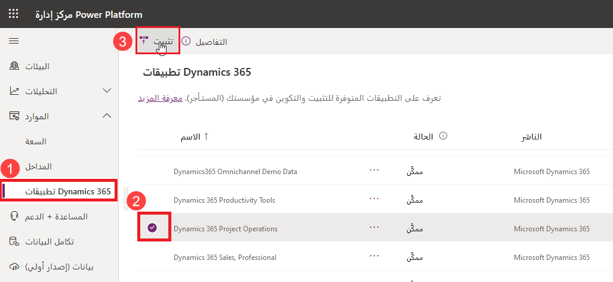
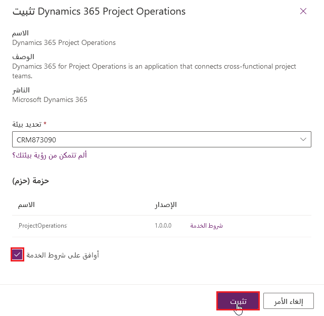
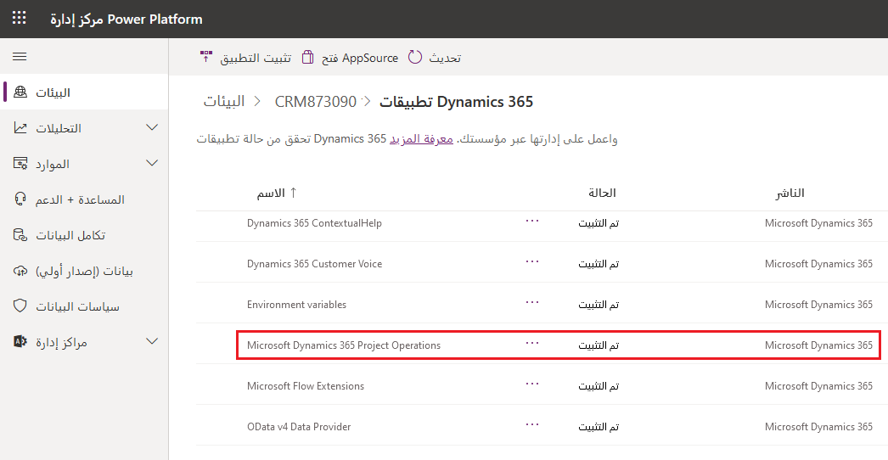
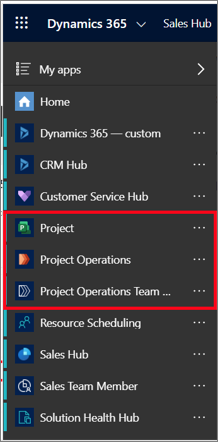

حدد سيناريو النشر الخفيف إذا كنت قد نشرت بالفعل وتستخدم تطبيقات Customer Engagement.

مع سيناريو النشر الخفيف، ستحصل على الإمكانات التالية:

- القدرة على إدارة المبيعات المستندة إلى المشروع مع أنواع أخرى من المبيعات باستخدام القدرات الموجودة في تطبيق Microsoft Dynamics 365 Sales.

- نظام متكامل يدير المشروعات الداخلية والقابلة للفوترة للجداول والماليات من مبيعات المشروع إلى الفوترة.

- نظام تخطيط موارد المؤسسة (ERP)/المحاسبة المالية من مصدر آخر لمساعدتك على التكامل مع Project Operations.

- نظام من مصدر آخر للعمل مع ضرائب المبيعات وأسعار الصرف وتسديدات المصروفات والمصروفات غير المتعلقة بالمشروع.

عملية نشر Project Operations في سيناريو نشر مخفف كالتالي:

1. استرداد اشتراكات البرامج

    - Project Operations‏ (CRM)

    - Office 365 Project Operations

    - تعيين التراخيص للمستخدمين

1. بيئة Dataverse - تثبيت Dynamics 365 Project Operations

1. إجراءات ما بعد النشر - استيراد بيانات التكوين والعروض التوضيحية (اختياري)

## ‏‏تثبيت Dynamics 365 Project Operations

لتثبيت Dynamics 365 Project Operations، اتبع الخطوات التالية:

1. افتح مستعرض ويب وانتقل إلى [مركز إدارة Microsoft Power Platform](https://admin.powerplatform.microsoft.com/?azure-portal=true).

1. حدد **تطبيقات Dynamics 365**.

1. حدد **Microsoft Dynamics 365 Project Operations**.

1. حدد **تثبيت**.

    > [!div class="mx-imgBorder"]
    > 

1. من الجزء الجانبي، حدد البيئة التي تحتوي على تطبيقات Customer Engagement في القائمة المنسدلة **تحديد بيئة**.

    > [!div class="mx-imgBorder"]
    > 

1. حدد خانة الاختيار **أوافق على شروط الخدمة**.

1. حدد **تثبيت**.

1. من صفحة **تطبيقات Dynamics 365**، تحقق من أن حالة **Microsoft Dynamics 365 Project Operations** هي **مثبت**.

    > [!div class="mx-imgBorder"]
    > 

    > [!div class="mx-imgBorder"]
    > 
