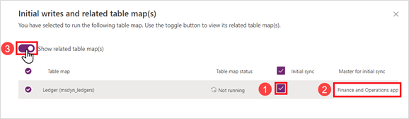
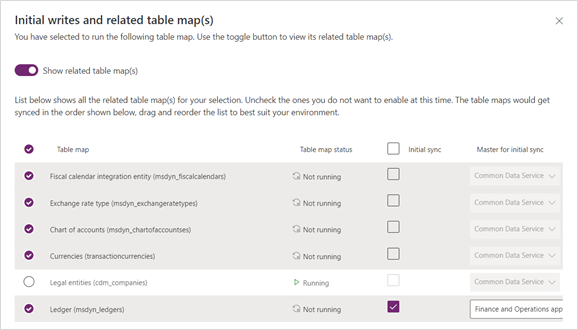
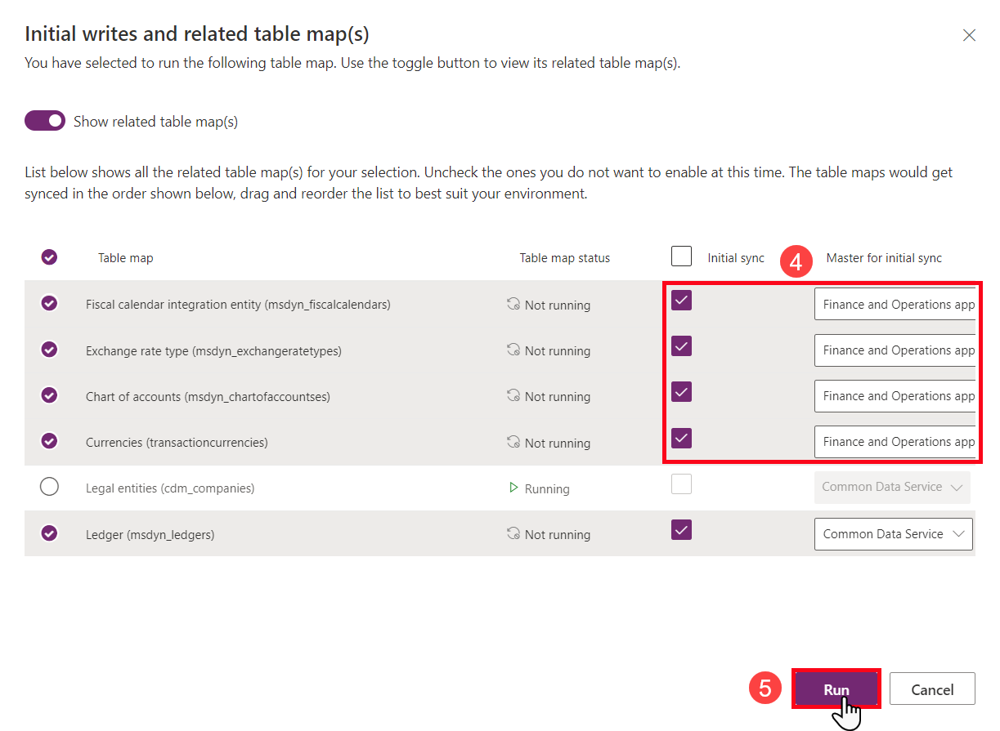

في هذا التمرين، سوف تكمل الإجراءات التالية لتكوين مخططات جداول الكتابة المزدوجة وتشغيلها.

1. عُد إلى صفحة ويب **Finance and Operations >** **الكتابة المزدوجة**.

1. في مربع **البحث** (الزاوية العلوية اليمنى)، أدخل **مورد المشروع** لتضييق النتائج. حدد **أدوار موارد المشروع لجميع الشركات (فئات الموارد القابلة للحجز)**، ثم حدد **تشغيل**.

1. في جزء **عمليات الكتابة الأولية ومخطط (مخططات) الجدول ذي الصلة**، حدد خانة الاختيار **المزامنة الأولية**، وتأكد من تحديد **Dataverse**، ثم حدد **تشغيل**.

1. في صفحة **الكتابة المزدوجة**، انتظر حتى تعرض حالة خريطة الجدول **قيد التشغيل**. قد تستغرق هذه العملية بضع دقائق حتى تكتمل.

1. كرر الخطوات من 2 إلى 4 للجداول التالية.

    > [!NOTE]
    > بالنسبة للإجراءات التي تستخدم تشغيل المتطلبات الأساسية وجدول التحديث، استخدم الإرشادات التي تتبع قائمة مخطط الجدول اللاحقة.

    | خريطة الجدول | تحديث الجدول | المزامنة الأولية | أصل المزامنة الأولية | تشغيل المتطلبات الأساسية | المزامنة الأولية للمتطلبات الأساسية |
    |-----------|---------------|--------------|-------------------------|-------------------|----------------------------|
    | أدوار موارد المشروع لجميع الشركات (فئات الموارد القابلة للحجز) | -- | نعم | Dataverse | -- | -- |
    | الكيانات القانونية (cdm_companies) | -- | نعم | تطبيقات Finance and Operations | -- | -- |
    | دفتر الأستاذ (msdyn_ledgers) | -- | نعم | تطبيقات Finance and Operations | نعم، اتبع التعليمات | نعم، تطبيقات Finance and Operations |
    | القيم الفعلية لتكامل Project Operations ‏(msdyn_actuals) | -- | لا | ‏‫غير متاح | نعم، اتبع التعليمات | لا |
    | شروط تعاقد المشروع (تفاصيل أمر المبيعات) | -- | لا | ‏‫غير متاح | -- | -- |
    | كيان التكامل لعلاقات حركات المشروع (msdyn_transactionconnections) | -- | لا | ‏‫غير متاح | -- | -- |
    | المراحل الرئيسية لشروط عقد تكامل Project Operations ‏(msdyn_contractlinesscheduleofvalues) | -- | لا | ‏‫غير متاح | -- | -- |
    | كيان تكامل Project Operations لتقديرات المصروفات (msdyn_estimateslines) | -- | لا | ‏‫غير متاح | -- | -- |
    | كيان تصدير فئات مصروفات مشروع تكامل Project Operations ‏(msdyn_expensecategories) | -- | لا | ‏‫غير متاح | -- | -- |
    | كيان تصدير مصروفات مشروع تكامل Project Operations ‏(msdyn_expenses) | نعم، اتبع التعليمات | لا | ‏‫غير متاح | -- | -- |
    | كيان تكامل Project Operations لتقديرات الساعات (msdyn_resourceassignments) | نعم، اتبع التعليمات | لا | ‏‫غير متاح | -- | -- |

1. في حالة ظهور مربع الحوار **التأكيد: لم تقم بتمكين أي مخطط (مخططات) جدول ذات صلة في الوقت الحالي. فهل أنت متأكد من أنك تريد المتابعة؟**، فحدد **نعم**.

### تشغيل المتطلبات الأساسية

لتشغيل المتطلبات الأساسية، اتبع الخطوات التالية:

1. ابحث عن مخطط الجدول وحدده، ثم حدد **تشغيل**.

1. في جزء **عمليات الكتابة الأولية ومخطط (مخططات) الجدول ذي الصلة**، قم بتكوين الإعدادات استناداً إلى المعلومات المعروضة في الجدول التالي.

    | خريطة الجدول | تحديث الجدول | 1 المزامنة الأولية | 2 أصل المزامنة الأولية | 3 تشغيل المتطلبات الأساسية | المزامنة الأولية للمتطلبات الأساسية |
    |-----------|---------------|----------------|---------------------------|---------------------|----------------------------|
    | دفتر الأستاذ (msdyn_ledgers) | -- | نعم | تطبيقات Finance and Operations | نعم، اتبع التعليمات | نعم، تطبيقات Finance and Operations |
    | القيم الفعلية لتكامل Project Operations ‏(msdyn_actuals) | -- | لا | ‏‫غير متاح | نعم، اتبع التعليمات | لا |

    > [!div class="mx-imgBorder"]
    > 

    سيتم عرض الجداول ذات الصلة.

    > [!div class="mx-imgBorder"]
    > 

    > [!NOTE]
    > قد يكون لديك مخطط جدول مرتبط تم تكوينه وقيد التشغيل بالفعل.

1. في جزء **عمليات الكتابة الأولية ومخطط (مخططات) الجدول ذي الصلة**، قم بتكوين الإعدادات استناداً إلى المعلومات المعروضة في الجدول التالي، ثم حدد **تشغيل**.

    | خريطة الجدول | تحديث الجدول | المزامنة الأولية | أصل المزامنة الأولية | تشغيل المتطلبات الأساسية | 4 المزامنة الأولية للمتطلبات الأساسية |
    |-----------|---------------|--------------|-------------------------|-------------------|------------------------------|
    | دفتر الأستاذ (msdyn_ledgers) | -- | نعم | تطبيقات Finance and Operations | نعم، اتبع التعليمات | نعم، تطبيقات Finance and Operations |
    | القيم الفعلية لتكامل Project Operations ‏(msdyn_actuals) | -- | لا | ‏‫غير متاح | نعم، اتبع التعليمات | لا |

    > [!div class="mx-imgBorder"]
    > 

    > [!NOTE]
    > تأكد من الانتظار حتى تعرض الحالة **قيد التشغيل** قبل المتابعة إلى مخطط الجدول التالي.

### إجراء لتحديث الجداول

لتحديث الجداول، اتبع الخطوات التالية:

1. ابحث عن اسم مخطط الجدول وحدده.

1. من علامة التبويب **تعيينات الجداول**، في شريط القوائم، حدد **تحديث** الجداول.

1. بعد اكتمال التحديث، حدد **تشغيل**.

1. في صفحة **عمليات الكتابة الأولية ومخطط (مخططات) الجدول ذي الصلة**، حدد **تشغيل**.

1. في مربع الحوار **تأكيد**، حدد **نعم**.

    > [!NOTE]
    > تم تمكين مخططات الجداول ذات الصلة بالفعل وهي قيد التشغيل.

1. حدد **الكتابة المزدوجة** للعودة إلى قائمة **مخططات الجداول**.

    > [!NOTE]
    > تأكد من الانتظار حتى تعرض الحالة **قيد التشغيل** قبل المتابعة إلى مخطط الجدول التالي.

1. أغلق علامة التبويب **Finance and Operations**.
