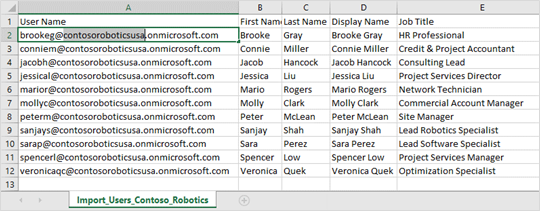

في هذا التمرين، ستقوم باستيراد وتحديث بيئة Project Operations باستخدام أداة ترحيل التكوين (CMT). ستقوم بعد ذلك بتحديث إعدادات تكوين Project Operations وإنشاء/تكوين مستخدمي العرض التوضيحي.

## استيراد التكوين والبيانات التجريبية

في هذه المهمة، ستقوم باستيراد بيانات العرض التوضيحي والتكوين لـ Project Operations في بيئة Dataverse باستخدام أداة CMT.

1. افتح علامة تبويب جديدة في مستعرض الويب الخاص بك، وانسخ الرابط التالي في مربع عنوان الويب، ثم اضغط على المفتاح **Enter**.

    [ProjOpsSampleSetupData- Integrated UR1.zip](https://download.microsoft.com/download/1/3/4/1349369c-6209-42b7-b3b4-5be0e67cacd8/ProjOpsSampleSetupData-%20Integrated%20UR1.zip)

1. في الجزء السفلي من الشاشة، حدد السهم، ثم حدد **إظهار في المجلد**.

1. انقر بزر الماوس الأيمن فوق ملف.zip ثم حدد **استخراج الكل...**

1. في مربع الحوار **استخراج المجلدات المضغوطة (بتنسيق Zip)**، قم بإلغاء تحديد خانة الاختيار **إظهار الملفات المستخرجة عند الاكتمال**، ثم حدد **استخراج**.

1. في إطار **مستكشف الملفات** الجديد، انتقل إلى مجلد **ProjOpsSampleSetupData- Integrated CMT**، وانقر نقراً مزدوجاً فوق ملف **DataMigrationUtility.exe**.

1. في نافذة **ترحيل التهيئة**، حدد **استيراد البيانات** ثم حدد **متابعة**.

1. في نافذة **تسجيل الدخول**، حدد **Office 365**، وتأكد من تحديد **إظهار الخيارات المتقدمة**، وأكمل نموذج الأمان، ثم حدد **تسجيل الدخول**.

1. في المربع **ملف مضغوط** حدد علامة القطع (**...**)، حدد **SampleSetupAndConfigData.zip** ملف، ثم حدد **فتح**.

1. في نافذة **ترحيل التهيئة** حدد **استيراد البيانات**.

    يجب أن تستغرق عملية الاستيراد حوالي ثلاث دقائق لإكمالها.

1. عند اكتمال الاستيراد، حدد **إنهاء**، ثم أغلق نافذة **ترحيل التكوين**.

    > [!NOTE]
    > إذا تلقيت تحذيراً (موضح في القسم التالي)، فقد يكون السجل قد تم إنشاؤه بالفعل.

## تحديث إعدادات تكوين Project Operations

في هذه المهمة، ستقوم بإنشاء وتكوين حساب مستخدم Dynamics 365 جديد استناداً إلى حساب مستخدم Microsoft 365. بعد ذلك، ستقوم بإنشاء قالب تقويم سيتم استخدامه كقالب افتراضي ثم تكوين Contoso Robotics Global لتكون الوحدة التنظيمية الافتراضية.

1. قم بالتبديل إلى صفحة ويب **Project Operations**، ثم في قائمة التنقل، ضمن قسم **المشاريع**، حدد **الموارد**. في شريط القوائم، حدد **جديد**.

1. في صفحة **المورد القابل للحجز الجديد**، أكمل الإعدادات التالية، ثم حدد علامة التبويب **جدولة**.

    | الإعداد   | إجراء الخطوات الآتية |
    |-----------|-------------------------------|
    | المستخدم      | أدخل **حساب المسؤول** |
    | المنطقة الزمنية | يجب عليك تحديد **‏(GMT-08:00) توقيت المحيط الهادئ (الولايات المتحدة وكندا)** لأن بيانات العرض التوضيحي تستند إلى هذه المنطقة الزمنية |

1. من علامة التبويب **جدولة**، في مربع **الشركة**، حدد **USPM**. في مربع **الوحدة التنظيمية**، حدد **Contoso Robotics US**، ثم حدد **حفظ**.

    > [!NOTE]
    > إذا تلقيت الخطأ "لا تتطابق عملة شركة الموارد القابلة للحجز مع الوحدة التنظيمية حالياً. اختر شركة أو وحدة تنظيمية مختلفة لمورد قابل للحجز للمتابعة"، هذا يعني أنك فاتتك خطوات في تمكين خريطة الكتابة المزدوجة لحقل عملة المحاسبة. راجع خريطة جدول دفتر الأستاذ (msdyn_ledgers) في مهمة تشغيل المتطلبات الأساسية في التمرين - تكوين مخططات جداول الكتابة المزدوجة وتشغيلها في هذه الوحدة.

1. حدد علامة التبويب **ساعات العمل**، ثم حدد إدخال تقويم **العمل** الأول. بعد ذلك، حدد **تحرير**، ثم حدد **هذا وكل الأحداث التالية**.

1. في جزء **ساعات العمل**، أكمل الإعدادات التالية، ثم حدد **حفظ**.

    | الإعداد | إجراء الخطوات الآتية |
    |---------|-------------------------------|
    | الوقت | قم بتغيير وقت البدء إلى **9:00 ص** ووقت الانتهاء إلى **5:00 م** |
    | أيام العمل | قم بإلغاء تحديد **الأحد** و **السبت** |
    | المنطقة الزمنية    | حدد **توقيت المحيط الهادئ (الولايات المتحدة وكندا)** |

1. من علامة التبويب **ساعات العمل**، في قائمة التقويم، حدد **جديد > غير العمل**.

1. في جزء **ساعات غير العمل**، قم بتشغيل **كل اليوم**، وحدد رمز التقويم، وحدد **1 يناير 2021**، ثم حدد **حفظ.**

1. كرر الخطوتين 6 و7 باستخدام العطلات القانونية بالولايات المتحدة المتبقية المسردة في الجدول التالي.

    | التاريخ‬              | إجازة                     |
    |-------------------|-----------------------------|
    | 18 يناير 2021  | يوم.Martin Luther King Jr  |
    | 31 مايو 2021      | يوم الذكرى                |
    | 5 يوليو 2021      | عيد الاستقلال (لوُحظ) |
    | 6 سبتمبر 2021 | عيد العمال                   |
    | 11 نوفمبر 2021 | يوم المحاربين القدامى                |
    | 25 نوفمبر 2021 | عيد الشكر            |
    | 24 ديسمبر 2021 | عيد الميلاد (لُوحظ)    |

1. عند الانتهاء، حدد **حفظ وإغلاق**.

1. حدد **تغيير المنطقة**، ثم حدد **الإعدادات >** **قوالب التقويم** **>** **جديد**.

1. في صفحة **قالب عمل جديد**، أكمل الإعدادات التالية ثم حدد **حفظ**.

    | الإعداد           | إجراء الخطوات الآتية                                         |
    |-------------------|-----------------------------------------------------------------------|
    | الاسم               | أدخل **9-5 لقالب PST**                                         |
    | الوصف       | أدخل **قالب للمستخدمين العاملين من 9 ص إلى 5 م في منطقة المحيط الهادئ الزمنية** |
    | مورد القالب | حدد **حساب المسؤول**                                         |

1. في قائمة التنقل، حدد **المعلمات**، وحدد **الوحدة التنظيمية** **الافتراضية**، ثم حدد **تحرير**.

1. في صفحة **معلمة المشروع**، أكمل الإعدادات التالية، ثم حدد **حفظ وإغلاق**.

    | الإعداد                     | إجراء الخطوات الآتية   |
    |-----------------------------|---------------------------------|
    | الوحدة التنظيمية الافتراضية | حدد **Contoso ‏Robotics US**  |
    | معدل تكرار الفاتورة           | حدد **حدد اليوم السابع والأخير**     |
    | قالب ساعات العمل          | حدد **9-5 لقالب PST** |

## إنشاء مستخدمي Microsoft 365

في هذه المهمة، ستقوم بتعديل ملف csv. واستخدامه لاستيراد مستخدمي Microsoft 365 بشكل مجمع. بعد ذلك، ستقوم بتعيين تراخيص Dynamics 365 وإنشاء كلمة مرور مشتركة لكل مستخدم. بعد ذلك، ستقوم بتكوين بيئة Dataverse الخاصة بك لإضافة مستخدمين جدد.

1. افتح علامة تبويب جديدة في مستعرض الويب الخاص بك، وانسخ الرابط التالي في مربع عنوان الويب، ثم اضغط على المفتاح **Enter**:  [https://aka.ms/Lab5ImportUsers](https://aka.ms/Lab5ImportUsers/?azure-portal=true)

1. في الجزء السفلي من الشاشة، حدد ملف **Import_Users_Contoso_Robotics.csv** لفتح الملف.

    إذا كنت قد قمت بتثبيت Microsoft Excel على الجهاز الخاص بك، يجب فتح الملف باستخدام Excel. إذا لم يكن الأمر كذلك، فيجب فتح الملف باستخدام Notepad.

1. ضمن عمود **اسم المستخدم**، قم بتعديل اسم المجال لعكس اسم المجال التجريبي لكل مستخدم في القائمة، ثم احفظه بتنسيق ملف csv.

    > [!div class="mx-imgBorder"]
    > 

1. قم بالتبديل إلى علامة التبويب **مركز إدارة Microsoft 365** (انتقل إلى: [https://admin.microsoft.com/Adminportal#/users](https://admin.microsoft.com/Adminportal#/users/?azure-portal=true))، ثم اضغط على المفتاح **Enter**.

1. في صفحة **المستخدمين النشطين**، حدد **+ إضافة مستخدم** وحدد **عدة مستخدمين**.

1. في جزء **تحميل ملف CSV مع معلومات المستخدم**، حدد **استعراض**.

1. في مربع الحوار **فتح**، انتقل/حدد إلى حيث قمت بحفظ ملف csv. المعدل، ثم حدد **فتح**.

1. إذا اجتاز ملف csv. التحقق من الصحة، فحدد **التالي**.

    > [!NOTE]
    > إذا تلقيت رسالة خطأ، فراجع ملف csv. الخاص بك بحثاً عن الأخطاء، ثم كرر الخطوات 6-8.

1. في جزء **التراخيص**، حدد خانتي الاختيار **Dynamics 365 Project Operations ‏(CRM) - معاينة** و **Office 365 Project Operations - معاينة**، ثم حدد **التالي**.

1. في جزء **مراجعة وإنهاء إضافة مستخدمين متعددين**، حدد **إضافة مستخدمين**.

1. في جزء **أضفت 11 مستخدماً**، قم بإلغاء تحديد خانة الاختيار **نتائج البريد الإلكتروني**، ثم حدد **إغلاق**.

1. في صفحة **المستخدمين النشطين**، حدد جميع المستخدمين الجدد، وحدد علامة الحذف ( **...**)، ثم حدد **إعادة تعيين كلمة المرور**.

1. في جزء **إعادة تعيين كلمة المرور**، أكمل الإعدادات التالية، ثم حدد **إعادة تعيين كلمة المرور**.

    | الإعداد                                                            | إجراء الخطوات الآتية |
    |--------------------------------------------------------------------|-------------------------------|
    | إنشاء كلمة مرور تلقائياً                                    | مسح خانة الاختيار           |
    | كلمة المرور                                                           | أدخل **Pa$$w0rd**             |
    | مطالبة هذا المستخدم بتغيير كلمة المرور الخاصة به عند تسجيل الدخول لأول مرة | مسح خانة الاختيار           |

1. في جزء **إعادة تعيين كلمة المرور**، حدد **إغلاق**.

## إضافة مستخدمي Microsoft 365 إلى بيئة Dataverse

في هذه المهمة، ستعيد تكوين بيئة Dataverse الخاصة بك لاستخدام مجموعة أمان Microsoft 365 التي تم إنشاؤها في المهمة السابقة.

1. افتح علامة تبويب جديدة في مستعرض الويب الخاص بك، وانسخ الرابط التالي في مربع عنوان الويب، ثم اضغط على **Enter**: https:\//admin.powerplatform.microsoft.com/environments.

1. في صفحة **البيئات**، حدد **بيئة ProjOps**.

1. في صفحة **بيئة ProjOps**، في شريط القوائم، حدد **الإعدادات**.

1. في صفحة **الإعدادات**، حدد **المستخدمين + الأذونات > المستخدمين**.

1. في صفحة **المستخدمين**، في شريط القوائم، حدد **+ إضافة مستخدم**.

1. في جزء **إضافة مستخدم**، في مربع **إدخال اسم أو عنوان بريد إلكتروني**، اكتب **Brooke Gray**، ثم حدد **إضافة**.

1. في مربع الحوار **تعيين دور أمان**، حدد **ليس الآن**.

1. كرر الخطوات من 5 إلى 7 للمستخدمين التاليين:

    - Connie Miller

    - Jacob Hancock

    - Jessica Liu

    - Mario Rogers

    - Molly Clark

    - Peter McLean

    - Sanjay Shah

    - Sara Perez

    - Spencer Low

    - Veronica Quek

1. عند إضافة **Veronica Quek**، حدد **بيئة ProjOps** من شريط التنقل.

1. في صفحة **بيئة ProjOps**، في شريط القوائم، حدد **فتح البيئة**.

    سيتم فتح علامة تبويب جديدة في صفحة **Dynamics 365 Project Operations**.

## إضافة أدوار أمان Dynamics 365 إلى المستخدمين

في هذه المهمة، ستضيف أدوار أمان إلى مستخدمي Dynamics 365 استناداً إلى مناصبهم.

1. في صفحة **Project Operations**، حدد **الإعدادات** (رمز الترس)، ثم حدد **الإعدادات المتقدمة**، التي ستفتح علامة تبويب مستعرض ويب جديدة.

1. في صفحة **الإعدادات > إدارة الأعمال**، حدد السهم الموجود بجوار **الإعدادات**. ضمن **النظام**، حدد **الأمان**.

1. في صفحة **الأمان**، حدد **المستخدمين**.

1. في صفحة **المستخدمين الذين تم تمكينهم**، حدد خانات الاختيار لجميع المستخدمين الذين تم إنشاؤهم حديثاً. في شريط القوائم، حدد **إدارة الأدوار**.

1. في مربع الحوار **إدارة أدوار المستخدمين**، حدد أدوار المستخدمين التالية، ثم حدد **موافق**.

    - الموافق على المشروع

    - مسؤول فوترة المشروع

    - مشروع مشترك

    - مدير المشروع

    - أنظمة ‏‫الكتابة المزدوجة لـ Project Operations

    - نظام Project Operations

    - مالك المشروع

    - مورد المشروع

    - نظام المشروع

    - عضو فريق المشروع

    - مستخدم المشروع

    - مدير الموارد

    - مدير المبيعات

    - بائع

    - مسؤول النظام

    - مستخدم إدخال الوقت

> [!NOTE]
> تم اختيار أدوار المستخدمين هذه فقط لتسهيل العملية. [هذا القسم ليس أفضل ممارسة.]

## ‏‏تعيين المديرين إلى المستخدمين

في هذه المهمة، ستقوم بتعيين **حساب المسؤول** كمدير لـ Jacob Hancock وSara Perez.

1. في صفحة **المستخدمين الذين تم تمكينهم**، حدد **Jacob Hancock** و **Sara Perez**، ثم في شريط القوائم، حدد **تغيير المدير**.

1. في مربع الحوار **تغيير المدير**، في مربع **المدير الجديد**، أدخل **حساب المسؤول**، وحدد رمز البحث، وحدد **حساب المسؤول**، ثم حدد **موافق**.

1. في الزاوية العلوية اليمنى بجوار **Dynamics 365**، حدد قائمة التطبيقات، ثم حدد **Project Operations**.
