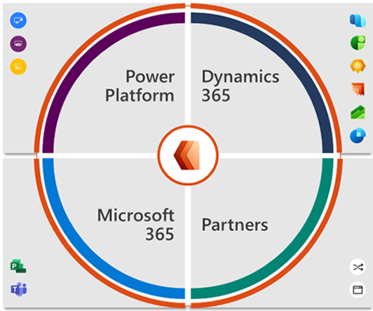
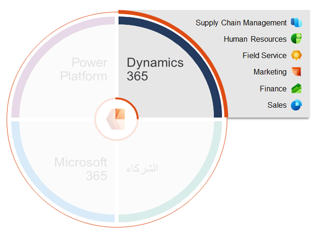
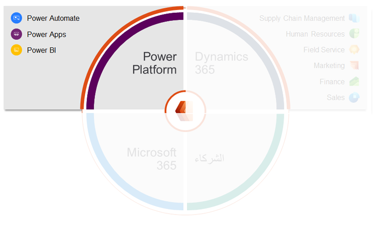
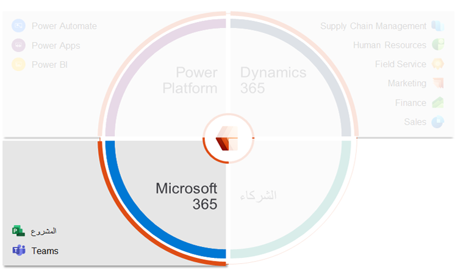
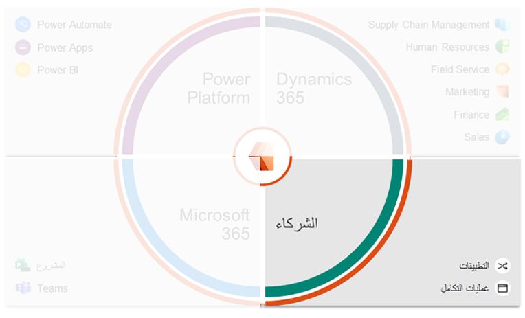

يتكامل Dynamics 365 Project Operations مع حل إدارة قوائم المشروعات Microsoft Project Portfolio Management وتطبيقات Microsoft وحلول الصناعة الأخرى:

-   Microsoft Dynamics 365

-   Microsoft Power Platform

-   Microsoft 365

-   شركاء Microsoft

> [!div class="mx-imgBorder"]
> 

## Dynamics 365

يحتوي Project Operations على العديد من سيناريوهات *الأفضل معاً* مع محفظة Dynamics 365.

> [!div class="mx-imgBorder"]
> 

تتوفر سيناريوهات *الأفضل معاً* التالية لـ Project Operations:

-   يتيح تكامل Microsoft Dynamics ‏365 Sales الجاهز للعملاء إدارة منتجاتهم وفرص خدماتهم والبنية الأساسية لبرنامج ربط العمليات التجارية في نظام واحد. سيتمكن العملاء الذين يبيعون المنتجات والخدمات من تعزيز عروضهم باستخدام Sales وProject Operations.

-   مع تكامل Microsoft Dynamics 365 Finance الجاهز، ستحصل على تخطيط موارد المؤسسة المرتكز على الخدمة (ERP) للعملاء، مما يوسع القدرات الشاملة إلى كشوف المرتبات والحسابات الدائنة/الحسابات المدينة وإمكانات دفتر الأستاذ العام الموجودة في Microsoft Dynamics 365 Finance.

-   تزودك إمكانات التسويق بعملية خطط اتصال *العميل المتوقع إلى الفرصة إلى عرض الأسعار* من أجل مبيعات الخدمات والمنتجات.

-   بالنسبة للعملاء الذين لديهم Dynamics 365 Field Service ووظائف والخدمة المتمركزة حول المشروع، يمكنك دعم مجموعة الموارد المركزية حيث يمكن إدارة توفر المصدر، بغض النظر عما إذا تم تعيين الموارد للمشاريع أو ما إذا تم تعيينها لأوامر العمل في الميدان.

-   في التكامل مع Microsoft Dynamics 365 Supply Chain Management، يتم دعم السيناريوهات المستندة إلى المخزون والإنتاج للعملاء، لا سيما في مجالات التصنيع والهندسة، بحيث يعتمد التكامل على إمكانات إدارة المشروع والمحاسبة.

## Power Platform

من منظور النظام الأساسي، تم دمج Project Operations أعلى Microsoft Power Platform. يمكنك أيضاً استخدام الإمكانات من نوع Microsoft Power Automate، وMicrosoft Power Apps، وMicrosoft Power BI.

> [!div class="mx-imgBorder"]
> 

## Microsoft 365

بالنسبة لـ Microsoft 365، يستخدم Project Operations إمكانات مباشرة من Project for the web. تستخدم جميع إمكانات تخطيط المشروع مشروعات Microsoft ومهامها وجدولتها وإمكانات لوحة جانت وكانبان.

يدعم Project Operations التكامل مع Microsoft Teams، ويمكن استخدامه لأعضاء مشروع أو فرصة للتعاون ومشاركة الوثائق في إعداد الفريق الخاص.

> [!div class="mx-imgBorder"]
> 

## شركاء Microsoft

يشكل شركاء Microsoft جزءاً كبيراً من نظام Microsoft Cloud الأساسي.

من خلال إنشاء تطبيقات متخصصة لصناعة أو تكامل مع أنظمة غير متجانسة، إن خبرتهم ومعرفتهم المتعمقة بالنظام الأساسي تشكل حلاً شاملاً للعملاء.

> [!div class="mx-imgBorder"]
> 

وProject Operations عبارة عن حمل عمل أفقي يستخدم الخبرة الصناعية للنظام البيئي الشامل لشركاء Microsoft لخدمة العملاء في صناعة معينة.

بالنسبة لمعظم الصناعات، ستكون هذه الخبرة في شكل شريك تنفيذ يوسع Project Operations باستخدام إمكانات Power Platform حتى يتم التمكن من تكييف Project Operations مع احتياجات هذا العميل.

يتخصص العديد من الشركاء في التصنيع والخدمات المهنية. الصناعات الأكثر تعقيداً لها حلول صناعية شريكة في Microsoft AppSource، التي يمكنها أيضاً تسريع التنفيذ.

يجلب النظام البيئي لشركاء Microsoft الخبرة والحلول الصناعية للصناعات التالية:

-   الخدمات المهنية والاستشارات

-   خدمات التصنيع

-   الهندسة المعمارية والهندسة والاستشارات

-   الخدمات الصحية

-   المنشآت والمرافق والتعدين وغيرها

للتعرف على تطور Dynamics 365 Project Operations وبنيته، شاهد الفيديو التالي: 

> [!VIDEO https://www.microsoft.com/videoplayer/embed/RWzrDk]
