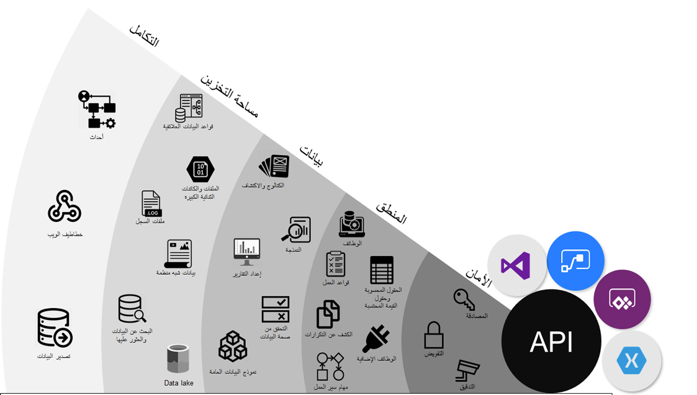

يساعدك Microsoft Dataverse (المعروف سابقاً باسم Common Data Service) في تخزين وإدارة البيانات التي \'تستخدمها تطبيقات العمل بأمان.Microsoft Dataverse (previously known as Common Data Service) helps you securely store and manage data that\'s used by business applications.

> [!div class="mx-imgBorder"]
> 

يتم تخزين البيانات داخل Dataverse مجموعة من الكيانات.Data within Dataverse is stored within a set of entities.  *الكيان* هي مجموعة من السجلات تُستخدم لتخزين البيانات، مثل كيفية تخزين الجدول للبيانات داخل قاعدة بيانات.An *entity* is a set of records that is used to store data, like how a table stores data within a database. يتضمن Dataverse مجموعة أساسية من الكيانات القياسية التي تغطي سيناريوهات نموذجية، ولكن يمكنك أيضاً إنشاء كيانات مخصصة خاصة بمؤسستك ثم تعبئتها بالبيانات باستخدام Power Query.Dataverse includes a base set of standard entities that covers typical scenarios, but you can also create custom entities that are specific to your organization and then populate them with data by using Power Query. بعد ذلك، يمكن لمنشئي التطبيقات استخدام Power Apps لإنشاء تطبيقات غنية باستخدام هذه البيانات.Then, app makers can use Power Apps to build rich applications by using this data.

## الأمانSecurity

يحتوي Dataverse على نموذج أمان غني للمساعدة في حماية تكامل البيانات وخصوصية المستخدمين مع تعزيز الوصول الفعال إلى البيانات والتعاون.Dataverse has a rich security model to help protect data integrity and privacy of users while promoting efficient data access and collaboration. يمكنك دمج وحدات الأعمال، والأمان المستند إلى الدور، والأمان المستند إلى السجل، والأمان المستند إلى الحقل لتحديد الوصول العام إلى المعلومات التي يمتلكها المستخدمون في بيئة Dataverse.You can combine business units, role-based security, record-based security, and field-based security to define the overall access to information that users have in a Dataverse environment.

## المنطق والتحقق من الصحةLogic and validation

يمكن للكيانات داخل Dataverse استخدام منطق غني من جانب الخادم والتحقق من الصحة لضمان جودة البيانات وتقليل التعليمات البرمجية المتكررة في كل تطبيق يقوم بإنشاء واستخدام البيانات داخل كيان.Entities within Dataverse can use rich, server-side logic and validation to ensure data quality and reduce repetitive code in each app that creates and uses data within an entity.

-   تتحقق **قواعد العمل** من صحة البيانات عبر حقول وكيانات متعددة وتوفر رسائل تحذير وخطأ، بغض النظر عن التطبيق المستخدم لإنشاء البيانات.**Business rules** validate data across multiple fields and entities and provide warning and error messages, regardless of the app that is used to create the data. لمزيد من المعلومات، راجع  [إنشاء قاعدة عمل لجدول](/powerapps/maker/common-data-service/data-platform-create-business-rule/?azure-portal=true).For more information, see [Create a business rule for a table](/powerapps/maker/common-data-service/data-platform-create-business-rule/?azure-portal=true).

-   **عمليات سير إجراءات العمل** ترشد المستخدمين لضمان إدخال البيانات بشكل متسق واتباع نفس الخطوات في كل مرة.**Business process flows** guide users to ensure that they enter data consistently and follow the same steps every time. في الوقت الحالي، لا يتم دعم عمليات سير إجراءات العمل إلا للتطبيقات المستندة إلى نماذج.Currently, business process flows are only supported for model-driven apps. لمزيد من المعلومات، راجع  [نظرة عامة على عمليات سير إجراءات العمل](/dynamics365/customerengagement/on-premises/customize/business-process-flows-overview/?azure-portal=true).For more information, see [Business process flows overview](/dynamics365/customerengagement/on-premises/customize/business-process-flows-overview/?azure-portal=true).

-   تتيح لك **مهام سير العمل** تنفيذ عمليات الأعمال تلقائياً دون تفاعل المستخدم.**Workflows** allow you to automate business processes without user interaction. لمزيد من المعلومات، راجع  [استخدام عمليات سير العمل لتنفيذ العمليات التي لا تتطلب تفاعل المستخدم](/dynamics365/customerengagement/on-premises/customize/workflow-processes/?azure-portal=true).For more information, see [Use Workflow processes to automate processes that don't require user interaction](/dynamics365/customerengagement/on-premises/customize/workflow-processes/?azure-portal=true).

-   يدعم **منطق الأعمال مع الرمز** سيناريوهات المطور المتقدمة لتوسيع التطبيق مباشرةً من خلال الرمز.**Business logic with code** supports advanced developer scenarios to extend the application directly through code. لمزيد من المعلومات، راجع  [تطبيق منطق الأعمال باستخدام الرمز](/powerapps/developer/common-data-service/apply-business-logic-with-code/?azure-portal=true).For more information, see [Apply business logic using code](/powerapps/developer/common-data-service/apply-business-logic-with-code/?azure-portal=true).

## دمج البياناتIntegrate data

عادةً ما يتضمن إنشاء تطبيق بيانات من أكثر من مصدر واحد.Building an app typically involves data from more than one source. بينما يمكن إجراء هذه العملية على مستوى التطبيق، إلا أن دمج هذه البيانات معاً في متجر مشترك يسمح أحياناً بتجربة أسهل في بناء التطبيق ومجموعة واحدة من المنطق للحفاظ على البيانات وتشغيلها.While this process can be done at the application level, occasionally, integrating this data together into a common store allows for an easier app building experience and a single set of logic to maintain and operate over the data. يتيح Dataverse دمج البيانات من مصادر متعددة في مخزن واحد يمكن استخدامه في Power Apps، وPower Automate، وPower BI، وMicrosoft Power Virtual Agents إلى جانب البيانات المتوفرة بالفعل من تطبيقات Dynamics 365.Dataverse allows data to be integrated from multiple sources into a single store that can be used in Power Apps, Power Automate, Power BI, and Microsoft Power Virtual Agents along with data that is already available from Dynamics 365 applications.

-   **التكامل المجدول باستخدام الأنظمة الأخرى** - يمكن مزامنة البيانات المحفوظة في تطبيق آخر بشكل منتظم باستخدام Dataverse للسماح لك باستخدام بيانات تطبيق أخرى في Power Apps.**Scheduled integration with other systems** - Data that is kept within another application can be regularly synchronized with Dataverse to allow you to use other application data in Power Apps.

-   **تحويل البيانات واستيرادها باستخدام Power Query** - يمكنك تحويل البيانات عند الاشتيراد إلى Dataverse باستخدام Power query من العديد من مصادر البيانات عبر الإنترنت، وهي أداة عامة تُستخدم عبر Microsoft Excel وPower BI.**Transform and import data by using Power Query** - You can transform data when importing into Dataverse by using Power Query from many online data sources, a common tool that is used across Microsoft Excel and Power BI.

-   **استيراد البيانات لمرة واحدة** - يمكن استخدام الاستيراد والتصدير البسيط لملفات Excel وcsv. لاستيراد البيانات لمرة واحدة أو بشكل غير متكرر إلى Dataverse.**One-time import of data** - Simple import and export of Excel and .csv files can be used for a one-time or infrequent import of data into Dataverse.

تستخدم تطبيقات Microsoft Dynamics ‏365 مثل Dynamics 365 Sales وDynamics 365 Customer Service أيضاً Dataverse لتخزين وتأمين البيانات التي تستخدمها التطبيقات.Microsoft Dynamics 365 applications, such as Dynamics 365 Sales and Dynamics 365 Customer Service, also use Dataverse to store and secure data that is used by the applications. تُمكّنك هذه الميزة من بناء التطبيقات باستخدام Power Apps وDataverse مباشرةً مقابل بيانات الأعمال الاساسيه المستخدمة بالفعل داخل Dynamics 365 دون الحاجة إلى التكامل.This feature enables you to build apps by using Power Apps and Dataverse directly against your core business data that is already used within Dynamics 365 without the need for integration.

-   **إنشاء تطبيقات مقابل بيانات Dynamics 365** - أنشئ تطبيقات سريعة مقابل بيانات الأعمال داخل Power Apps أو باستخدام أدوات مطور برامج المطور الخاصة بـ PRO ‏(SDK).**Build apps against your Dynamics 365 data** - Quickly build apps against your business data within Power Apps or by using the Pro Developer software developer kit (SDK).

-   **إدارة منطق الأعمال والقواعد التي يمكن إعادة استخدامها** - يتم تطبيق قواعد ومنطق الأعمال المحددة بالفعل في كيانات Dynamics 365 الخاصة بك على تطبيقات Power Apps لضمان اتساق البيانات، بغض النظر عن كيفية وصول المستخدمين إلى البيانات أو من خلال أي تطبيق.**Manage reusable business logic and rules** - Business rules and logic that are already defined in your Dynamics 365 entities are applied to your Power Apps applications to ensure data consistency, regardless of how your users are accessing the data or through which app.

-   **المهارات القابلة لإعادة الاستخدام عبر Dynamics 365 وPower Apps** - المستخدمون الذين لديهم مهارات سابقة في Power Apps أو Dynamics 365 يمكنهم الآن استخدام هذه المهارات عبر النظام الأساسي لـ Dataverse.**Reusable skills across Dynamics 365 and Power Apps** - Users who have previous skills in Power Apps or Dynamics 365 can now use those skills across the Dataverse platform. أصبح إنشاء الكيانات والنماذج والمخططات وما إلى ذلك أمراً شائعاً الآن عبر تطبيقاتك.Creating entities, forms, charts, and so on, are now common across your applications.
