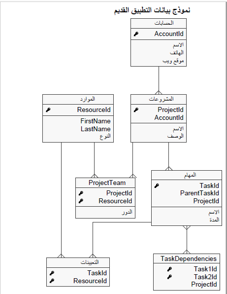
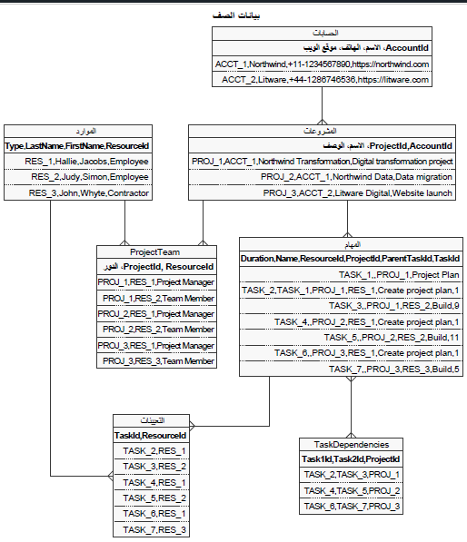
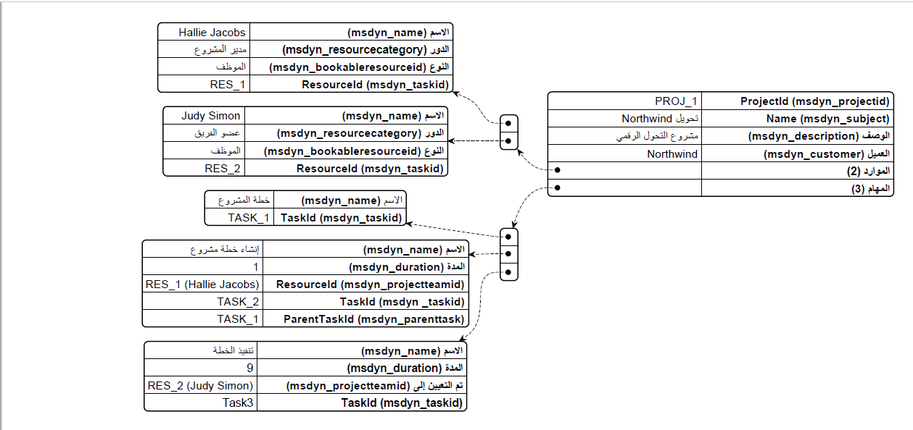

توفر لك واجهات برمجة تطبيقات (API) جدولة المشروع القدرة على تنفيذ عمليات الإنشاء والتحديث والحذف باستخدام كيانات الجدولة. ويمكنك إدارة هذه الكيانات من خلال محرك الجدولة في Project for the web. تدعم واجهة برمجة تطبيقات (API) الجدولة الكيانات التالية.

| اسم الكيان | الاسم المنطقي للكيان |
|-------------|---------------------|
| المشروع | msdyn_project |
| مهمة المشروع | msdyn_projecttask |
| تبعية مهمة المشروع | msdyn_projecttaskdependency |
| تعيين المورد | msdyn_resourceassignment |
| مستودع المشروع | msdyn_projectbucket |
| عضو فريق المشروع | msdyn_projectteam |
| قائمة اختيار المشروع | msdyn_projectchecklist |
| مهمة المشروع التي يجب تسميتها | msdyn_projecttasktolabel |

للتعرف على استخدام واجهات برمجة التطبيقات (API)، ستتبع سيناريو ترحيل البيانات حيث تقوم إحدى المؤسسات بترحيل البيانات من نظام قديم إلى Project Operations. إنه سيناريو قريب من سيناريو العالم الحقيقي، مما سيساعد في توضيح استخدام واجهات برمجة تطبيقات (API) الجدولة. يُظهر المخطط التالي لعلاقة الكيان نموذج البيانات الذي يستخدمه التطبيق القديم.

> [!div class="mx-imgBorder"]
> [](../media/legacy-application-data-model.png#lightbox)

فيما يلي الجداول المضمنة في نموذج البيانات:

- **الحسابات** - يحتوي هذا الجدول على جميع حسابات المؤسسة. وبإمكان مشاريع نشطة كثيرة أن تكون قيد التشغيل لأحد الحسابات.

- **المشاريع** - يحتوي هذا الجدول على المعلومات الخاصة بالمشروع لأحد الحسابات.

- **المهام** - يحتوي هذا الجدول على المهمة المقترنة بتسليم مشروع.

- **تبعيات المهام** - يحتوي هذا الجدول على التبعية المتداخلة بين مختلف المهام في أحد المشاريع. بإمكان مهمة أن تعتمد على مهمة أخرى؛ بشكل أساسي، يجب إكمال المهمة السابقة قبل أن تتمكن المهمة الحالية من البدء.

- **الموارد** - يحتوي هذا الجدول على المعلومات المتعلقة بالموارد المختلفة التي تملكها المؤسسة. بإمكان المورد أن يكون أيضاً عبارة عن أصل. لتبسيط الأمور، افترض أن المورد هو موظف.

- **فريق المشروع** - يحتوي هذا الجدول على العلاقة بين المشاريع والموارد. بإمكان المورد أن يعمل على مشاريع كثيرة، وسيكون للمشروع أكثر من مورد واحد. وفي هذه الحالة، يمثل فريق المشروع‬ جدولاً وسيطاً يُستخدم لتصميم علاقات متعدد إلى متعدد.

- **التعيينات** - يحتوي هذا الجدول على المعلومات التي تربط الموارد بالمهام. إنه أيضاً عبارة عن جدول وسيط يمثل علاقات متعدد إلى متعدد.

## <a name="sample-data-for-migration"></a>عينة بيانات ستُستخدم في عملية الترحيل

الغرض من التمرين هو توضيح استخدام واجهات برمجة التطبيقات (API)، وبالتالي ستتخطى الجزء المتعلق بسحب البيانات من النظام المصدر. فيما يتعلق بنطاق التمرين، ستعمل على إجراء ترميز مضمن لبيانات المصدر، وستعمل مع عدد محدود من السجلات. يُظهر المخطط التالي البيانات التي ستكون جزءاً من التمرين. يتعامل التمرين مع حسابين مع ثلاثة مشاريع ذات صلة، إلى جانب بعض المهام والموارد. وتُعد عينة البيانات كافية لتوضيح معظم ميزات واجهة برمجة التطبيقات (API) ووظائفها، مثل تبعية المهام وتجميع المهام وما إلى ذلك.

> [!div class="mx-imgBorder"]
> [](../media/raw-data.png#lightbox)

## <a name="use-schedule-apis-for-data-migration"></a>استخدام واجهات برمجة تطبيقات (API) الجدولة لترحيل البيانات

تشتمل واجهات برمجة تطبيقات (API) الجدولة الحالية على ما يلي:

- **msdyn_CreateProjectV1** - استخدم واجهة برمجة التطبيقات (API) هذه لإنشاء مشروع. يتم إنشاء المشروع ومستودع المشروع الافتراضي على الفور.

- **msdyn_CreateTeamMemberV1** - استخدم واجهة برمجة التطبيقات (API) هذه لإنشاء عضو فريق المشروع. يتم إنشاء سجل عضو الفريق على الفور.

- **msdyn_CreateOperationSetV1** - استخدم واجهة برمجة التطبيقات (API) هذه لجدولة طلبات متعددة سيتم تنفيذها ضمن حركة.

- **msdyn_PSSCreateV1** - استخدم واجهة برمجة التطبيقات (API) هذه لإنشاء كيان. بإمكان الكيان أن يكون عبارة عن أي من كيانات جدولة المشروع التي تدعم عملية الإنشاء.

- **msdyn_PSSUpdateV1** - استخدم واجهة برمجة التطبيقات (API) هذه لتحديث كيان. بإمكان الكيان أن يكون عبارة عن أي من كيانات جدولة المشروع التي تدعم عملية التحديث.

- **msdyn_PSSDeleteV1** - استخدم واجهة برمجة التطبيقات (API) هذه لحذف كيان. بإمكان الكيان أن يكون عبارة عن أي من كيانات جدولة المشروع التي تدعم عملية الحذف.

- **msdyn_ExecuteOperationSetV1** - استخدم واجهة برمجة التطبيقات (API) هذه لتشغيل جميع العمليات ضمن مجموعة العمليات المعينة.

يُظهر المخطط التالي الخطوات الرئيسية المضمنة في عملية ترحيل البيانات. علاوةً على ذلك، تسرد الخطوات الفردية واجهات برمجة التطبيقات (API) التي سيتم استخدامها لتنفيذ الخطوة. سيتم استخدام معظم واجهات برمجة التطبيقات (API) ذات الصلة بالإنشاء في هذا السيناريو.

> [!div class="mx-imgBorder"]
> [](../media/migration.png#lightbox)

الخطوات التالية مضمنة في عملية ترحيل البيانات:

1. **تصدير البيانات من المصدر** - في سيناريو العالم الحقيقي، سيكون لهذه الخطوة خطوات فرعية متعددة. ومع ذلك، ولتبسيط التمرين، سيستخدم هذا السيناريو مجموعة بيانات ذات ترميز مضمن تمت مناقشتها في وقت سابق. تم ترميز البيانات بشكل مضمن في الأمثلة عن الكود C#‎.

1. **إنشاء حسابات** - من الضروري أن تنشئ حسابات قبل إنشاء المشاريع حتى يمكن ربط المشاريع بالحسابات. ستستخدم أسلوب Dynamics 365 SDK القياسي لإنشاء السجلات.

1. **إنشاء الموارد** - تأكد من أن إنشاء جميع موارد النظام القديم قد تم في النظام الهدف قبل بدء ترحيل المشروع. سيتم تعيين هذه الموارد إلى فريق المشروع. وفي سيناريو العالم الحقيقي، بإمكان الموارد أن تكون أيضاً عبارة عن مستخدمي النظام. لتبسيط الأمور، ستقوم بإنشاء كل مورد قديم كجهة اتصال في النظام الهدف. وسيسمح لك النظام بإعادة تشغيل الترحيل عدة مرات كي تتمكن من فهمه بشكل أفضل. لتعيين مورد إلى مشروع، من الضروري أن تقوم بإنشاء مورد قابل للحجز، وبالتالي سيتم إنشاء جميع جهات الاتصال كموارد قابلة للحجز في النظام. وسيتم تعيين جميع الأدوار من النظام القديم إلى فئات الموارد القابلة للحجز.

1. **إنشاء المشروع** - سيتم إنشاء سجل المشروع في النظام الهدف باستخدام واجهة برمجة التطبيقات (API) **msdyn_CreateProjectV1**.

1. **تطبيق قالب المشروع** - بإمكان المؤسسة أن تتضمن مجموعة قياسية من التخصيصات التي يجب تطبيقها على كل مشروع عند إجراء التهيئة. يمكنك تطبيق هذه التخصيصات باستخدام واجهة برمجة التطبيقات (API) **msdyn_CopyProjectV3**. تم وضع علامة على هذه الخطوة باعتبارها اختيارية، وتتناولها الوحدة التالية بشكل أكثر تفصيلاً. تمت إضافة هذه الخطوة لتوضيح حالة استخدام قابلة للتطبيق لواجهة برمجة التطبيقات (API).

1. **إنشاء أعضاء الفريق** - سيتم إنشاء أعضاء الفريق الذين يقترنون بالمشروع باستخدام واجهة برمجة التطبيقات (API) **msdyn_CreateTeamMemberV1**. عندما تقوم بإنشاء عضو فريق، سيتم ربط سجل المورد القابل للحجز بالسجل msdyn_projectteam.

1. **إنشاء OperationSet** - تسمح OperationSet بتنفيذ طلبات جدولة متعددة ليتم تشغيلها كمجموعة، وبالتالي توفير إمكانات الحركات. وهي أيضاً أكثر فاعلية نوعاً ما بسبب العدد القليل من الاستدعاءات التي تُرسل إلى النظام. في هذه الخطوة، ستنشئ مجموعة عمليات جديدة سيتم استخدامها في خطوات لاحقة.

1. **إضافة المهام والتبعيات والتعيينات** - تُضاف جميع المهام المرتبطة بالمشروع إلى OperationSet من الخطوة السابقة. وستقوم أيضاً بإنشاء تبعيات وتعيينات المهام.

1. **تشغيل OperationSet** - بعد إضافة جميع المهام والمعلومات ذات الصلة إلى OperationSet، يمكنك تشغيل المجموعة باستخدام واجهة برمجة التطبيقات (API) **msdyn_ExecuteOperationSetV1**. ستضمن واجهة برمجة التطبيقات (API) هذه تشغيل جميع العمليات التي تم تحديدها في المجموعة وإرجاع الأخطاء. بشكل افتراضي، يجب أن تنجح جميع العمليات في مجموعة حتى تنجح المجموعة. يتم تكرار الخطوات السابقة حتى يزداد عدد المشاريع المتاحة للترحيل.

يوضح المخطط التالي كيف سيتم تعيين سجل مشروع فردي من النظام القديم إلى مختلف الحقول في Project Operations.

> [!div class="mx-imgBorder"]
> [](../media/mapping.png#lightbox)

## <a name="run-the-data-migration-code"></a>تشغيل التعليمات البرمجية لترحيل البيانات

يُظهر المثال التالي التعليمات البرمجية الأساسية المسؤولة عن السيناريو الذي ورد ذكره سابقاً. تتطلب التعليمات البرمجية بعض التعليمات البرمجية المساعدة الإضافية، والتي تم توفيرها في نهاية القسم.

```csharp
InitializeLegacyData();
InitializeOrganisationService();

PrintHeader("Create Accounts");
foreach (var legacyAccount in data.Accounts)
{
    CreateAccount(legacyAccount);
}

PrintHeader("Create Resources");
foreach (var legacyContact in data.Resources)
{
    Entity contact = CreateContact(legacyContact);
    CreateBookableResource(legacyContact, contact);
}

PrintHeader("Create Bookable Resource categories");
Entity ProjectManagerResource = CreatePMResource();
Entity TeamMemberResource = CreateTeamMemberResource();


PrintHeader("Create Projects");
foreach (var legacyProject in data.Projects)
{
    Entity project = CreateProject(legacyProject);
    var projectReference = project.ToEntityReference();

    // create team members associated with the project
    foreach (var legacyProjectTeam in data.ProjectTeams
        .Where(x => x.ProjectId == legacyProject.ProjectId))
    {
        CreateTeamMember(
            ProjectManagerResource,
            TeamMemberResource,
            projectReference,
            legacyProjectTeam);
    }

    // Create operation set to include all the tasks, dependencies and assignments
    var description = $"{legacyProject.Name} - {DateTime.Now.ToShortTimeString()}";
    var operationSetId = CallCreateOperationSetAction(project.Id, description);

    // Create tasks and assignment
    foreach (var legacyTask in data.Tasks
        .Where(x => x.ProjectId == legacyProject.ProjectId))
    {
        Entity task = AddTaskToOperationSet(
            projectReference,
            operationSetId,
            legacyTask);

        // Find assignment for the task. To keep the scenario simple
        // there is only one assignment per task.
        var legacyAssignment = data.Assignments
            .FirstOrDefault(x => x.TaskId == legacyTask.TaskId);
        if (legacyAssignment != null)
        {
            AddAssignmentToOperationSet(
                legacyProject,
                project,
                operationSetId,
                legacyTask,
                task,
                legacyAssignment);
        }
    }

    // create task dependencies
    foreach (var legacyDependency in data.Dependencies
        .Where(x => x.ProjectId == legacyProject.ProjectId))
    {
        AddDependencyToOperationSet(
            project,
            operationSetId,
            legacyDependency);
    }

    CallExecuteOperationSetAction(operationSetId);
}

Console.WriteLine("Migration finished. Press any key to continue...");
Console.ReadLine();

```

ملاحظات من تشغيل عينة التعليمات البرمجية:

- يتم حساب الجهد الإجمالي للمشروع بشكل تلقائي من المدة المتوفرة على المهام.

- تدعم المهام التجميع، حيث يقع **إنشاء خطة المشروع** تحت قسم **خطة المشروع** لمشروع تحويل Northwind.

- توجد لدى المهام تبعيات يمكنك عرضها من علامة تبويب **المخطط الزمني** في قسم **المهام** في سجل مشروع.

- تم تعيين مدير المشروع كموافق على المشروع.

يمكنك الوصول إلى الأساليب الأخرى من هذا الارتباط [Program.cs file](https://github.com/MicrosoftDocs/mslearn-developer-tools-power-platform/blob/master/project-opeartions/Program.cs/?azure-portal=true).

## <a name="limitations-and-known-issues"></a>القيود والمشاكل المعروفة

تتضمن القيود والمشاكل المعروفة المتعلقة بتشغيل التعليمات البرمجية لترحيل البيانات ما يلي:

- يمكن استخدام واجهات برمجة تطبيقات (API) جدولة المشروع فقط من قِبل الأشخاص الذين يحملون ترخيص Microsoft Project. المستخدمون الذين لا يمكنهم استخدام واجهات برمجة التطبيقات (API) هم:

  - مستخدمو التطبيق

  - مستخدمو النظام

  - مستخدمو التكامل

  - المستخدمون الآخرون الذين ليس لديهم الترخيص المطلوب

- بإمكان كل OperationSet أن تتضمن 100 عملية كحدٍ أقصى فقط.

- بإمكان كل مستخدم أن يكون لديه 10 مجموعات OperationSet مفتوحة كحدٍ أقصى فقط.

- يدعم تطبيق Project Operations في الوقت الحالي عدداً إجمالياً من المهام يبلغ 500 مهمة كحدٍ أقصى على أحد المشاريع.

- في الوقت الحالي، لا تتوفر حالة فشل وسجلات فشل OperationSet.

لمزيد من المعلومات، راجع [الحدود والقيود الموضوعة على المشاريع والمهام](/project-for-the-web/project-for-the-web-limits-and-boundaries/?azure-portal=true).
