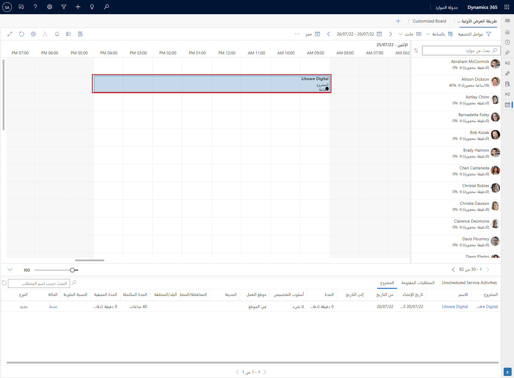
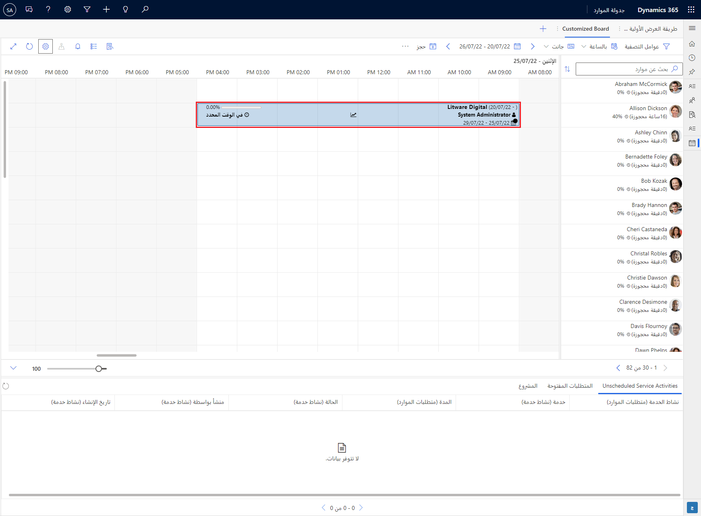
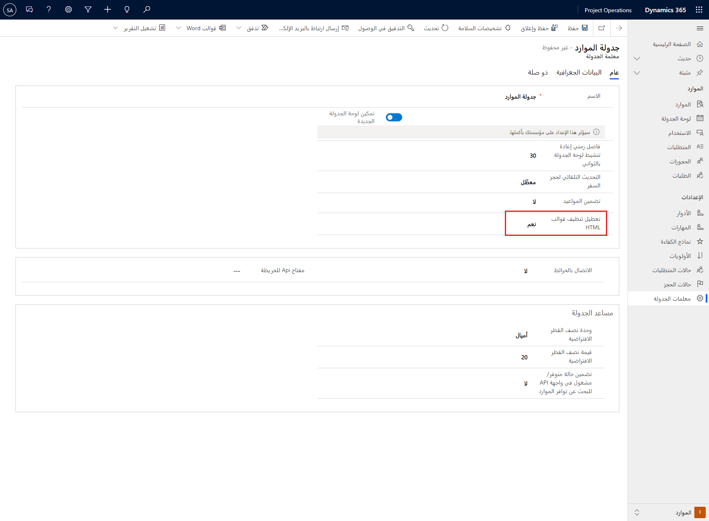

عند جدولة أحد المتطلبات لأحد الموردين، سيتم إنشاء سجل حجز وعرضه على لوحة الجدولة خلال الفترة الزمنية للمورد المعني. ويطلق على الحقول المعروضة في الحجز الخاص بلوحة الجدولة قالب حجز وتكون قابلة للتحرير.

## <a name="edit-a-booking-template"></a>تحرير قالب الحجز

يمكن أن يكون لكل لوحة جدولة وكل جدول ممكن للجدولة (مثل المشاريع أو الحالات أو الجداول المخصصة) قالب حجز مختلف. عند جدولة أحد متطلبات المشروع، سيعرض قالب الحجز اسم سجل حجز الموارد القابل للحجز ونوع السجل وقيم المدة، كما هو موضح في لقطة الشاشة التالية.

> [!div class="mx-imgBorder"]
> [](../media/booking-template-1-default.png#lightbox)

يتم عرض المعلومات التالية في القالب الجديد:

- اسم المشروع

- تواريخ بدء المشروع ونهايته

- تقدم المشروع

- اسم مدير المشروع

- الوضع العام للمشروع

- الأداء المجدول

- تواريخ بدء وانتهاء المورد في المشروع

ستأتي المعلومات السابقة من سجلات فريق المشروع والمشروع.

ستستخدم عبارات CSS في القالب. بشكل افتراضي، يتم تعقيم جميع CSS من القالب.

لتعطيل الوظيفة، اتبع الخطوات التالية:

1. انتقل إلى **Project Operations >** **الموارد** > **الإعدادات** > **معلمات الجدولة**.

1. افتح سجل **جدولة الموارد**.

1. حدد **نعم** في الحقل **تعطيل تعقيم قوالب**.

    > [!div class="mx-imgBorder"]
    > [](../media/booking-template-2-updated.png#lightbox)

لتحرير HTML الذي يتحكم في قالب الحجز، اتبع الخطوات التالية:

1. انتقل إلى لوحة **الإعدادات**.

1. مرر لأسفل إلى القسم **أنواع الجدولة** وحدد جدول **المشروع** على اليسار.

1. قم بتمكين قالب **حجز مخصص** عن طريق تحديد **التشغيل** في مفتاح التبديل.

1. حدد **تحرير** لتعديل قائمة الحقول.

1. الصق التعليمة البرمجية التالية في المحرر:

    ```html
    <div style="font-size:0.8rem;line-height:1.2rem;">
        <div style="display:flex;justify-content:space-between;align-items:center;">
            <span>
                <strong style="font-size:0.9rem;">{name}</strong>
                <span
                    style="font-variant-numeric: tabular-nums;">({msdyn_msdyn_project_bookableresourcebooking_projectid.msdyn_scheduledstart}
                    - {msdyn_msdyn_project_bookableresourcebooking_projectid.msdyn_scheduledend})</span>
            </span>
            <div>
                <progress style="width:100px;max-width:100px"
                    title="Percent Completed - {msdyn_msdyn_project_bookableresourcebooking_projectid.msdyn_progress}"
                    value="{msdyn_msdyn_project_bookableresourcebooking_projectid.msdyn_progress}" max="100">
                </progress>
                <span
                    style="font-variant-numeric: tabular-nums;">{msdyn_msdyn_project_bookableresourcebooking_projectid.msdyn_progress}%</span>
            </div>
        </div>
        <div style="display:flex;justify-content:space-between;align-items:center;">
            <span title="Project Manager">
                <i class="fa fa-user" style="margin-right:0.25rem" aria-hidden="true"></i>
                <strong>{msdyn_msdyn_project_bookableresourcebooking_projectid.msdyn_projectmanager}</strong>
            </span>
            <span title="Status">
                <i class="fa fa-line-chart" style="margin-right:0.25rem" aria-hidden="true"></i>
                <strong>{msdyn_msdyn_project_bookableresourcebooking_projectid.msdyn_overallprojectstatus}</strong>
            </span>
            <span title="Schedule">
                <i class="fa fa-clock-o" style="margin-right:0.25rem" aria-hidden="true"></i>
                <strong>{msdyn_msdyn_project_bookableresourcebooking_projectid.msdyn_scheduleperformance}</strong>
            </span>
        </div>
        <div style="display:flex;justify-content:space-between;">
            <span title="Team member start and end date" style="font-variant-numeric: tabular-nums;">
                <i class="fa fa-calendar" style="margin-right:0.25rem;" aria-hidden="true"></i>
                {msdyn_msdyn_projectteam_bookableresourcebooking_projectteamid.msdyn_start} -
                {msdyn_msdyn_projectteam_bookableresourcebooking_projectteamid.msdyn_finish}
            </span>
        </div>
    </div>
    ```

1. حدد **حفظ**.

1. قم بتحديث لوحة الجدولة. سيشبه قالب الحجز لقطة الشاشة التالية.

    > [!div class="mx-imgBorder"]
    > [](../media/booking-template-3-css-settings.png#lightbox)

> [!NOTE]
> لتجنب أخطاء الكتابة، انتقل إلى [Power Apps maker portal](https://make.powerapps.com/?azure-portal=true)، وحدد **الحلول > جداول > الحلول الافتراضية > حجوزات الموارد القابلة للحجز،** ثم انسخ أسماء الحقول. يمكنك الرجوع مباشرة إلى الحقول من جدول **حجز الموارد القابلة للحجز** باستخدام اسم الحقل في الأقواس، على سبيل المثال،`{duration}`.

إذا كنت تريد عرض حقل من جدول مرتبط، فابحث عن اسم العلاقة N:1. بالنسبة لجدول المشروع، تكون علاقة N:1 هذه: **msdyn_msdyn_project_bookableresourcebooking_projectid**.

أضف نقطة (.) متبوعة باسم حقل الخاص بالجدول الهدف. على سبيل المثال، يحتوي الحقل **مدير المشروع** في المشروع على اسم مخطط **msdyn_projectmanager**. لذلك، ستضيف اسم المخطط هذا بعد مخطط العلاقة ثم أرفق السلسلة بأكملها في الأقواس، كما يلي:

`{msdyn_msdyn_project_bookableresourcebooking_projectid.msdyn_projectmanager}`

بالإضافة إلى ذلك، يمكنك استخدام أيقونات مخصصة في القالب. يأتي النظام الأساسي مع نسخة مسبقة الصنع من أيقونات خط رائع. يمكنك استخدام أي رمز متوفر في الإصدار 4 من المكتبة. لمزيد من المعلومات، راجع [وثائق خط رائع](https://fontawesome.com/docs/?azure-portal=true).
