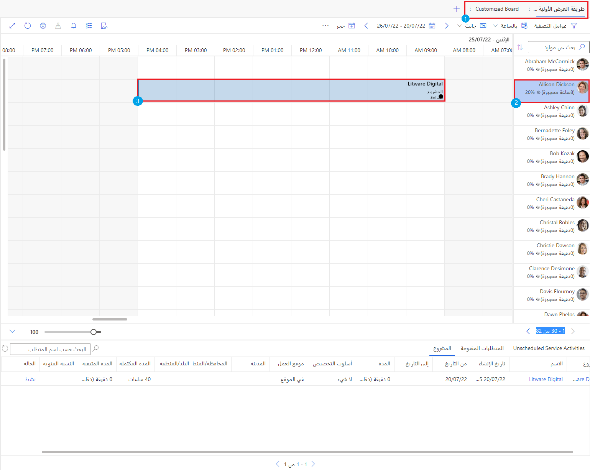

في Microsoft Dynamics 365 Project Operations، توفر لوحة الجدولة نظرة عامة على توفر الموارد لحجوزات الموارد والتعيينات.

يمكنك تخصيص لوحة الجدولة لتخصيص تجربة المستخدم الخاصة بها وفقاً لاحتياجاتك، مثل:

- إثراء معلومات خلية المورد بتضمين أعمدة مخصصة من جدول الموارد القابلة للحجز.

- تحسين قالب الحجز بتضمين أعمدة إضافية من جدول المشروع.

> [!div class="mx-imgBorder"]
> 

تُظهر لقطة الشاشة السابقة عناصر مهمة في لوحة جدولة مخصصة (تتوافق الأرقام التالية مع الأرقام الموجودة في لقطة الشاشة):

1. **علامة التبويب لوحة الجدولة** - علامة التبويب **طريقة العرض العامة الأولية** هي علامة تبويب لوحة الجدولة الافتراضية التي تتضمن جميع الموارد والمتطلبات. يمكنك إضافة مزيد من علامات تبويب لوحة الجدولة، ويمكنك مشاركة علامة تبويب لوحة الجدولة علناً مع جميع المستخدمين أو المستخدمين المحددين.

2. **خلية المورد** - في لوحة الجدولة، تسرد خلايا الموارد عمودياً أسماء الموارد وصورها واستخدامها. تعرض خلية المورد المعلومات المتعلقة بالمورد القابل للحجز.

3. **خلية قالب الحجز** - عند جدولة أحد المتطلبات إلى مورد، يتم إنشاء سجل حجز وعرضه على لوحة الجدولة أثناء الفترة الزمنية للمورد المعني. يعرض قالب الحجز الأعمدة المرتبطة بحجز مورد قابل للحجز للمشروع.

في هذه الوحدة، ستتعلم كيفية تخصيص لوحة الموارد لتوفير تجربة مستخدم مخصصة لمؤسستك عن طريق إضافة معلومات مفيدة من الجداول ذات الصلة. سيتم تقديم أمثلة لإثبات هذه المفاهيم.
