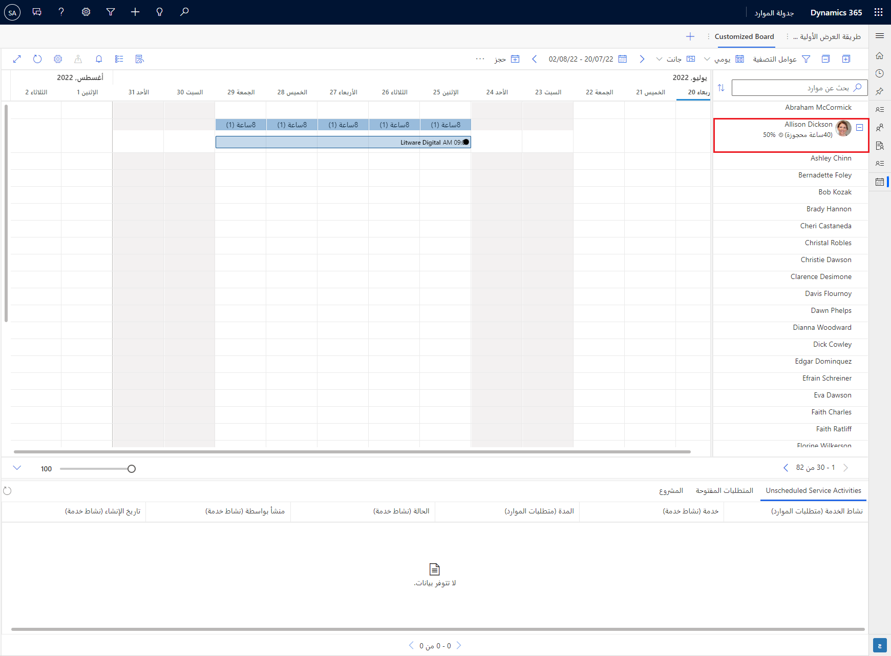
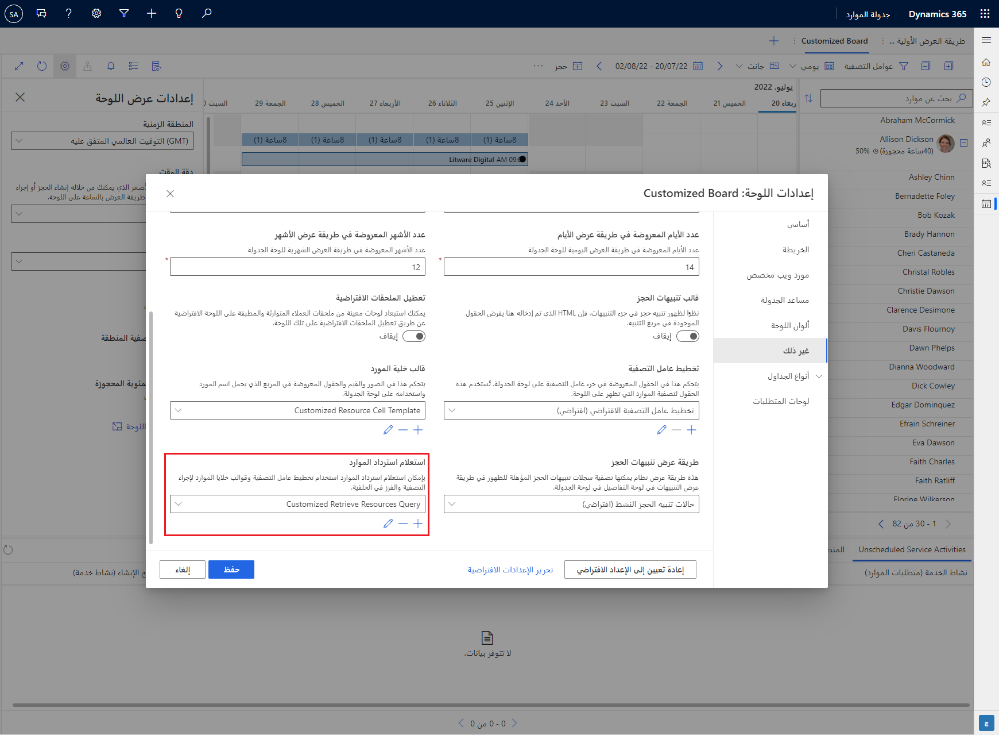
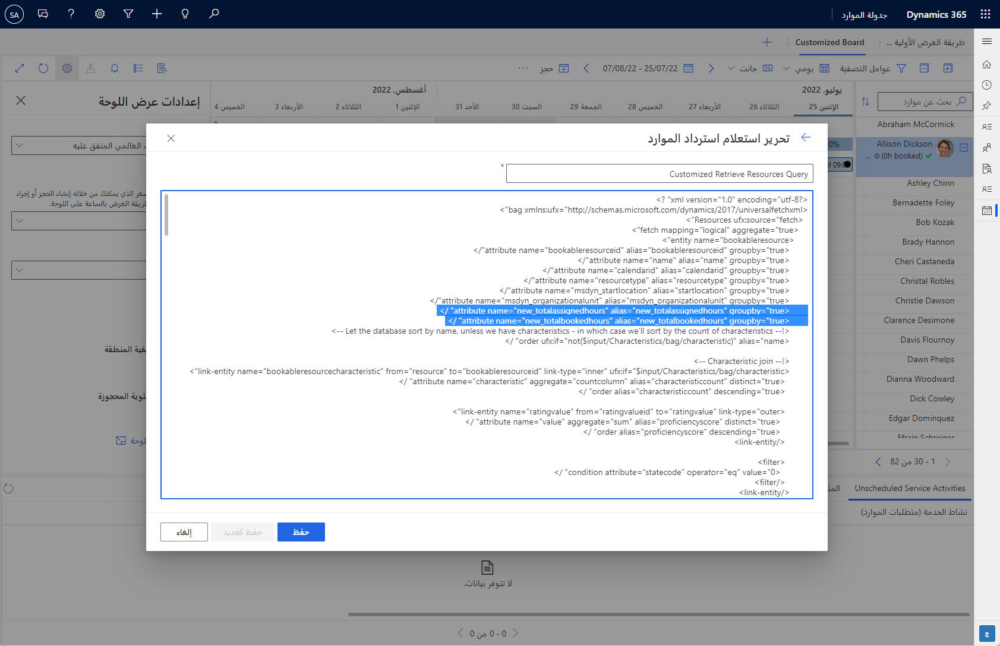

يمكن تخصيص لوحة الجدولة وتوسيعها لمساعدتك على تلبية احتياجات أعمالك.

لننظر إلى سيناريو التخصيص التالي:

يمكنك تعيين مورد قابل للحجز وحجزه لأحد المشاريع. وبسبب عوامل مختلفة، يمكن أن تحدث اختلافات بين الساعات المحجوزة والساعات المعيّنة مقابل مورد قابل للحجز. تريد إدارة الموارد إبراز مثل هذه الاختلافات على اللوحة. في هذا السيناريو، ستقوم بتطبيق التخصيصات التالية على خلية المورد لإظهار ما يلي:

- إجمالي الساعات المحجوزة

- إجمالي الساعات المعيّنة

- علامة اختيار خضراء في الخلية إذا كانت الأرقام متطابقة أو رمز تقاطع أحمر إذا كانت الأرقام مختلفة

في السيناريو الحالي، سيتلقى مورد معين جميع الساعات المحجوزة والمعيّنة في النظام، والتي ستتضمن البيانات السابقة. سيساعد هذا النهج في إبقاء السيناريو بسيطاً. في سيناريو الحياة الواقعية، قد ترغب في الحصول فقط على الساعات المحجوزة/المعيّنة ذات الصلة والمرتبطة بالمشاريع الحالية. ويمكنك أيضاً تصفية البيانات بحيث تظهر الساعات القادمة فقط في الخلية. يمكنك تحقيق هذا الهدف باستخدام Microsoft Power Automate. في هذا السيناريو، ستستخدم حقول القيمة المحتسبة لجمع الساعات.

لمزيد من المعلومات، راجع [الحجوزات مقابل التعيينات](/dynamics365/project-operations/resource-management/booking-vs-assignment/?azure-portal=true).

في هذا التمرين، ستضيف أعمدة القيمة المحتسبة إلى جدول **المورد القابل للحجز**، وستعدّل استعلام المورد، وتحدّث قالب الخلية على لوحة الجدولة.

لمزيد من المعلومات، راجع [إنشاء حقل قيمة محتسبة لتجميع القيم](/dynamics365/customerengagement/on-premises/customize/define-rollup-fields/?azure-portal=true). لإضافة الأعمدة الجديدة إلى جدول الموارد القابلة للحجز، اتبع الخطوات التالية:

1. من [Microsoft Power Apps Maker Portal](https://make.preview.powerapps.com/?azure-portal=true)، حدد البيئة الصحيحة.

1. انتقل إلى **الحلول** > **الحل الافتراضي** > **الجداول** > **مورد قابل للحجز** > **الأعمدة**، ثم أضف عمودين مع التفاصيل التالية.

    **خصائص عمود إجمالي الساعات المحجوزة**

    | **الخاصية** | **القيمة** |
    |--------------|-----------|
    | اسم العرض | إجمالي الساعات المحجوزة |
    | نوع البيانات | عشري |
    | السلوك | القيمة المحتسبة |
    | مطلوب | اختياري |
    | اسم المخطط | new_TotalBookedHours |
    | الاسم المنطقي | new_totalbookedhours |
    | **تكوين حقل القيمة المحتسبة** |
    | الكيان المصدر | المورد القابل للحجز |
    | استخدام التدرج الهرمي | لا |
    | الكيان المرتبط | أعضاء فريق المشروع (مورد قابل للحجز) |
    | عوامل التصفية | إذا كانت الحالة تساوي "نشط" |
    | التجميع | مجموع ساعات حجز العمالة المحدد |

    **خصائص عمود إجمالي الساعات المعيّنة**

    | **الخاصية** | **القيمة** |
    |--------------|-----------|
    | اسم العرض | إجمالي الساعات المعيّنة |
    | نوع البيانات | عشري |
    | السلوك | القيمة المحتسبة |
    | مطلوب | اختياري |
    | اسم المخطط | new_TotalAssignedHours |
    | الاسم المنطقي | new_totalassignedhours |
    | **تكوين حقل القيمة المحتسبة** |
    | الكيان المصدر | المورد القابل للحجز |
    | استخدام التدرج الهرمي | لا |
    | الكيان المرتبط | أعضاء فريق المشروع (مورد قابل للحجز) |
    | عوامل التصفية | إذا كانت الحالة تساوي "نشط" |
    | التجميع | مجموع الجهد الإجمالي (بالساعات) |

1. أضف الأعمدة التي تم إنشاؤها حديثاً إلى النموذج لإدارة مواردك.

1. انشر التغيرات.

## <a name="create-a-new-schedule-board-or-modify-an-existing-one"></a>إنشاء لوحة جدولة جديدة (أو تعديل لوحة جدولة موجودة)

انتقل إلى لوحة الجدولة حيث تريد إضافة الأعمدة الجديدة. تُظهر لقطة الشاشة التالية مثالاً عن لوحة جدولة تحمل العنوان **لوحة مخصصة**. سيتم تمييز المناطق على لوحة الجدولة التي ستقوم بتخصيصها باستخدام الأعمدة الجديدة.

> [!div class="mx-imgBorder"]
> [](../media/cell-template-1-board-customizations.png#lightbox)

## <a name="modify-the-resource-query"></a>تعديل استعلام المورد

لاسترداد الأعمدة الجديدة على اللوحة، ستحتاج إلى تعديل الاستعلام الافتراضي المرتبط باللوحة. يمكنك القيام بذلك من لوحة **إعدادات اللوحة**، التي يمكنك الوصول إليها عن طريق تحديد علامة الحذف (**...**) إلى جانب اسم اللوحة في شريط الأدوات، ثم تحديد **إعدادات اللوحة**.

1. في لوحة **إعدادات اللوحة**، انتقل إلى **غير ذلك‬ > استعلام استرداد الموارد**.

1. أنشئ استعلام موارد جديداً باسم **استعلام استرداد موارد مخصص** باستخدام **استعلام استرداد الموارد‬** باعتباره المصدر. يمكنك القيام بذلك عن طريق فتح الاستعلام الافتراضي الموجود وتحديد الزر **حفظ باسم** في المحرر.

    > [!div class="mx-imgBorder"]
    > [](../media/cell-template-2-board-settings-other.png#lightbox)

    التعليمات البرمجية الموجودة طويلة، وبالتالي فإن القصاصات البرمجية التالية هي الوحيدة التي ستحتاج إلى لصقها في استعلام موارد موجود.

1. بعد هذا السطر:

    `<attribute name="msdyn_organizationalunit" alias="msdyn_organizationalunit" groupby="true" />`

    الصق الأسطر التالية:

    ```xml
    <attribute name="new_totalassignedhours" alias="new_totalassignedhours" groupby="true" />

    <attribute name="new_totalbookedhours" alias="new_totalbookedhours" groupby="true" />
    ```

استخدم الصورة التالية كمرجع.

> [!div class="mx-imgBorder"]
> [](../media/cell-template-3-edit-retrieve-resource-query.png#lightbox)

## <a name="modify-the-resource-cell-template"></a>تعديل قالب خلية المورد

ستقوم بإنشاء **قالب خلية مورد** جديداً باسم **قالب خلية مورد مخصص** من **إعدادات اللوحة** > **غير ذلك** > **قالب خلية المورد** > **إضافة جديد**. الصق التعليمات البرمجية التالية في المحرر، ثم احفظ الإعدادات. قد تحتاج إلى تحديث اللوحة لعرض التغييرات.

```html
<div
    class='resource-card-wrapper {{iif ResourceCellSelected "resource-cell-selected" ""}} {{iif ResourceUnavailable "resource-unavailable" ""}} {{iif IsMatchingAvailability "availability-match" ""}}'>
    {{#if (or (eq (is-sa-grid-view) true) (eq (is-row-small) false)) }}
    {{#if imagepath}}
    
    {{else if isPool}}
    <div class='resource-image pool-resource'></div>
    {{else if isCrew}}
    <div class='resource-image crew-resource'></div>
    {{else}}
    <div class='resource-image unknown-resource'></div>
    {{/if}}
    {{/if}}
    <div class='resource-info'>
        <div class='resource-name primary-text ellipsis' title='{{name}}'>{{name}}</div>
        <div class='secondary-text ellipsis'>
            {{#if (and (eq (is-sa-grid-view) false) (eq (is-row-small) false)) }}
            {{#if ResourceAllocation}}
            <div class='resource-allocation'>{{ResourceAllocation}}</div>
            {{else}}
            {{#if (eq new_totalbookedhours new_totalassignedhours) }}
            <i class="fa fa-check" aria-hidden="true" style="color:#22c55e"></i>
            {{else}}
            <i class="fa fa-times" aria-hidden="true" style="color:#ef4444"></i>
            {{/if}}
            <div class='booked-duration'>
                {{#if new_totalbookedhours}}
                ({{new_totalbookedhours}}h booked)<div class='fo-sch-clock'></div>
                {{else}}
                (0h booked)<div class='fo-sch-clock'></div>
                {{/if}}
            </div>
            <div class='booked-duration'>
                {{#if new_totalassignedhours}}
                ({{new_totalassignedhours}}h assigned)<div class='fo-sch-clock'></div>
                {{else}}
                (0h assigned)<div class='fo-sch-clock'></div>
                {{/if}}
            </div>
            <div class='booked-percentage'>{{BookedPercentage}}%</div>

            {{/if}}
            {{additional-capacity-button false 40 55}}
            {{/if}}
        </div>
        {{additional-capacity-button true 55 605 }}
        {{#if (eq (is-sa-grid-view) false) }}
        <div class='matching-indicator'></div>
        {{/if}}
    </div>
    {{additional-capacity-button false 0 40}}
    {{#if (eq (is-sa-grid-view) false) }}
    {{> resource-map-pin-template this }}
    {{/if}}
</div>
```

يجب الآن أن تظهر علامة الاختيار الخضراء أو رمز التقاطع الأحمر مقابل كل مورد عندما توسّع تفاصيل المورد عن طريق تحديد زر علامة الجمع (**+**). يمكنك الرجوع إلى القسم السابق للحصول على عينة للإخراج مقدمة كمثال.
