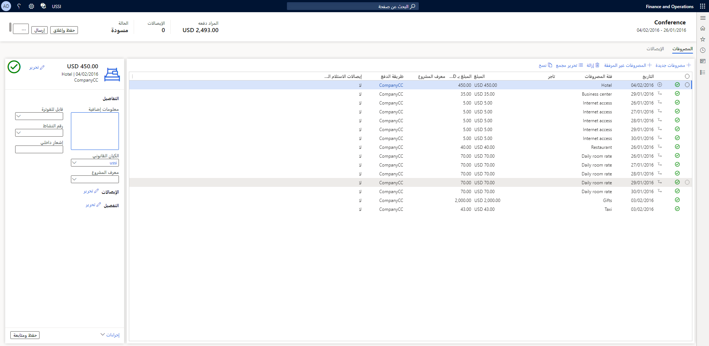

في هذه الوحدة، ستتعرف على الوظائف الأساسية لإدارة المصروفات، وميزاتها المبسطة، والاعتبارات الخاصة بتخطيط التنفيذ الخاص بك لتعزيز قدرات إدارة المصروفات في مؤسستك.In this module, you will learn about the core functionality of Expense management, its streamlined features, and considerations for planning your implementation to enhance your organization's expense management capabilities.

تم تبسيط إمكانات إدارة المصروفات في Microsoft Dynamics 365 Project Operations لعمليات إدارة المصروفات في مؤسستك.The Expense management capabilities in Microsoft Dynamics 365 Project Operations are streamlined for your organization's expense management processes. يمكنك استخدام إدارة المصروفات لإنشاء مهام سير عمل تلقائية لجمع معلومات حول طرق الدفع التي يمكن استخدامها ولتتمكن من تعقب عدد مرات استخدام بطاقة ائتمان الشركة مقابل النقد، على سبيل المثال.You can use Expense management to create automated workflows to collect information on payment methods that can be used and to be able to track how often the company credit card is used versus cash, for example. يمكنك أيضاً استيراد مشتريات بطاقة الائتمان ومراقبة الأموال التي ينفقها الموظفون على مصروفات مؤسستك.You can also import credit card purchases and monitor the money that employees spend on your organization's expenses. ستكون قادراً على استخدام سياسات المصروفات والمعلمات الأخرى الجاهزة لإعداد وإدارة **نفقات المؤسسة** عبر الفئات والتنفيذ التلقائي لسداد نفقات السفر.You will be able to use the expense policies and other out-of-the-box parameters to set up and manage **Organization expenditures** across categories and automate travel expense reimbursement.

في مساحة عمل **إدارة الميزات**، يمكنك تمكين ميزة **إعادة تصور تقارير المصروفات‬** لتبسيط التجربة وتقليل الوقت المطلوب لإكمال تقارير المصروفات.In the **Feature management** workspace, you can enable the **Expense reports reimagined** feature to simplify the experience and reduce the time that is needed to complete expense reports. لتخصيص رؤية حقول النموذج، يمكنك إضافة صفحة **إعداد** جديدة وتحديد البيانات المطلوبة أو الاختيارية أو غير الضرورية عند إدخال تقارير المصروفات.To customize the form fields' visibility, you can add a new **Setup** page and decide what data is required, optional, or unnecessary when expense reports are entered. عند تمكين هذه الميزة، سيتم فتح مساحة عمل جديدة للمصروفات.When this feature is enabled, a new workspace for expenses will open.

مساحة عمل **إدارة المصروفات** هي الصفحة المقصودة لإنشاء تقارير المصروفات وإرسالها.The **Expense management** workspace is the landing page for creating and submitting expense reports.

تتضمن الميزات الأخرى لتقارير المصروفات ما يلي:Other features of expense reports include:

- مساحة لتعقب المصروفات التي تساعدك على عرض مصروفات مفوضك.Space for tracking expenditures that helps you view your delegate's expenses.
- تجربة المطابقة مع الإيصالات للمساعدة في عرض الإيصالات على مستوى الرأس وتحسين طريقة إضافة الإيصالات إلى بنود المصروفات.Matching experience with receipts to help display receipts at the header level and improve the method of adding receipts to expense lines.
- شبكة حديثة للقراءة فقط تتيح لك عرض المزيد من بنود المصروفات والمزيد من أعمدة البيانات.Modern read-only grid that allows you to display even more expense lines and more data columns. ستظهر بنود مفصّلة ومتقطعة، إلى جانب المصروفات الأصلية.Itemized and broken lines, along with their parental expenses, will appear.
- جزء مبسط لتحرير المصروفات.Streamlined expense editing pane.

تمنحك ميزة **إعادة تصور تقارير المصروفات‬** الوصول إلى مصروفات المفوضين من خلال مساحة عمل **إدارة مصروفات** حديثة.The **Expense reports reimagined** feature gives you access to delegates' expenses through a modern **Expense management** workspace. يتضمن جزءاً بسيطاً وسهلاً لتحرير المصروفات وخطأً متقدماً ونظام تحذير ورسائل السياسة لضمان وقت تعطل أقل بفضل التصحيح أو انتظار عمليات التحرير لإرسال تقرير المصروفات بنجاح.It includes a simple and intuitive pane for editing expenses and an advanced error, warning, and policy messaging system to ensure less downtime due to correcting or waiting on edits to submit an expense report successfully. في حالة ظهور مشكلات، يمكن لسير عمل المصروفات توجيه المستخدمين إلى الخطأ وتقديم اقتراحات حول ما يجب إصلاحه.If issues arise, the expense workflow can guide users to the error and offer suggestions on what to fix. 

توفر إدارة المصروفات أيضاً تذكيرات لطيفة بالسياسة للمستخدمين لمساعدة المؤسسة على البقاء في حالة امتثال.Expense management also offers gentle policy reminders to users to help the organization stay in compliance. لضمان حصولك على التجربة الكاملة، تأكد من استخدامك مساحة عمل **إدارة الميزات** لتمكين ميزة مطابقة إيصال تقارير المصروفات.To ensure that you are getting the full experience, make sure that you use the **Feature management** workspace to enable the expense reports receipt matching feature.

