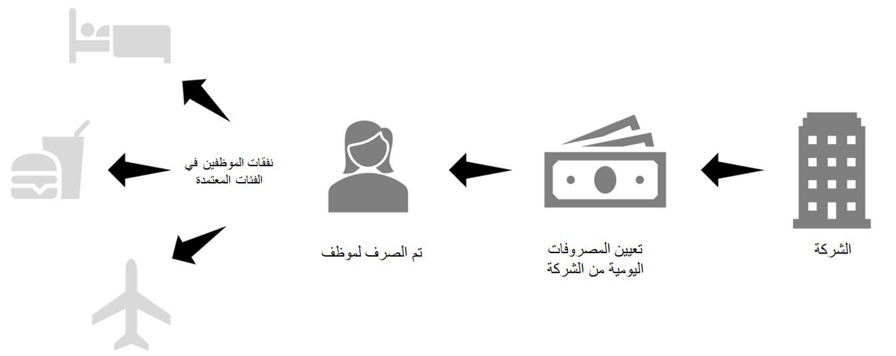
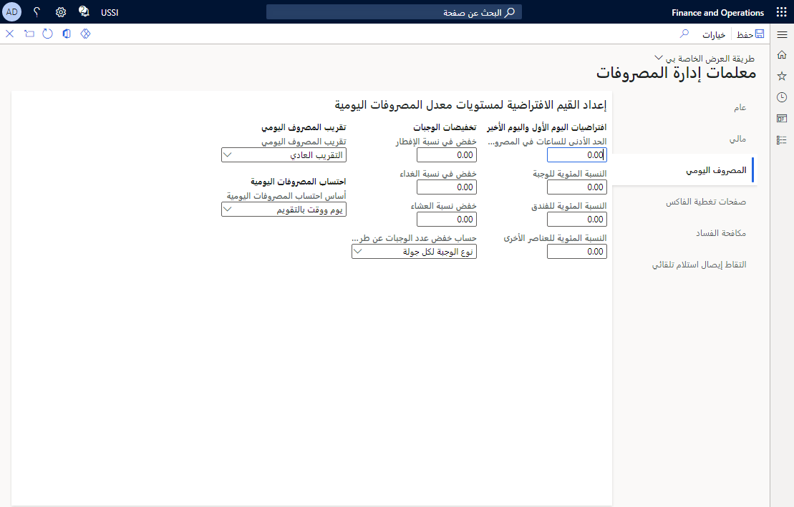

يجب تحديد المصروف اليومي للموظف الذي تقدمه شركتك. نظراً لاستخدام المصروفات اليومية عادةً لتغطية المصروفات مثل الوجبات والإقامة والمصروفات العرضية الأخرى، يمكنك إنشاء إرشادات لبدلات المصروفات اليومية التي تقدمها شركتك. قد يعتمد المصروف اليومي على الوقت من السنة أو وجهة السفر أو كليهما. 

عند تقييم أحد شروط المصروفات اليومية، يمكنك تحديد جزء من معدل المصروف اليومي إذا تلقى عامل وجبات أو خدمات مجانية. يمكنك أيضاً تحديد عتبات معدل المصروفات اليومية وتعيين الحدين الأدنى والأقصى لعدد الساعات التي تتم إضافتها إلى سفر العامل حسب معدل المصروفات اليومية.

 

## تنفيذ المصروفات اليومية

يجب عليك اتخاذ عدة قرارات بخصوص تنفيذ المصروفات اليومية.

اسأل نفسك الأسئلة التالية عند اتخاذ قرارات بخصوص تنفيذ المصروفات اليومية.

**قواعد المصروفات اليومية الافتراضية لليومين الأول والأخير:**

- ما هو الحد الأدنى لعدد الساعات التي يمكن لأحد الموظفين المطالبة بها ليوم ما واستمرار استلام المصروف اليومي؟
- هل هناك تخفيض في المبلغ المقدم لوجبات الطعام لليومين الأول والأخير؟ في حالة وجود تخفيض، ما النسبة المئوية للتخفيض؟
- هل هناك تخفيض في المبلغ المقدم للفندق لليومين الأول والأخير؟ إذا كان كذلك، ما النسبة المئوية للتخفيض؟
- هل هناك تخفيض في المبلغ المقدم للمصروفات الأخرى التي يتم تحملها لليومين الأول والأخير؟ إذا كان كذلك، ما النسبة المئوية للتخفيض؟

**قواعد المصروفات اليومية الافتراضية:**

- هل هناك نسبة تخفيض في بدل المصروفات اليومية لكل وجبة إذا كانت الوجبة مجانية على سبيل المثال؟ في حالة وجود تخفيض، ما النسبة المئوية للتخفيض لكل وجبة؟
- هل يتم احتساب تخفيض الوجبات لكل يوم أو لكل رحلة أو حسب عدد الوجبات في اليوم؟
- هل يتعين تقريب مبالغ المصروفات اليومية بالطريقة العادية أم تقريبها لأعلى؟
- هل يتم احتساب المصروفات اليومية استناداً إلى فترة 24 ساعة أو يوم تقويم؟ 

 
    

**قواعد المصروفات اليومية التي تستند إلى الموقع:**

- هل تختلف معدلات المصروفات اليومية وفقاً للموقع؟ ما المواقع المضمنة؟
- إذا اختلفت معدلات المصروفات اليومية وفقاً للموقع، لكل موقع، ما النسبة المئوية للمبلغ الذي يتم توفيره لأنواع المصروفات التالية؟
    - الوجبات
    - الفندق
    - مصروفات أخرى

