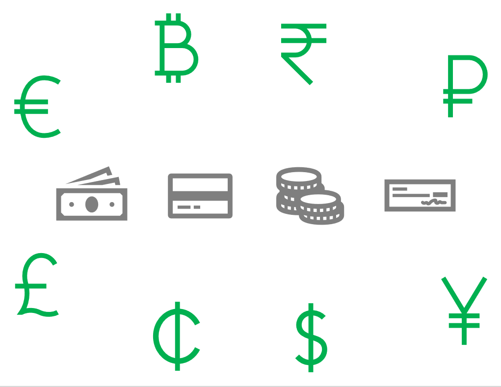

يجب عليك تحديد طرق الدفع التي يتعين على الموظفين استخدامها عندما تسمح لهم بتكبد مصروفات نيابةً عن شركتك. علي سبيل المثال، قد تسمح للعاملين باستخدام النقود أو بطاقة ائتمان خاصة بشركة. يمكنك أيضاً السماح للموظفين باستخدام بطاقات الائتمان الشخصية ثم تعويضهم. 

**الأسئلة التي يجب مراعاتها عند السماح باستخدام نوع الدفع جنباً إلى جنب مع المصروفات**

يجب عليك اتخاذ القرارات التالية لكل طريقة دفع تعتمدها:

- ما طرق الدفع المسموح بها؟ 
- من يتحمل المصروفات الخاصة بطريقه الدفع الشركة أم العامل مثلاً؟
- هل يتوفر نوع حساب بمقابل؟ إذا كان نوع حساب المقابل متاحاً، فما هو؟ 
- إذا كان نوع حساب المقابل متاحاً، فما هو؟ 
- إذا كانت بطاقة الائتمان هي طريقه الدفع، فهل يجب استخدام طريقه الدفع فقط للحركات التي تم استيرادها ؟

