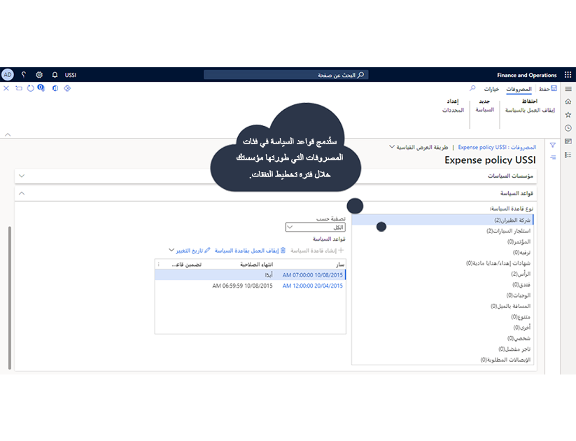

 

تساعد السياسات على ضمان عدم تجاوز الموظفين حدود الميزانية، وتوفير جميع المعلومات المطلوبة، وإنفاق الأموال عند الحاجة فقط. 

يتعين مراعاة العوامل التالية لكل سياسة تقرير مصروفات والاعتماد الذي تم إنشاؤه:

- اسم السياسة
- الغرض من سياسة المصروفات
- إذا تم تمكين المصروفات بين الشركات الشقيقة، فما هي الشركات التي سيتم تطبيق هذه السياسة عليها
- ما إذا كان للسياسة إطار زمني فعال
- إذا كان للسياسة تاريخ انتهاء
- المعلمات الدقيقة لقاعدة السياسة
- النتيجة المرجوة من قاعدة السياسة

 
