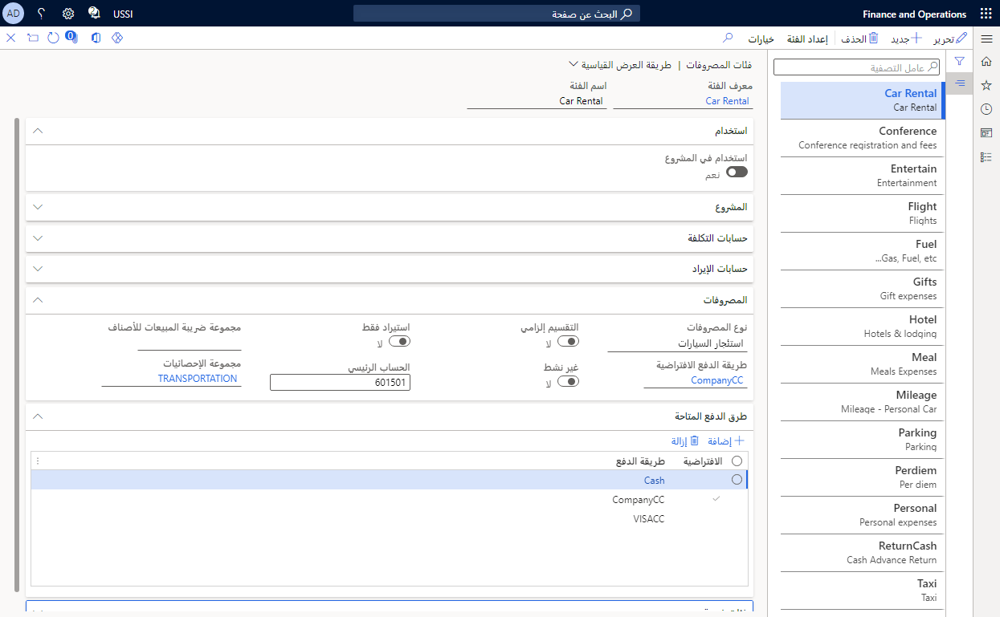

عند إنشاء الموظفين تقرير مصروفات، يجب أن يقترن كل مصروف من المصروفات التي قاموا بتسجيلها بفئة مصروفات. 

يتم اشتقاق فئات المصروفات من الفئات التي يمكن مشاركتها عبر الكيانات القانونية في مؤسستك. يمكن أيضاً مشاركة هذه الفئات في إدارة المشروع والمحاسبة، اعتماداً على كيفية تعريف مؤسستك. 

> [!NOTE]
> يمكن مشاركة فئات المصروفات بين المشروع والمصروفات أو المشروع والإنتاج، ولكن ليس بين المصروفات والإنتاج. 

تتضمن بعض فئات المصروفات المستخدمة على نطاق واسع تذاكر الطيران والإقامة والوجبات والانتقالات.

**أسئلة يتعين مراعاتها عند إنشاء فئات المصروفات لمؤسسة:**

- ما هو نوع المصروفات؟ فئات الرحلات الجوية أو الفنادق أو الأميال على سبيل المثال.
- هل يمكن استخدام فئة المصروفات في إدارة المشاريع والمحاسبة؟
- ما طريقة الدفع الافتراضية التي يتعين تحديدها لفئة المصروفات؟
- هل تحتاج إلى تفصيل المصروفات؟
- ما هو الحساب الافتراضي لفئة المصروفات؟
- ما مجموعة ضريبة المبيعات للصنف الافتراضية لفئة المصروفات؟
- ضع في اعتبارك ما إذا كان يجب استخدام طرق دفع إضافية لفئة المصروفات. إذا كان الأمر كذلك، فما هي هذه الطريقة؟
- هل ستشتمل فئة المصروفات على فئات فرعية؟ وإذا كان الأمر كذلك، فيجب إيلاء اهتمام إضافي للمواضيع التالية:
    - هل سيتم استبعاد أي من الفئات الفرعية من استرداد الضرائب؟
    - ما مجموعة ضريبة المبيعات للصنف للفئات الفرعية؟
- هل يمكن استخدام فئة المصروفات في إدارة المشاريع والمحاسبة؟ إذا كانت الإجابة بنعم، انظر أيضاً العوامل التالية:
    - ما حسابات التكلفة التي سيتم استخدامها للمصروفات التالية؟
        - التكلفة
        - تخصيص الرواتب
        - أعمال قيد التنفيذ (WIP)-قيمه التكلفة
        - Cost-item
        - WIP-cost value-item
        - الخسارة المستحقة
        - WIP-accrued loss
    - ما حسابات الإيرادات التي سيتم استخدامها لما يلي؟
        - إيراد تمت فوترته
        - قيمة Accrued revenue-sales
        - قيمة WIP-sales
        - Accrued revenue-production
        - WIP-production
        - Accrued revenue-profit
        - WIP-profit
        - Accrued revenue-subscription
        - WIP-subscription

