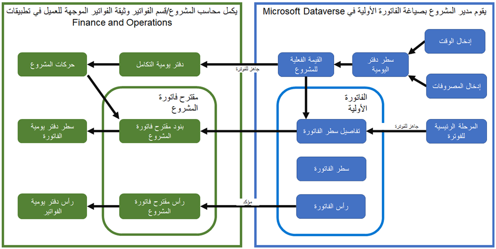

بالنسبة لعملية الفوترة، سيقوم مدير المشروع بإدارة تراكم فوترة المشروع، وسيقوم موظف حسابات المقبوضات/محاسب المشروع بإنشاء مستند فاتورة متوافق ودقيق مخصص للعملاء.

تحدد شروط تعاقد المشروع طريقة الفوترة لحركات المشروع ذات الصلة. عندما يوافق مدير المشروع على حركات الوقت والمصروفات، يسجل النظام الحركات في كيان **القيم الفعلية للمشروع** ثم يرسل المعلومات إلى الوحدة النمطية لإدارة المشاريع والمحاسبة في Microsoft Dynamics 365 Finance. يقوم محاسب المشروع بعد ذلك بمراجعة السجلات وترحيلها باستخدام [دفتر يومية التكامل في Microsoft Dynamics 365 Project Operations](https://docs.microsoft.com/dynamics365/project-operations/project-accounting/project-operations-integration-journal/?azure-portal=true). يتضمن دفتر اليومية تفاصيل محاسبية مهمة للقيم الفعلية للمشروع، مثل الفوترة ومجموعة ضريبة المبيعات ومجموعة ضريبة مبيعات صنف الفوترة والأبعاد المالية.

يمكن لمدير المشروع مراجعة حركات المبيعات غير المفوترة باستخدام طريقة فوترة الوقت والمواد في [تراكم الفوترة الزمنية والمواد ](https://docs.microsoft.com/dynamics365/project-operations/proforma-invoicing/manage-billing-backlog/?azure-portal=true#time-and-material-billing-backlog)وفوترة السعر الثابت في [المراحل الرئيسية للسعر الثابت ](https://docs.microsoft.com/dynamics365/project-operations/proforma-invoicing/manage-billing-backlog/?azure-portal=true#fixed-price-milestones). وتتيح طرق العرض هذه إمكانية تصفية الحركات التي يجب تضمينها في دوره الفوترة التالية وتحديدها ثم وضع علامة عليها كحركات **جاهزة للفوترة**.

يمكنك [إنشاء فاتورة أولية يدوياً ](https://docs.microsoft.com/dynamics365/project-operations/proforma-invoicing/create-manual-proforma-invoice/?azure-portal=true) أو استخدام [عملية دورية ](https://docs.microsoft.com/dynamics365/project-operations/proforma-invoicing/configure-automated-invoice-creation/?azure-portal=true). يمكن لمدير المشروع تعديل مسودة الفاتورة الأولية حسب الحاجة ثم تأكيدها.

يتم إرسال الفاتورة الأولية التي تم تأكيدها إلى الوحدة النمطية لإدارة المشاريع والمحاسبة في التمويل. سيقوم محاسب المشروع بتنسيق اقتراح فاتورة المشروع وتحديثه، ثم يعمل بعد ذلك على ترحيل المستند وطباعته. يتم تسجيل فواتير المشروع التي تم ترحيلها في دفتر الأستاذ العام ودفاتر الأستاذ الفرعية للعميل والمشروع.

