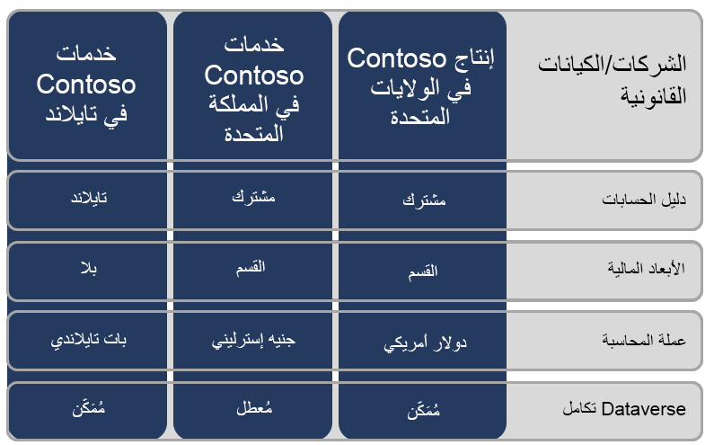

محاسبة المشروع في Microsoft Dynamics 365 Project Operations:

- تم بناؤها استناداً إلى Microsoft Dynamics 365 Finance. 
- مصدر البيانات الحقيقية للمكونات المالية في Project Operations مثل ضريبة المبيعات وأسعار الصرف ومحاسبة العمل قيد التقدم (WIP) واستحقاقات الإيرادات والإقرار.

يمكنك تكوين تكامل Microsoft Dataverse لكل كيان قانوني.

يُعد المخطط التالي مثالاً على كيفية تكوين الإعداد.

