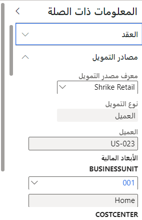

يستخدم Project Operations إطار عمل [الأبعاد المالية](https://docs.microsoft.com/dynamics365/finance/general-ledger/financial-dimensions/?azure-portal=true) في Dynamics 365 Finance لتوفير رؤى إضافية بشأن معاملات دفتر الأستاذ العام ودفتر الأستاذ الفرعي للمشروع.

يمكن إعداد الأبعاد المالية الافتراضية في العميل أو مصدر تمويل المشروع أو الحدث الرئيسي أو بند عقد المشروع أو المشروع.

## تحديد الأبعاد المالية الافتراضية لعميل
يتم تحديد القيم الافتراضية لأبعاد العميل في التمويل. أكمل الخطوات التالية لتعيين افتراضيات الأبعاد:

1.  انتقل إلى **الحسابات المدينة > العملاء > كافة العملاء**.
2.  في صفحة **العملاء**، ضمن علامة التبويب **الأبعاد المالية**، قم بتعيين قيم الأبعاد المالية لعميل محدد.

## تحديد الأبعاد المالية الافتراضية لعقود المشروع
يتم إنشاء عقود المشروع والمحافظة عليها في Microsoft Dataverse. يتم تعيين سمات المحاسبة لعقود المشروع في الوحدة النمطية لإدارة المشاريع والمحاسبة في الشؤون المالية.

## تعيين الأبعاد المالية لمصدر تمويل مشروع
لتعيين الأبعاد المالية لمصدر تمويل مشروع، اتبع الخطوات التالية:

1.  انتقل إلى **إدارة المشاريع والمحاسبة > المشاريع > عقود المشاريع**.
2.  حدد السجل الذي ترغب في تحديثه، وفي علامة التبويب **عقد المشروع**، حدد **إظهار المحاسبة الافتراضية**.
3.  قم بتوسيع **المعلومات ذات الصلة** وحدد علامة التبويب **مصادر التمويل**.
4.  قم بتعيين افتراضيات الأبعاد المالية. لاحظ أنّ الأبعاد المالية تتخلف عن حساب العميل.

## قم بتعيين الأبعاد المالية لبند عقد مشروع
لتعيين الأبعاد المالية لبند عقد مشروع، اتبع الخطوات التالية:

1.  انتقل إلى **إدارة المشاريع والمحاسبة > المشاريع > عقود المشاريع**.
2.  حدد السجل الذي ترغب في تحديثه، وفي علامة التبويب **عقد المشروع**، حدد **إظهار المحاسبة الافتراضية**.
3.  قم بتوسيع **المعلومات ذات الصلة** وحدد علامة التبويب **بنود العقد**.
4.  قم بتعيين افتراضيات الأبعاد المالية. تكون افتراضيات الأبعاد المالية قابلة للتطبيق ويمكن استخدامها فقط مع بنود العقود الخاصة **بالسعر الثابت (الحدث الرئيسي)**.

يتم استخدام هذه الإعدادات الافتراضية في بنود الفواتير والمعاملات على الحساب الخاصة بالمشروع ذات الصلة.

## تحديد الأبعاد المالية الافتراضية للمشاريع
يتم إنشاء المشاريع والمحافظة عليها في Microsoft Dataverse. يتم تعيين سمات المحاسبة للمشاريع في الوحدة النمطية لإدارة المشاريع والمحاسبة في الشؤون المالية.

1.  انتقل إلى **إدارة المشاريع والمحاسبة > المشاريع > كل المشاريع**.
2.  حدد السجل الذي ترغب في تحديثه، وفي علامة التبويب **المشروع**، حدد **إظهار المحاسبة الافتراضية**.
3.  قم بتوسيع **المعلومات ذات الصلة** وحدد علامة التبويب **الإعداد**.
4.  قم بتعيين افتراضيات الأبعاد المالية. لاحظ أن الأبعاد المالية تتخلف عن حساب العميل. إذا كان المشروع مرتبطاً ببند عقد يحتوي على عملاء عقود مشاريع متعددين، فسيتم استخدام العميل الأساسي للتخلف عن الأبعاد المالية.

يتم استخدام الأبعاد المالية الافتراضية للمشروع لتعيين افتراضيات سطر دفتر اليومية لمعاملات الوقت والمصروفات والرسوم في **دفتر يومية تكامل Project Operations** وفي بنود فواتير المشاريع ذات الصلة.

