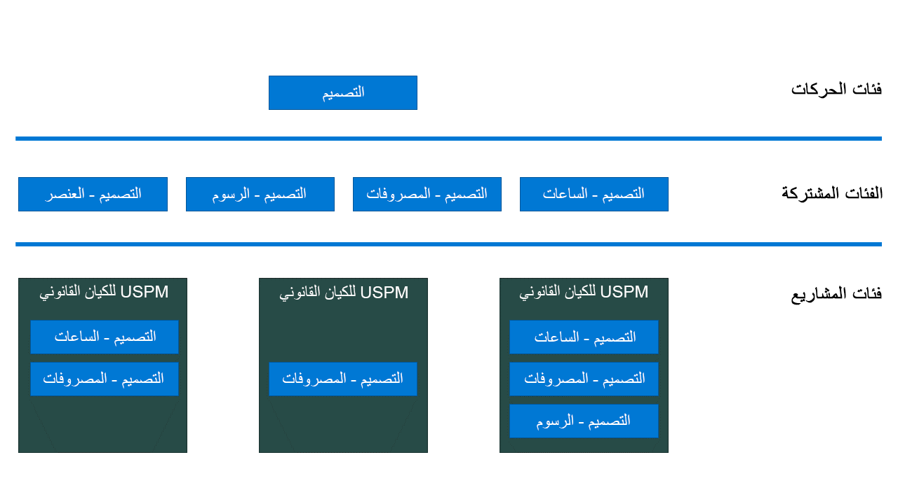

يوفر Project Operations إمكانات فعّالة لتصنيف الإيرادات والمصروفات في المشاريع. تُتيح لك الفئات إمكانية إعداد تقارير حول معاملات المشروع وتحليلها وتعزيز الترحيل إلى دفتر الأستاذ العام.

يوضّح الرسم التخطيطي التالي الارتباط بين فئات المعاملات والفئات المشتركة وفئات المشاريع.

وتمثّل فئات المعاملات التجميعات الأساسية لمعاملات المشروع. وتندرج ضمن هذا التجميع مجموعة من الفئات المشتركة التي يمكن مشاركتها عبر التطبيقات والوحدات النمطية. وتُشكِّل فئات المشاريع مستوى الفئات الأكثر دقة وتتعلق تحديداً بالكيان القانوني والوحدة النمطية والتطبيق.

## فئات المعاملات
تُمثّل فئات المعاملات التجميع الأساسي لمعاملات المشروع ولا تتعلق بنوع الشركة أو المعاملة. على سبيل المثال، تستخدم شركة Contoso Robotics فئات التصميم والسفر والتثبيت ومعاملة الخدمة لتجميع معاملات المشروع.

يمكنك تحديد فئات المعاملات في Project Operations:

1.  انتقل إلى **الإعدادات > فئات المعاملات** لفتح الصفحة.
2.  يمكنك إنشاء فئة معاملة جديدة من خلال تحديد **جديد** أو **استيراد من Excel**.

## الفئات المشتركة
يستخدم Microsoft Dynamics 365 مفهوم الفئات المشتركة لتصنيف المصروفات في تطبيقات مختلفة، مثل Finance وSupply Chain Management وProject Operations. 

يُنشئ Project Operations تلقائياً لكل فئة معاملة يتم إنشاؤها أربع فئات مشتركة ذات صلة:

- **الساعات‬**
- **المصروفات**
- **الرسوم**
- **الصنف**

يمكنك مراجعة الفئات المشتركة وتعديلها من خلال الانتقال إلى **إدارة المشاريع والمحاسبة > الإعداد > الفئات > الفئات المشتركة**.

## فئات المشاريع
تعتبر فئات المشاريع المستوى الأكثر دقة لتكوين الفئات ويجب تكوينها بشكل منفصل لكل شركة من خلال محاسب المشروع.

1.  انتقل إلى **إدارة المشاريع والمحاسبة‬‬‏‫ > الإعداد > الفئات > فئات المشاريع**.
2.  حدد **جديد**.
3.  حدد **معرّف الفئة** للفئة المشتركة التي أنشأتها في القسم السابق. يُتيح لك Project Operations استخدام تلك الفئات المشتركة المقترنة بفئات المعاملات فقط.
4.  حدد ‏‫مجموعة الفئات.

## مجموعات الفئات
تُستخدم مجموعات الفئات لمشاركة الخصائص، وملفات تعريف الترحيل بشكل أساسي، بين فئات المشاريع ذات الصلة. يجب أن يكون هناك مجموعة فئات واحدة على الأقل لكل نوع معاملة ويتم تعيين مجموعة لكل فئة مشاريع.

يتم تحديد مواصفات الترحيل في Project Operations وفقاً لقواعد ملفات تعريف تكلفة المشروع وإيراداته وفئات المشاريع ومجموعات الفئات. يمكنك إعداد مجموعات الفئات من خلال **إدارة المشاريع والمحاسبة > الإعداد > الفئات > مجموعات الفئات**.
