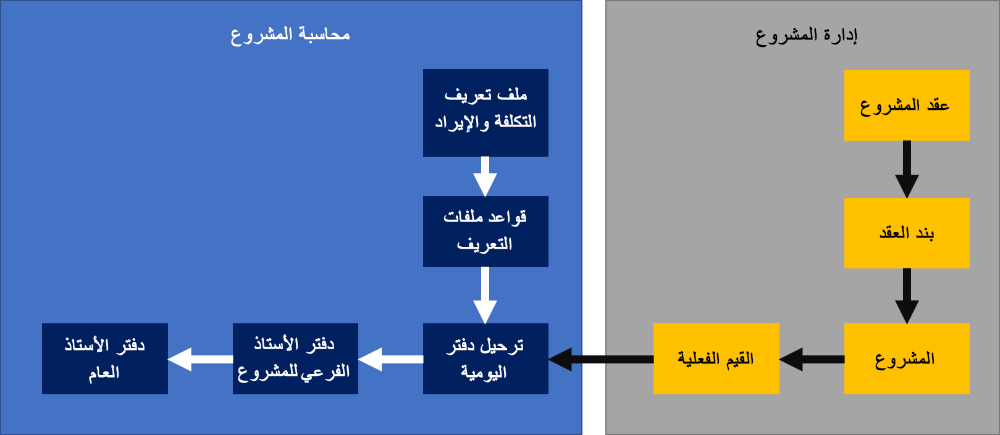

تعمل قيود الوقت والمصروفات على إنشاء الحركات **الفعلية** التي تمثل العرض التشغيلي للعمل الذي تم استكماله مقابل أحد المشاريع. يوفر Project Operations محاسبين باستخدام أداة لمراجعة الحركات وتعديل سمات المحاسبة حسب الحاجة. بعد اكتمال المراجعة والتعديلات، يتم ترحيل الحركات إلى دفتر الأستاذ الفرعي ودفتر الأستاذ العام الخاصيْن بالمشروع. يمكن لمحاسب تنفيذ هذه الأنشطة باستخدام دفتر يومية **تكامل Project Operations** (**التمويل > إدارة المشروع والمحاسبة > دفاتر اليومية > دفتر يومية تكامل Project Operations**).

## إنشاء سجلات في دفتر يومية التكامل
يتم إنشاء السجلات الموجودة في دفتر يومية تكامل Project Operations باستخدام عملية دورية تسمى **الاستيراد من الجدول المرحلي**. ويمكنك إجراء هذه العملية من خلال الانتقال إلى **التمويل > إدارة المشاريع والمحاسبة > دوري > تكامل Project Operations > الاستيراد من الجدول المرحلي**. ويمكنك إجراء العملية بشكلٍ تفاعلي أو تكوين العملية لإجرائها في الخلفية حسب الحاجة.

عند إجراء العملية الدورية، يتم العثور على أي قيم فعلية لم تتم إضافتها بعد إلى دفتر يومية تكامل Project Operations. يتم إنشاء سطر دفتر اليومية لكل حركة فعلية. يقوم النظام بتصنيف سطور دفتر اليومية إلى دفاتر يومية منفصلة استناداً إلى القيمة التي تم تحديدها في حقل **‏‫وحدة الفترة‬ في دفتر يومية تكامل Project Operations** (**التمويل > إدارة المشاريع والمحاسبة > الإعداد > معلمات إدارة المشروع والمحاسبة**، **Project Operations في علامة التبويب Dynamics 365 Customer Engagement**). 

تتضمن القيم المحتملة لهذا الحقل ما يأتي:

- **الأيام** - قيم فعلية يتم تصنيفها حسب تاريخ الحركة. يتم إنشاء دفتر يومية منفصل لكل يوم.
- **الأشهر** قيم فعلية يتم تصنيفها حسب شهر التقويم. يتم إنشاء دفتر يومية منفصل لكل شهر.
- **الأعوام** قيم فعلية يتم تصنيفها حسب عام التقويم. يتم إنشاء دفتر يومية منفصل لكل عام.
- **الكل** جميع الحركات الفعلية التي تم إدراجها في نفس دفتر يومية التكامل. إذا لم يكن دفتر اليومية متاحاً عند إجراء العملية الدورية، مثلاً إذا كان دفتر اليومية يقوم بعملية ترحيل الحركات، فسيتم إنشاء دفتر يومية جديد.

