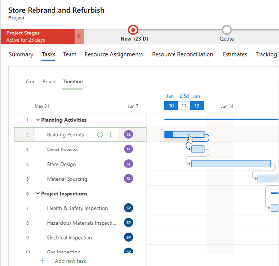

يعبر هيكل تنظيم العمل (WBS) عن وصف للعمل الذي سيتم إنجازه لمشروع.A work breakdown structure (WBS) is a description of the work that will be done for a project. وهو عبارة عن تدرج هرمي للمهام يمثل قدرة فريق المشروع على استيعاب مزج مهام العمل معاً وحجم كل مكون أو مهمة وتكلفتها ومدتها.It’s a hierarchy of tasks that represents the project team’s understanding of the composition of work and of the size, cost, and duration of each component or task. يضم هيكل تنظيم العمل ثلاثة أغراض رئيسية:A WBS has three major purposes:

- وصف تنظيم العمل وتقسيمه إلى مهام أو دمجها معاً.Describe the breakdown or composition of work in tasks.
- جدولة عمل المشروع.Schedule the project work.
- تعيين الموارد إلى عمل المشروع.Assign resources to the project work.

تعتمد درجة التفاصيل في هيكل تنظيم العمل على مستوى الدقة المطلوب في التقديرات ومستوى التعقب اللازم مقابل تلك التقديرات.The degree of detail in a WBS depends on the level of accuracy that is required in estimates and the level of tracking that is required against those estimates. عادة ما تتطلب المشاريع، التي لديها تجاوز منخفض لفترات التأخر في الجدول الزمني أو التكلفة، هيكل تنظيم عمل أكثر تفصيلاً، بالإضافة إلى التعقب الدؤوب لتقدم العمل والتكلفة مقابل هيكل تنظيم العمل.Projects that have low tolerance for slippages in schedule or cost usually require a more detailed WBS, in addition to diligent tracking of work progress and cost against the WBS. هذا النوع من المشاريع شائع في صناعات البناء والهندسة.This kind of project is common in the construction and engineering industries.

