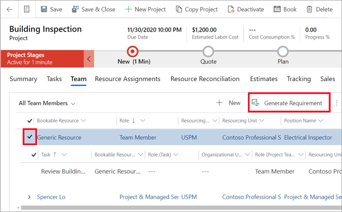

تُحدَّد متطلبات الموارد من جانب مدير المشروع لتقرير الموارد اللازمة لتنفيذ العمل في المشروع.Resource requirements are defined by the project manager to establish the resources that are needed to implement the work on the project. 

أكمل الخطوات الآتية لتحديد متطلبات الموارد.Complete the following steps to define a resource requirement.

1.  في **هيكل تنظيم العمل**، أنشئ مهمة واحدة أو أكثر.In the **Work breakdown structure**, create one or more tasks.
2.  تعيين عضو فريق عام لكل مهمة.Assign a generic team member to each task. ستعمل التعيينات على تحديث الجهد الإجمالي لعضو فريق المشروع.The assignments will update the total effort of the project team member.
3.  في علامة التبويب **الفريق**، حدد عضو الفريق ثم حدد **إنشاء متطلبات**.On the **Team** tab, select the team member and then select **Generate Requirement**.

    

شاهد الفيديو الآتي للاطلاع على عرض توضيحي حول كيفية إضافة موارد إلى خطة المشروع.Watch the following video for a demonstration of how to add resources to a project plan.

 > [!VIDEO https://www.microsoft.com/videoplayer/embed/RWzdR0]

## تحرير تفاصيل متطلبات المواردEdit resource requirement details
بعد تحديد متطلبات المورد عن طريق الإجراء **إنشاء متطلبات** في شبكه عضو الفريق، ويمكن لمدير المشروع تحرير المتطلبات وإضافة مزيد من التفاصيل.After a resource requirement is defined by the **Generate Requirement** action in the team member grid, the project manager can edit the requirement and add more details.

بصفتك مدير مشروع، أكمل الخطوات الآتية لتحرير متطلبات الموارد الخاصة بعضو الفريق.As a project manager, complete the following steps to edit a team member’s resource requirement.

1.  انتقل إلى شبكة **عضو الفريق**، وحدد موقع عضو الفريق في القائمة، ثم حدد رابط متطلبات الموارد ذات الصلة.Go to the **Team member** grid, locate the team member in the list, and then select the link to the associated resource requirements.
2.  في النموذج **تفاصيل المتطلبات**، قم بتحديث السمات الآتية، حسب الضرورة:On the **Requirement details** form, update the following attributes, as necessary:
    - المهاراتSkills
    - الأدوارRoles
    - تفضيلات المواردResource preferences
    - الوحدة التنظيمية المفضلةPreferred organization unit
    - شركة التوريدResourcing company

## تحرير مخططات تعيين المواردEdit resource assignment contours
إضافة إلى تحرير تفاصيل متطلبات الموارد، يستطيع مدير المشروع تحديث المخططات الفردية لمتطلبات الموارد باستخدام وظيفة **تحديد النمط**.In addition to editing the details of the resource requirements, a project manager can update the individual contours of the resource requirement by using the **Specify Pattern** functionality. عند اختيار **تحديد النمط**، يتم فتح الصفحة، ويمكنك عرض المخططات بمقياس زمني مدته يوم أو أسبوع أو شهر.When **Specify Pattern** is selected, a page opens, and you can view contours at the day, week, or month time scale. يمكن ضبط كل مخطط لوقت البدء ووقت الانتهاء وإجمالي الجهد في فتره معينة.Each contour can be adjusted for start time, end time, and total effort in a given period.

## إرسال طلب مواردSubmit a resource request
يمكنك إرسال متطلب الموارد التي تم إنشاؤها كطلب موارد.You can submit a generated resource requirement as a resource request. بعد ذلك، يتم إرسال الطلب إلى مدير الموارد لاستيفائه.The request is then sent to a Resource Manager for fulfillment.

1.  في Project Operations، في صفحة **المشاريع**، حدد علامة التبويب **الفريق** لعرض قائمة الموارد القابلة للحجز.In Project Operations, on the **Projects** page, select the **Team** tab to view a list of bookable resources.
2.  حدد المَورد العام الذي يحتوي على متطلب موارد من القائمة ثم حدد **إرسال الطلب**.Select the generic resource that has a resource requirement from the list, and then select **Submit Request**.

ستتغير حالة طلب عضو الفريق العام إلى **تم الإرسال**.The request status of the generic team member will change to **Submitted**.

بعد استيفاء الطلب، يتم استبدال المَورد العام بمَورد مسمى إذا كانت إدارة الموارد تستوفي الطلب من خلال حجز مَورد مسمى.After the request is fulfilled, the generic resource is replaced by a named resource if the Resource Manager fulfills the request by booking a named resource. أو، إذا كان مدير الموارد يقترح مَورداً مسمى، فسيظل المَورد العام موجوداً في الفريق وستتغير حالة الطلب إلى **بحاجة إلى المراجعة**.Otherwise, if the Resource Manager proposes a named resource, the generic resource remains on the team and the request status will change to **Needs Review**.

شاهد الفيديو الآتي للحصول على عرض توضيحي حول كيفية إنشاء متطلبات الموارد وإرسالها.Watch the following video for a demonstration of how to generate and submit resource requirements.
 

 > [!VIDEO https://www.microsoft.com/videoplayer/embed/RWzk1H]

