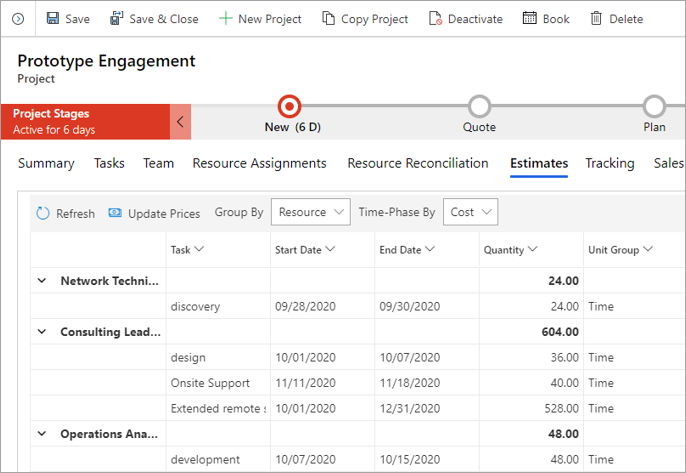

في عرض الأسعار المستند إلى المشروع، يمكنك استخدام الكيان **تفصيل بند عرض الأسعار** لتقدير العمل المطلوب من أجل تسليم المشروع. بعد ذلك، يمكنك مشاركة هذا التقدير مع العميل.

يمكن أن تكون قيمة بنود عرض الأسعار المستند إلى المشروع صفراً في العديد من تفاصيل بند عرض الأسعار. يتم استخدام تفاصيل بند عرض الأسعار لتقدير الوقت أو المصروفات أو الرسوم. لا تسمح Project Operations بتقديرات المواد في تفاصيل بند عرض الأسعار. وتسمى هذه التقديرات فئات الحركة. كما يمكن إدخال مبالغ الضريبة المقدَّرة في فئة الحركة.

بالإضافة إلى فئات الحركة، تحتوي تفاصيل بند عرض الأسعار على نوع الحركة. يتم دعم نوعين من أنواع الحركة لتفاصيل بند عرض الأسعار: **التكلفة** و **عقد المشروع**.

## التقدير باستخدام عقد
إذا استخدمت عرض أسعار عند إنشاء عقد يستند إلى المشروع، فإنه يتم نسخ التقدير الذي أجريته لكل بند عرض أسعار في عقد المشروع. تكون بنية عقد المشروع مماثلة لبنية عرض أسعار المشروع الذي يحتوي على بنود وتفاصيل بنود وجداول فواتير.

يمكن إجراء التقديرات مباشرةً في عقد المشروع، كما يتم إجراؤها في عرض أسعار المشروع. بالنسبة إلى عرض أسعار المشروع، يتم إجراء التقدير باستخدام شروط التعاقد وتفاصيل شروط التعاقد. كما يمكن إنشاء تفاصيل شروط التعاقد من خطة مشروع تم إنشاؤها باستخدام طريقة التقدير من أسفل إلى أعلى.

يمكن استخدام تفاصيل شروط التعاقد لتقدير الوقت أو المصروفات أو الرسوم. كما يمكن إدخال مبالغ الضريبة المقدَّرة في تفاصيل شروط التعاقد.

لا يُسمح بتقديرات المواد في تفاصيل شروط التعاقد.

وتتمثل العمليات المعتمدة على عقد المشروع في إنشاء الفواتير وتأكيدها. سيؤدي إنشاء الفاتورة إلى إنشاء مسودة لفاتورة مستندة إلى المشروع تتضمن كافة القيم الفعلية للمبيعات غير المفوترة حتى التاريخ الحالي.

يؤدي التأكيد إلى تعيين العقد القراءة فقط وتغيير حالته من **المسودة** إلى **مؤكد**. بعد اتخاذ هذا الإجراء، لا يمكنك التراجع عنه. لأن هذا الإجراء دائم، نوصي بالاحتفاظ بالعقد في حالة **المسودة**.

تتمثل الاختلافات الوحيدة بين عقود المسودة والعقود المؤكدة في حالتها وفي حقيقة أن عقود المسودة يمكن تحريرها، بينما لا يمكن تحرير العقود المؤكدة. يمكن إجراء إنشاء الفواتير وتعقب القيم الفعلية في عقود المسودة والعقود المؤكدة.

لا تدعم Project Operations أوامر التغيير في العقود أو المشاريع.

## تقدير المشاريع
يمكنك تقدير الوقت والمصروفات على المشاريع. لا تسمح Project Operations بتقديرات المواد أو الرسوم على المشاريع.

يتم إنشاء تقديرات الوقت عندما تقوم بإنشاء مهمة وتحديد سمات المورد العام المطلوبة لأداء المهمة. يتم إنشاء تقديرات الوقت من المهام المجدولة. لا يتم إنشاء تقديرات الوقت إذا قمت بإنشاء أعضاء فريق عام خارج سياق الجدول.

يتم إدخال تقديرات المصروفات في الشبكة في الصفحة **التقديرات**.

## تقديرات المورد 
تأتي تقديرات المورد من الجهود الموزعة على الوقت التي يتم تحديدها في هيكل تنظيم العمل بالإضافة إلى أبعاد التسعير القابلة للتطبيق. بشكل عام، تكون العملية الحسابية هي **المعدل/الساعة** لكل دور **x من الساعات**. يتم تخزين الجهود الموزعة على الوقت لكل مورد في سجل تعيين المورد. يتم تخزين التسعير في قائمة الأسعار المحددة مسبقاً. ينطبق تحويل الوحدة استناداً إلى قائمة الأسعار القابلة للتطبيق.

**سعر التكلفة الافتراضي وعملة التكلفة** - يتم تعيين أسعار التكلفة افتراضياً من الوحدة التنظيمية.

**سعر الفاتورة الافتراضي وعملة المبيعات** - يتم تطبيق أسعار المبيعات مرة واحدة لكل صفقة. يكون الوضع الافتراضي للتدرج الهرمي لقائمة أسعار البيع على النحو الآتي:

1.  المؤسسة
2.  العميل
3.  عرض الأسعار/العقد

## تقديرات المصروفات
تسمح Project Operations لمديري المشاريع بتحديد المصروفات المستندة إلى المشروع لكل مشروع. يمكن ربط كل صنف مصروفات بمهمة مشروع محددة أو فئة مصروفات. يتم عادةً تحديد فئات المصروفات على المستوى التنظيمي. يتم عادةً تحديد الأسعار لكل فئة مصروفات في التدرج الهرمي الآتي:

- المؤسسة
- العميل
- عرض الأسعار/العقد

أكمل الخطوات الآتية لعرض مصروفات المشروع أو إضافتها أو حذفها:

1.  انتقل إلى **المشاريع** وحدد المشروع الذي ترغب في العمل عليه.
2.  حدد علامة التبويب **تقديرات المصروفات** واعرض قائمة بمصروفات المشروع.
3.  حدد **إضافة تقدير مصروفات** لإضافة مصروفات. بدلاً من ذلك، حدد مصروفات لحذفها، ثم حدد **حذف تقدير المصروفات**.

يتم تحديد السمات الآتية لكل صنف من بنود المصروفات:

- **الفئة** - التجميعات الشائعة المستخدمة لوصف كافة المصروفات التي يتكبدها المشروع.
- **تاريخ البدء** - التاريخ الذي يتم فيه التنبؤ بتكبد المصروفات.
- **الكمية** - العدد المقدَّر من أصناف المصروفات لفئة معينة.
- **سعر التكلفة للوحدة** - سعر الوحدة المستخدم لحساب تكلفة المصروفات.
- **سعر المبيعات للوحدة** - سعر الوحدة المستخدم لحساب أسعار البيع للمصروفات.

شاهد الفيديو الآتي للاطلاع على عرض توضيحي حول كيفية إضافة تقديرات المصروفات. 

> [!VIDEO https://www.microsoft.com/videoplayer/embed/RWzk1F]

## التقديرات المالية للمواد على المشاريع

تسمح Project Operations لمديري المشاريع بتحديد تكاليف المواد المستندة إلى المشروع لكل مشروع أو مهمة. يمكن أن يرتبط كل تقدير للمواد بمهمة مشروع محددة. يتم تصنيف المصروفات في فئات مصروفات مختلفة، والتي يتم تحديدها في المستوى التنظيمي. يتم تحديد التسعير والتكلفة لكل فئة مصروفات في قائمة الأسعار.

أكمل الخطوات الآتية لعرض تقدير مواد المشروع أو إضافته أو حذفه:

1. انتقل إلى **المشاريع** وحدد المشروع الذي ترغب في تحديثه.
2. في علامة التبويب **تقديرات المواد**، اعرض قائمة تقديرات مواد المشروع.
3. حدد **تقدير مواد جديد** لإنشاء تقدير مواد جديد. أو، حدد تقدير مواد لحذفه، ثم حدد **حذف تقدير المواد**.

لمعرفة المزيد حول الحقول الموجودة في بند **تقدير المواد** على المشروع، راجع [التقديرات المالية للمواد على المشاريع](/dynamics365/project-operations/project-management/create-material-estimate/?azure-portal=true)
