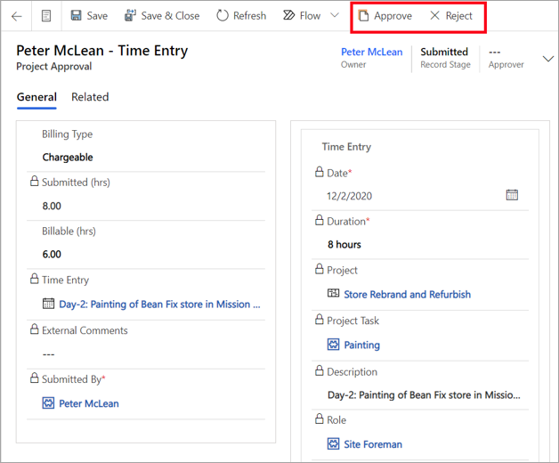

يتم نقل عمليات إرسال الوقت والمصروفات عبر سير عمل الموافقة.Time and expense submissions move through an approval workflow. وبعد اعتماد الإدخالات، يتم تسجيل الحركات في القيم الفعلية أو يتم حجز الوقت في الجدول.After the entries are approved, transactions are recorded in actuals or time is booked in the schedule.

## سير عمل الموافقاتApprovals workflow
عندما تقوم بإنشاء إدخال وقت أو مصروفات وإرساله، يتم إنشاء إدخال الموافقة.When you create and submit a time or expense entry, an approval entry is created. ويقوم الموافق على المشروع أو مديرك بمراجعة إدخالك والموافقة عليه.The project approver or your manager reviews and approves your entry. وإذا كان الإدخال مرتبطاً بمشروع، فعند الموافقة عليه، سيتم إنشاء القيم الفعلية.If the entry is related to a project, when it's approved, the actuals will be created. وتتيح هذه الطريقة إمكانية تتبع التكلفة والفوترة.This approach allows the cost and billing to be tracked.

## الموافقة على إدخالApprove an entry
تسمح لك الصفحة **الموافقات** بالتبديل بين طرق العرض المختلفة حتى يمكنك عرض أنواع مختلفة من الموافقات.The **Approvals** page allows you to switch between different views so that you can view the different types of approvals.

1.  انتقل إلى النموذج **الموافقات** وحدد **المصروفات** أو **الوقت** أو **الاستدعاءات**.Go to the **Approvals** form and select **Expenses**, **Time**, or **Recalls**.
2.  قم بمراجعة كل موافقة وحدد ما تريد الموافقة عليه.Review each approval and select the ones that you want to approve.
3.  حدد **موافقة** للموافقة على الإدخالات المحددة.Select **Approve** to approve the selected entries. وسيقوم النظام بمعالجة هذه الإدخالات وإنشاء قيم فعلية أو حجز.The system will process these entries and create actuals or a booking.

## رفض إدخالReject an entry
وبصفتك الموافق على المشروع، قد تضطر إلى إرسال إدخال مرة أخرى إلى مستخدم للتصحيح.As the project approver, you might have to send an entry back to a user for correction.

1.  انتقل إلى الصفحة **الموافقات** وحدد الإدخال المراد رفضه.Go to the **Approvals** page and select the entry to reject.
2.  حدد "رفض".Select Reject.
3.  اختياري: قم بإضافة تعليق في مربع الحوار **تعليقات الرفض** لإخبار المستخدم بسبب رفض الإدخال.Optional: Add a comment in the **Rejection Comments** dialog box to inform the user why the entry is being rejected.
4.  حدد **موافق**.Select **OK**. وسيتم إرجاع الإدخال إلى المستخدم.The entry will be returned to the user.

للحصول على مزيد من المعلومات، راجع ["التعامل مع إدارة المصروفات" في Dynamics 365 Project Operations]( https://docs.microsoft.com/learn/paths/work-expense-management/?azure-portal=true).For more information, see [Work with Expense management in Dynamics 365 Project Operations]( https://docs.microsoft.com/learn/paths/work-expense-management/?azure-portal=true).

