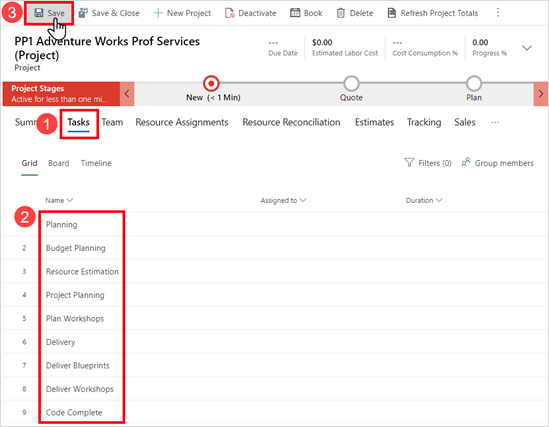
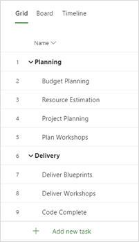
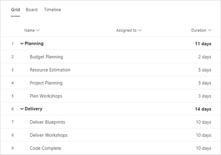
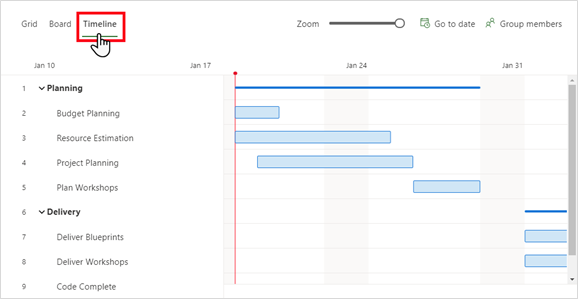
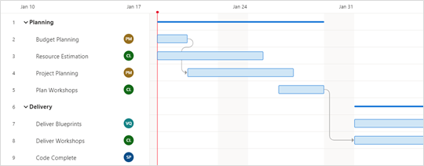
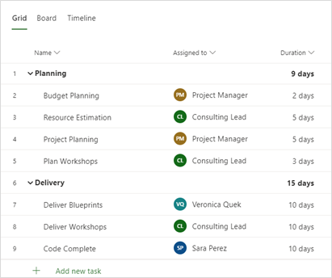

في هذا التمرين، ستقوم بإنشاء مشروع جديد لـ **Adventure Works** يتضمن المهام والفترات والتعيينات والتبعيات. وستقوم بعد ذلك بإنشاء عرض أسعار للمبيعات وتعيين المشروع إلى عرض أسعار المبيعات، ثم تربح عرض الأسعار. 

يمكنك الوصول إلى البيئة التجريبية لتطبيق Project Operations من خلال تحديد **الشروع في العمل** في أعلى الزاوية اليُمنى [من صفحة Dynamics 365 Project Operations على microsoft.com](https://dynamics.microsoft.com/project-operations/overview/?azure-portal=true).

## المهمة 1: إنشاء مشروع
في هذه المهمة، ستقوم بتسجيل الدخول باسم "حساب المسؤول" وتنشئ مشروعاً جديداً للخدمات المهنية الخاصة بـ **Adventure Works**.

1.  قم بالتبديل إلى مستعرض الويب، الذي يتم تسجيل الدخول إليه باسم **حساب المسؤول**. في قائمة التنقل، حدد **المشاريع > المشاريع > إضافة مشروع جديد**.
2.  في الصفحة **مشروع جديد**، أكمل الإعدادات الآتية ثم حدد **حفظ**.
    - **الاسم** - أدخِل **خدمات PP1 Adventure Works الاحترافية (المشروع)**
    - **الوصف** - أدخِل **مشروع الخدمات الاحترافية لـ Adventure Works**
    - **العميل** - حدد **Adventure Works**
    - **قالب التكوين** - حدد **9-5** لـ **قالب PST**
    - **تاريخ البدء المقدر** - حدد أيقونة التقويم، ثم حدد تاريخ يوم الاثنين (هذا الأسبوع)
3.  حدد علامة التبويب **المهام**، ثم حدد **إضافة مهمة جديدة**. قم بإضافة أسماء المهام الآتية وأرقامها ثم حدد **حفظ**.
    - 1 التخطيط
    - 2 تخطيط الموازنة
    - 3 تقدير المورد
    - 4 تخطيط المشروع 
    - 5 وضع خطة لورش العمل
    - 6 التسليم
    - 7 تنفيذ المخططات
    - 8 تنفيذ ورش العمل
    - 9 اكتمال الكود
    
      

    في المهمة **تخطيط الموازنة**، حدد أيقونة المزيد من الأوامر ثم حدد المهمة الفرعية **إجراء**.

4.  كرر الخطوة 3 للمهام الآتية:
    - تقدير المورد
    - تخطيط المشروع
    - وضع خطة لورش العمل
    - تنفيذ المخططات
    - تنفيذ ورش العمل 
    - اكتمال الكود
5.  يجب أن تبدو طريقة عرض **الشبكة** لديك مثل الصورة الآتية:

 
    
### إضافة تواريخ المهام ومدتها
لإضافة تواريخ المهام ومدتها، اتبع الخطوات الآتية:

1.  في المهمة **تخطيط الموازنة**، حدد أيقونة التفاصيل.
2.  في الجزء **تخطيط الموازنة**، أكمل الإعدادات الآتية، ثم حدد **إغلاق الجزء (X)**.
    - **البدء** -حدد **يوم الاثنين** من هذا الأسبوع
    - **المدة** - أدخِل **يومان**
    - **الانتهاء** - يتم حساب تاريخ الانتهاء تلقائياً
3.  أكمل المهام المتبقية باستخدام الإعدادات الآتية.
    - المهمة: **تقدير المورد**
        - **البدء** -حدد **يوم الاثنين** من هذا الأسبوع
        - **المدة** - أدخِل **5 أيام**
    - المهمة: **تخطيط المشروع**
        - **البدء** -حدد **يوم الأربعاء** من هذا الأسبوع
        - **المدة** - أدخِل **5 أيام**
    - المهمة: **وضع خطة لورش العمل**
        - **البدء** -حدد **يوم الأربعاء** من هذا الأسبوع
        - **المدة** - أدخِل **3 أيام**
    - المهمة: **تنفيذ المخططات**
        - **البدء** - حدد **يوم الاثنين** الثاني من هذا الأسبوع
        - **المدة** - أدخِل **10 أيام**
    - المهمة: **تنفيذ ورش العمل**
        - **البدء** - حدد **يوم الاثنين** الثاني من هذا الأسبوع
        - **المدة** - أدخِل **10 أيام**  
    - المهمة: **اكتمال الكود**
        - **البدء** - حدد **يوم الاثنين** الثالث من هذا الأسبوع
        - **المدة** - أدخِل **10 أيام**
4.  يجب أن تبدو طريقة عرض **الشبكة** لديك مشابهة للصورة الآتية.

    

    > [!NOTE]
    > قد تختلف مدد المهام الموجزة في خطتك بسبب أيام العطلة أو العطلات الرسمية في قالب التقويم الافتراضي.

 

5.  حدد **المخطط الزمني**. يجب أن تبدو طريقة العرض لديك مشابهة للصورة الآتية.

    

### إضافة تبعيات المهمة
لإضافة تبعيات المهمة، اتبع الخطوات الآتية:

1.  في المهمة **تنفيذ ورش العمل**، حدد أيقونة التفاصيل.
2.  في الجزء **تنفيذ ورش العمل**، قم بالتمرير إلى أسفل الجزء وحدد **إضافة تبعية**.
 
3.  في القائمة **المهام المقترحة**، حدد المهمة **5 وضع خطة لورش العمل**، ثم أغلق الجزء **تنفيذ ورش العمل**.
4.  كرر الخطوات 1-3 للمهمة **4 تخطيط المشروع** المعتمدة على المهمة **2 تخطيط الموازنة**.
5.  راجع طريقة العرض **الخط الزمني**. لاحظ أنه يتم الآن ربط **وضع خطة لورش العمل** و **تنفيذ ورش العمل**، أي أنه عند انتهاء المهمة **وضع خطة لورش العمل**، يمكن أن تبدأ المهمة **تنفيذ ورش العمل**. 

    

    > [!NOTE]
    > تختلف صورة الخط الزمني السابقة لأن يوم 18 يناير 2021 يوم عطلة (عطلة يوم مارتن لوثر كنج). 

    *التحضير للمهمة التالية*

6.  انقر بزر الماوس الأيمن فوق علامة التبويب "مستعرض الويب" وحدد **تكرار**.
7.  من علامة التبويب "مستعرض الويب الجديد"، حدد القائمة "تغيير المنطقة"، ثم حدد **المبيعات**.

## المهمة 2: إنشاء عرض أسعار لمبيعات المشروع وتعيين مشروع
في هذه المهمة، ستقوم بإنشاء عرض أسعار مبيعات لـ **Adventure Works** للخدمات الاحترافية.

1.  في جزء التنقل، ضمن قسم **المبيعات**، حدد **عروض الأسعار > إضافة عرض جديد**.
2.  في صفحة **عرض أسعار جديد**، أكمل الإعدادات الآتية ثم حدد **حفظ**.
    - **الاسم** - أدخِل **خدمات PP1 Adventure Works الاحترافية (في الموقع)**
    - **العميل المحتمل** - حدد **Adventure Works**
    - **تاريخ انتهاء صلاحية عرض الأسعار** - حدد أيقونة التقويم، ثم حدد أسبوعين من تاريخ اليوم
3.  في الصفحة **خدمات PP1 Adventure Works الاحترافية (في الموقع)**، حدد علامة التبويب **بنود عرض الأسعار**، ثم حدد **إضافة بند عرض أسعار جديد**.
4.  في صفحة **بند عرض أسعار جديد**، أكمل الإعدادات الآتية ثم حدد **حفظ وإغلاق**.
    - **الاسم** - أدخِل **‏‫الخدمات الاحترافية‬**
    - **أسلوب الفوترة** - حدد **الوقت والمادة**
    - **المشروع** - حدد **خدمات PP1 Adventure Works الاحترافية (المشروع)**
    - **المبلغ المعروض** - أدخِل **135،600.00**
    - **موازنة العميل** - أدخِل **150،000.00**
5.  في الصفحة **عرض الأسعار**، من شريط القوائم، حدد **إغلاق كمكسب**، ثم حدد **نعم** في مربع الحوار.
بعد اكتمال المعالجة، سيتم تحويل عرض أسعار المبيعات إلى عقد مشروع. 
6.  في الصفحة **أمر PP1**، في الحقل **تاريخ التسليم المطلوب**، حدد أربعة أشهر في المستقبل من تاريخ اليوم. في الحقل **حد ما يجب ألا يتم تجاوزه**، قم بإدخال **150،000**، ثم حدد **حفظ وإغلاق**.
7.  في قائمة التنقل، ضمن القسم **المبيعات**، حدد **عقود المشروع**.
سيتم الآن تحويل عرض الأسعار الخاص بك إلى عقد مشروع.

## المهمة 3: إضافة موارد إلى خطة المشروع
في هذه المهمة، ستقوم بإنشاء الموارد العامة والمسماة وتعيينها إلى خطة المشروع.

### إنشاء موارد عامة وتعيينها
لإنشاء موارد عامة وتعيينها، اتبع هذه الخطوات:

1.  قم بالتبديل إلى علامة تبويب مستعرض الويب **(المشروع)**، ثم حدد طريقة العرض **الشبكة**. بالنسبة إلى المهمة **تخطيط الموازنة**، في العمود **معيَّن إلى**‬، قم بالتمرير فوق الأيقونة **تعيين هذه المهمة** وتحديدها، وحدد علامة القطع **(...)**، ثم حدد **إضافة مورد عام**.
2.  في الجزء **الإنشاء السريع: عضو فريق المشروع**، في الحقل **اسم المنصب**، أدخِل **مدير المشروع**. في الحقل **الدور**، قم بتغيير الدور إلى **مدير المشروع**، ثم حدد **حفظ وإغلاق**. يتم الآن تعيين **مدير المشروع** للمورد العام إلى المهمة **تخطيط الموازنة**.
3.  تعيين **مدير المشروع** للمورد العام إلى المهمة **تخطيط المشروع**.
4.  كرر الخطوات 1-2 في **الرئيسي الاستشاري** للمورد العام مع تعيين دور **العميل الاستشاري المحتمل** إلى المهام **تقدير المورد** و **وضع خطة لورش العمل** و **تنفيذ ورش العمل**.

### تعيين الموارد المسماة
لتعيين موارد مسماة، اتبع الخطوات الآتية:

1.  بالنسبة إلى مهمة **تنفيذ المخططات**، في العمود **معيَّن إلى**، قم بالتمرير فوق الأيقونة **تعيين هذه المهمة** وحددها. في الحقل **إدخال النص المراد البحث عنه**، أدخل **فيرونيكا**، ثم حدد **فيرونيكا كويك**.
2.  كرر الخطوة 1 وعيِّن **سارا بيريز** للمهمة **اكتمال الكود**.
3.  عند الانتهاء، يجب أن تكون طريقة العرض **الشبكة** مشابهة للصورة الآتية.

    

    > [!NOTE]
    > قد تختلف إجماليات المدة الموجزة بسبب أيام العطلات الرسمية (الإجازات).

## المهمة 4: إضافة تقديرات المصروفات
في هذه المهمة، ستقوم بإضافة تقديرات مصروفات تذكرة الطيران والفندق والأميال إلى خطة المشروع. 

1.  حدد علامة التبويب **تقديرات المصروفات**، ثم حدد **+ إضافة تقدير المصروفات**.
2.  في الحقل **الفئة**، أكمل الإعدادات الآتية، ثم حدد **حفظ**.
    - **الفئة** - حدد **رحلة طيران**
    - **تاريخ البدء** -حدد **يوم الاثنين** من هذا الأسبوع
    - **الكمية** - أدخِل **2.00**
3.  في الحقل **الفئة**، أكمل الإعدادات الآتية، ثم حدد **حفظ**.
    - **الفئة** - حدد **فندق**
    - **تاريخ البدء** -حدد **يوم الاثنين** من هذا الأسبوع
    - **الكمية** - أدخِل **10.00**
4.  في الحقل **الفئة**، أكمل الإعدادات الآتية، ثم حدد **حفظ**.
    - **الفئة** - حدد **أميال**
    - **تاريخ البدء** -حدد **يوم الاثنين** من هذا الأسبوع
    - **الكمية** - أدخِل **100.00**
    - **سعر تكلفة الوحدة** - قم بتغييرها إلى **2.00**
5.  حدد علامة التبويب **التقديرات** لمراجعة تسعير التقدير الإجمالي. عند الانتهاء، حدد **حفظ**.

## المهمة 5: إنشاء متطلبات الموارد وإرسالها
في هذه المهمة، تقوم بدور مدير المشروع الذي يقوم بإنشاء متطلبات الموارد من الموارد العامة التي تم تعيينها إلى مهام المشروع. وبعد إنشاء المتطلبات، ستقوم بمراجعة المتطلبات وإرسالها إلى مدير الموارد. 

### إنشاء متطلبات الموارد العامة
لإنشاء متطلبات موارد عامة، اتبع الخطوات الآتية:

1.  حدد علامة التبويب **الفريق**، ثم قم بتغيير طريقة العرض إلى **أعضاء الفريق العام**. حدد جميع الموارد العامة، ثم حدد **إنشاء متطلب**.
2.  بعد اكتمال المعالجة، حدد **موافق**.

### مراجعة متطلبات الموارد وإرسالها
لمراجعة متطلبات الموارد وإرسالها، اتبع الخطوات الآتية:

1.  انقر بزر الماوس الأيمن فوق علامة التبويب "مستعرض الويب"، ثم حدد **تكرار**.
2.  من علامة التبويب "مستعرض الويب الجديد"، في قائمة التنقل، حدد القائمة "تغيير المنطقة"، ثم حدد **الموارد**.
3.  في جزء التنقل، ضمن القسم **المورد**، حدد **المتطلبات**، ثم في الصفحة **متطلبات الموارد النشطة**، حدد **خدمات PP1 Adventure Works الاحترافية (المشروع) – العميل الاستشاري المحتمل**.
4.  في الصفحة **العميل الاستشاري المحتمل**، في القسم **المهارات**، حدد أيقونة المزيد من الأوامر، ثم حدد **إضافة خاصية متطلب جديدة**.
5.  في الجزء **الإنشاء السريع: خاصية المتطلبات**، في الحقل **الخاصية**، أدخِل **التدريب**. في الحقل **قيمة التصنيف**، حدد بحث/تحديد **جيد**، ثم حدد **حفظ وإغلاق**.
6.  في الصفحة **العميل المحتمل الاستشاري**، في شريط القوائم، حدد **حفظ > إرسال طلب**. 
7.  في مربع الحوار **الطلب المرسل**، حدد **موافق**.
8.  في الصفحة **متطلبات الموارد**، لاحظ ظهور إجراء جديد في شريط القوائم يسمى **استدعاء طلب**. عند الانتهاء من المراجعة، حدد **حفظ وإغلاق**.
9.  كرر الخطوات 3-8 لـ **خدمات PP1 Adventure Works الاحترافية (المشروع) - مدير المشروع** باستخدام خاصية **إدارة المشروع** والتصنيف **جيد**.

