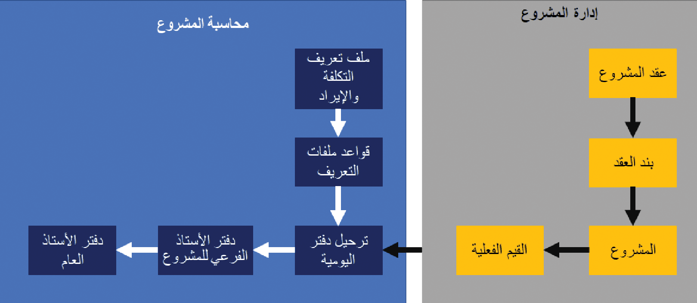
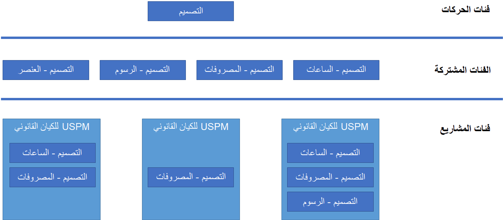

يقدم Project Operations حل عمل متصل مع القدرات المحاسبية للمشاريع العالمية للإدارة المالية في كل مرحلة من مراحل المشروع. وفي حين أن فريق المشروع يسجل الوقت والمصروفات والحركات الأخرى المرتبطة بالمشروع، يضمن محاسب المشروع أن يتم حساب هذه الحركات وتسجيلها بدقة في دفتر الأستاذ الفرعي للمشروع ودفتر الأستاذ العام.

## خيارات المحاسبة للمشروعات القابلة للفوترة

يدعم Project Operations خيارات المحاسبة المتنوعة للمشاريع القابلة للفوترة التي تشمل حركات الوقت والمواد والسعر الثابت.

- **حركات الوقت والمواد** - تتم فوتره هذه الحركات عند تقدم عملية العمل استنادا إلى استهلاك الساعات أو المصروفات أو الأصناف أو الرسوم في المشروع. يمكن أن تتطابق تكاليف الحركات هذه مع الإيراد الموجود في كل حركة وتتم فوترة المشروع مع تقدم العمل. يمكن أيضاً استحقاق إيراد المشروع في الوقت الذي تحدث فيه الحركة. في أثناء الفوترة، يتم التعرف على الإيراد، ويتم عكس الإيراد المستحق، إذا كان ذلك ممكناً.
 
- **حركات السعر الثابت** - تتم فوترة هذه الحركات وفقاً لجدول الفوترة القائم على عقد المشروع. يمكن التعرف على إيراد حركات السعر الثابت عند الفوترة أو حسابها وترحيلها دورياً، وفقاً لطريقة العقد المكتمل أو النسبة المئوية المكتملة.

يعد المشروع قابلاً للفوترة عندما يكون مرتبطاً بأحد شروط التعاقد أو أكثر. يحدد شرط التعاقد الخاص بالمشروع طريقة الفوترة وأنواع الحركات المسموح بها.

## خيارات المحاسبة للمشروعات الداخلية

تتيح المشاريع الداخلية للشركات إمكانية تتبع التكلفة المرتبطة بالأنشطة التي لم تتم فوترتها إلى العميل. تتضمن أمثلة المشاريع الداخلية:

- تطوير منتج، مثل تطبيق محمول، وتتبع التكلفة المرتبطة بالتطوير.
- إدارة المصروفات والوقت السابق للبيع. يمكن تحويل هذا المشروع الداخلي الذي تم البيع عليه مسبقا إلى مشروع قابل للفوترة إذا كان عرض الأسعار فائزاً.

يتم التعامل مع أي مشروع غير مرتبط بعقد في Project Operations باعتباره داخلياً. لا يتم استخدام ملفات تعريف الإيراد وتكلفة المشروع لتحديد قواعد المحاسبة للمشروع. يتم دائماً ترحيل تكلفة المشروع الداخلية باستخدام مبادئ الأرباح والخسائر. يتم تحديد حسابات دفتر الأستاذ لعمليات الترحيل في صفحة **إعداد ترحيل دفتر الأستاذ**.

- يتم ترحيل الحركات الزمنية عن طريق خصم حساب التكلفة وإضافة ائتمان لحساب تخصيص الرواتب.
- يتم ترحيل حركات المصروفات عن طريق خصم حساب التكلفة وإضافة ائتمان إلى الحساب المقابل للمصروفات.

بعد ترحيل الحركات إلى المشروع، إذا كان المشروع مقترنا بعقد مشروع، سيقوم النظام بعكس كافة الحركات التراكمية وإنشاء حركات قابلة للفوترة جديدة. تتبع الحركات القابلة للفوترة قواعد المحاسبة المحددة في ملف تعريف **الإيرادات وتكلفة المشروع**.

## معالجة تكاليف المشروع والمبيعات غير المفوترة باستخدام دفتر يومية التكامل

تعمل قيود الوقت والمصروفات على إنشاء الحركات **الفعلية** التي تمثل العرض التشغيلي للعمل الذي تم استكماله مقابل أحد المشاريع. يوفر Project Operations محاسبين باستخدام أداة لمراجعة الحركات وتعديل سمات المحاسبة حسب الحاجة. بعد اكتمال المراجعة والتعديلات، يتم ترحيل الحركات إلى دفتر الأستاذ الفرعي ودفتر الأستاذ العام الخاصيْن بالمشروع. 

 

يتم إنشاء السجلات الموجودة في دفتر يومية **تكامل Project Operations** باستخدام عملية دورية تسمى **الاستيراد من الجدول المرحلي**. عند تشغيل العملية الدورية، يتم العثور على أي عمل فعلي لم تتم إضافته بعد إلى دفتر يومية **تكامل Project Operations** ويتم إنشاء بند دفتر يومية لكل حركة فعلية. عند ترحيل دفتر يومية التكامل، يتم إنشاء المشروع من غير المرحل وحركات دفتر الأستاذ العام. يتم استخدام هذه الحركات في الفوترة اللاحقة للعميل والإقرار بالإيرادات وإعداد التقارير المالية.

## الأبعاد المالية
تستخدم Project Operations إطار عمل الأبعاد المالية في Dynamics 365 Finance لتوفير رؤى إضافية على المشروع في حركات دفتر الأستاذ الفرعي وحركات دفتر الأستاذ العام. يمكن تعيين الأبعاد المالية الافتراضية على العميل أو مصدر تمويل المشروع أو الحدث الرئيسي أو بند عقد المشروع أو المشروع. تتم إدارة الافتراضيات الخاصة بالأبعاد المالية في شريط التمرير **المحاسبة الافتراضية** الذي يمكن الوصول إليه من **عقد المشروع** أو صفحة **المشروع**. عند تدفق حركات المشروع إلى دفتر يومية **تكامل Project Operations**، يتم تطبيق افتراضيات الأبعاد المالية وتصبح متوفرة للمحاسب لتحريرها، حسب الحاجة، باستخدام النموذج **توزيع المبالغ**. وبمجرد قيام النظام بترحيل الحركات إلى المشروع في دفتر الأستاذ الفرعي ودفتر الأستاذ العام، فمن الممكن تحليل الأداء المالي للمشروع استنادا إلى هذه الابعاد المالية. 

## فئات المشاريع
يمكن لProject Operations تصنيف الإيرادات والمصروفات على المشاريع. توفر الفئات القدرة على إنشاء تقرير حول حركات المشروع وترحيل محرك الأقراص وتحليلها إلى دفتر الأستاذ العام.

يوضّح الرسم التخطيطي التالي الارتباط بين فئات المعاملات والفئات المشتركة وفئات المشاريع.

وتعتبر فئات الحركة هي التجميع الأساسي لحركات المشروع. داخل ذلك التجميع عبارة عن مجموعة من الفئات التي يمكن مشاركتها عبر التطبيقات والوحدات النمطية. تعتبر فئات المشاريع خاصة بكيان قانوني ووحدة نمطية وتطبيق.

تقوم الفئات المشتركة بفرز المصروفات في تطبيقات مختلفة، مثل Finance وSupply Chain Management وProject Operations. يُنشئ Project Operations تلقائياً لكل فئة معاملة يتم إنشاؤها أربع فئات مشتركة ذات صلة: 

- الساعات‬
- المصروفات
- الرسوم
- الصنف

تعتبر فئات المشاريع المستوى الأكثر دقة لتكوين الفئات ويجب تكوينها بشكل منفصل لكل شركة من خلال محاسب المشروع.

## إقرار الإيرادات

في Project Operations، تختلف قواعد التعرف على الإيرادات وفقا لطريقة الفوترة المحددة لمشروع أو جزء من المشروع.

### الحركات التي تمت محاسبتها بطريقة فوترة معاملات الوقت والمواد

عند حساب الحركات باستخدام طريقة الوقت والفوترة، تحدث الإجراءات التالية:

- إقرار التكاليف والإيرادات متصلان. يتم ترحيل تكلفة الحركة غير المفوترة المبيعات باستخدام دفتر يومية **تكامل Project Operations**.
- يحدد ملف تعريف الإيرادات وتكلفة المشروع ما إذا كان سيتم ترحيل حركات مبيعات غير مفوترة إلى دفتر الأستاذ العام. في حالة تحديد **الإيراد المستحق**، يستخدم النظام **قيمة مبيعات الأعمال تحت التنفيذ (WIP)** وحسابات **قيمة مبيعات الإيراد المستحق أثناء الترحيل**. الشكل التالي هو مثال لهذا الأسلوب.

    | **نوع الحركة** | **المدين/الدائن** | **المبلغ** |
    | ------------- | ------------- |------------- |
     | **قيمة مبيعات الأعمال تحت التنفيذ (WIP)** | مدين | 100|
    | **قيمة مبيعات الإيراد المستحق** | دائن‬ | 100|

- يتم التعرف على الإيراد أثناء الفوترة. يستخدم النظام حساب الإيراد الذي تمت فوترته أثناء الترحيل. الشكل التالي هو مثال لهذا الأسلوب.

    | **نوع الحركة** | **المدين/الدائن** | **المبلغ**|
     | ------------- | ------------- |------------- |
     | **رصيد العميل** | مدين | 120|
     | **ضريبة المبيعات مستحقة الدفع** | دائن‬ | 20|
    | **إيراد الفاتورة** | دائن‬ | 100|

- إذا كانت الإيرادات مستحقة عند ترحيل المبيعات غير المفوترة، سيقوم النظام بإلغاء الإيراد المستحق عند الفوترة.

    | **نوع الحركة** | **المدين/الدائن** | **المبلغ**|
     | ------------- | ------------- |------------- |
     | **قيمة مبيعات الإيراد المستحق** | مدين | 100|
     | **قيمة مبيعات الأعمال تحت التنفيذ (WIP)** | دائن‬ | 100|

### الحركات التي تمت محاسبتها بطريقة فوترة السعر الثابت

عند حساب الحركات باستخدام طريقة فوترة السعر الثابت، تحدث الإجراءات التالية:

- إقرار التكاليف والإيرادات منفصلان. يتم ترحيل تكلفة الحركة باستخدام دفتر يومية **تكامل Project Operations**. لم يتم إنشاء حركات مبيعات غير مفوترة.

- يمكن إقرار الإيرادات في أثناء الفوترة إذا كان ملف تعريف إيرادات وتكلفة المشروع يتضمن **قاعدة مستخدمة في العمليات الحسابية لإكمال المشروع** تم تعيينها إلى **عدم وجود أعمال تحت التنفيذ (WIP)**. استخدم هذا الأسلوب للمشاريع القصيرة والبسيطة فقط.

- يمكن التعرف على الإيرادات من خلال استخدام تقديرات إيرادات السعر الثابت، إما بطريقة **العقد المكتمل** أو الإيراد المستحق حسب **النسبة المئوية للاكتمال**.

تعرف علي المزيد حول محاسبة المشروع في الوحدة النمطية [البدء في محاسبة المشروع Dynamics 365 Project Operations](/learn/modules/get-started-project-accounting/?azure-portal=true).
