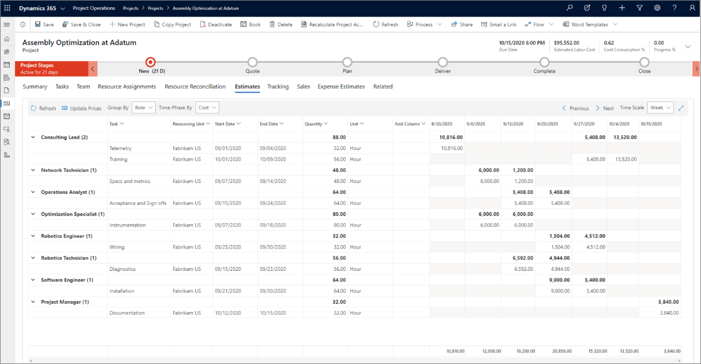
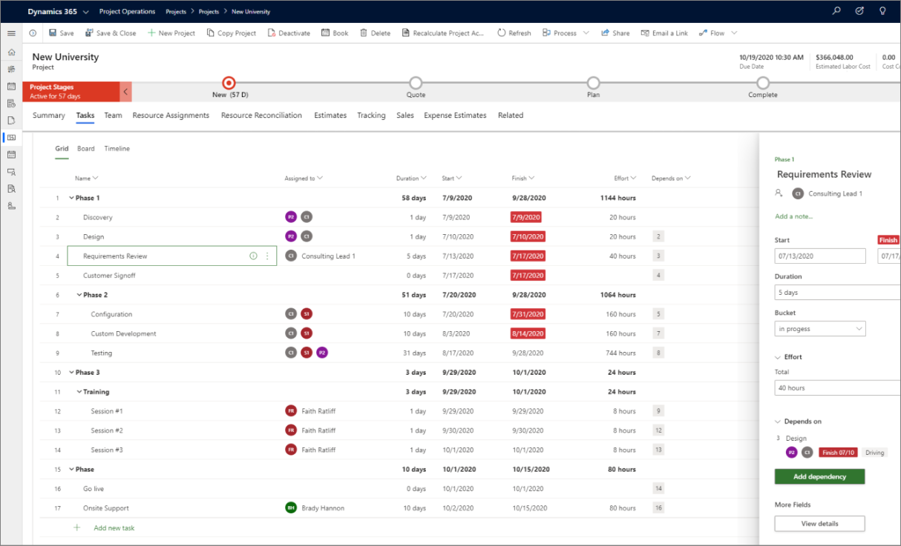
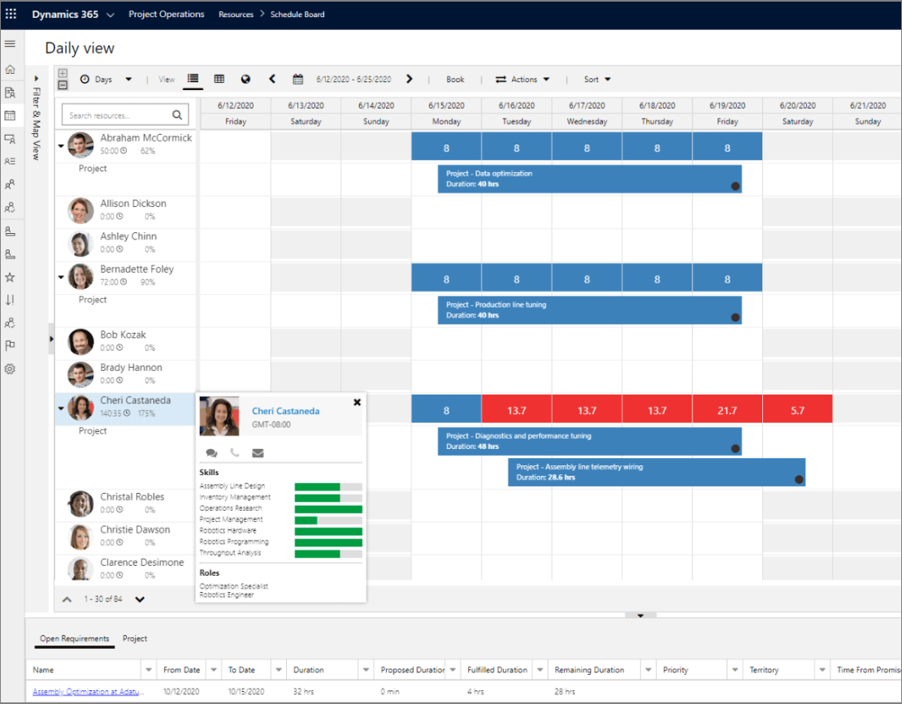
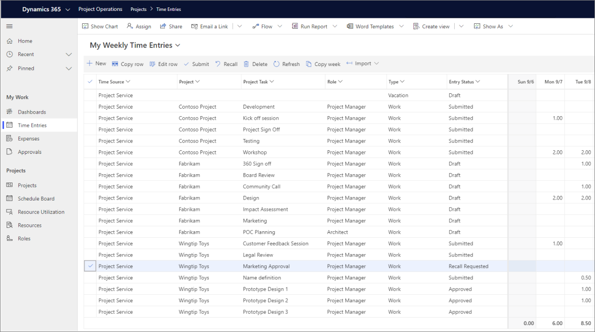

يقدم Project Operations مناطق الميزات التالية.Project Operations offers the following feature areas.

## إدارة الفرصOpportunity management
تدعم الميزات التالية إدارة الفرص في Project Operations:The following features support opportunity management in Project Operations:

- **تخصيص التكاليف والأسعار على أساس الموارد** – قم بإعداد نماذج قوية للتسعير والتكلفة بناءً على الجغرافيا واقتصاديات السوق المحلية التي تؤثر على القوى العاملة العالمية وأسعار الصرف.**Customize resource-based costing and pricing** – Model robust pricing and costing variations based on geography and local market economics that influence your global workforce and exchange rates.
- **استخدام بنيات الصفقات المصممة خصيصاً للمؤسسات المستندة إلى المشاريع** – أنشئ عقوداً ذات سعر ثابت ووقت ومواد وعقود من نوع الاحتفاظ لمشاريعك باستخدام نماذج فوترة قابلة للتكيف تلبي متطلبات التدفق النقدي لعملائك.**Use deal structures that are tailored for project-based organizations** – Create fixed-price, time and materials, and retainer-type contracts for your projects by using adaptable billing models that meet your customers’ cash-flow requirements.
- **الأسعار المرنة وعروض الأسعار الأدق** – بعد إنشاء تقدير عالي المستوى، استخدم قوالب موحدة لتطوير تقدير مفصل وجدول زمني وقيم نقدية لعرض الأسعار بسرعة.**Flexible pricing and more accurate quotes** – After generating a high-level estimate, use standardized templates to quickly develop a detailed estimate, schedule, and monetary values for the quote.
- **إدارة تدفق المبيعات ولوحة المعلومات الموحدة للمبيعات** – اجمع بيانات العملاء من مصادر مختلفة في طريقة عرض واحدة عن طريق الاتصال بـ Dynamics 365 Sales.**Sales pipeline management and a unified sales dashboard** – Combine customer data from different sources into a single view by connecting to Dynamics 365 Sales. استخدم النظام الأساسي لبيانات العملاء السهل والمرن للحصول على رؤى قابلة للتنفيذ وإنشاء تجارب مخصصة للعملاء.Use the intuitive and flexible customer data platform to get actionable insights and create personalized customer experiences.
 

## إمكانات إدارة المشاريع المحسنةEnhanced project management capabilities
تدعم الميزات التالية الإمكانات المحسنة لإدارة المشاريع في Project Operations:The following features support the enhanced project management capabilities in Project Operations:

- **أدوات إدارة المشاريع** – قم بتحسين الإنتاجية باستخدام إمكانات Microsoft Project المضمنة، بما في ذلك لوحات المعلومات التي يمكن الوصول إليها وإدارة المهام والجدولة ومخططات جانت التفاعلية وهياكل تقسيم العمل.**Project management tools** – Improve productivity with embedded Microsoft Project capabilities, including accessible dashboards, task management, scheduling, interactive Gantt charts, and work-breakdown structures.
- **تعقب المشاريع بكفاءة** – وضع تقديرات دقيقة للعمالة والمصروفات والمواد، وتعقب الاستهلاك المخطط إلى الفعلي مع تقدم المشاريع.**Track your projects efficiently** – Develop accurate estimates for labor, expenses, and materials, and track planned-to-actual consumption as projects progress. استخدم الرؤى المضمنة لفهم كيف تتجه مشاريعك واتخاذ القرارات في الوقت المناسب لتصحيح المسار.Use built-in insights to understand how your projects are trending and drive timely decisions for course correction.
- **العمل الجماعي مع Microsoft Teams** – تعاون عبر دورة حياة المشروع من خلال جمع فرقك متعددة الوظائف معاً حول خطط المشروع والنطاق والموازنة أثناء التقاط المحادثات ومشاركة المحتوى واستخدام التطبيقات، كل ذلك في مكان واحد.**Teamwork with Microsoft Teams** – Collaborate across the project life cycle by bringing your cross-functional teams together around project plans, scope, and budget while capturing conversations, sharing content, and using apps all in one place.
 

## جدولة الموارد وتعييناتهاResource scheduling and assignments
تدعم الميزات التالية جدولة الموارد والتعيينات في Project Operations:The following features support resource scheduling and assignments in Project Operations:

- **زيادة استخدامك الموارد** – وزع أحمال العمل بالتساوي عبر مواردك من أجل التنفيذ الأمثل لاحتياجات تسليم المشروع.**Maximize your resource use** – Distribute workloads equally across your resources for optimal implementation on project delivery needs.
- **مواءمة الأشخاص المناسبين مع مجموعات المهارات المناسبة للمشاريع المناسبة** – الاحتفاظ بملفات تعريف الموارد لمطابقة الأشخاص مع المشاريع.**Align the right people with the right skillsets to the right projects** – Maintain resource profiles to match people with projects. قيم المهارات باستخدام نماذج الكفاءة التي تتكيف مع احتياجات عملك.Rate skills with proficiency models that adapt to your business needs.
- **توقع احتياجات الموارد باستخدام الجدولة الذكية** – قم بتبسيط الجدولة باستخدام المهام الذكية وذات الصلة القائمة على المهارات والمعلومات المحدثة حول توفر الموارد باستخدام Universal Resource Scheduling.**Anticipate resourcing needs with intelligent scheduling** – Streamline scheduling with intelligent and relevant skills-based assignments and up-to-date information about resources’ availability by using Universal Resource Scheduling.
- **إدارة الموارد عبر مؤسستك** – يتكامل Universal Resource Scheduling مع تطبيقات Dynamics الأخرى، مثل Field Service وCustomer Service، للسماح بحجز الموارد في طريقة عرض شاملة.**Manage resources across your organization** – Universal Resource Scheduling integrates with other Dynamics apps, such as Field Service and Customer Service, to allow booking of resources in an all-up view.
 

## تبسيط تعقب الوقت وإدارة المصروفاتSimplify time tracking and expense management
تدعم الميزات تعقب الوقت المبسط وإدارة المصروفات في Project Operations:The following features support simplified time tracking and expense management in Project Operations:

- **إدخال الوقت السهل** – يلتقط أعضاء الفريق الوقت من خلال شبكة سهلة الاستخدام لإدخال الوقت تسمح لهم بإدخال الوقت في عرض أسبوعي، أو إضافة وقت من حجوزاتهم أو مهامهم، أو لنسخ إدخالات الوقت الماضية.**Intuitive time entry** – Team members capture time through an intuitive time entry grid that allows them to enter time in a weekly view, add time from their bookings or their assignments, or to copy past time entries.
- **إرسال الوقت والمصروفات أثناء التنقل** – استخدم تطبيق الهاتف المحمول أو متصفحاً للوقت والمصاريف المرسلة، بغض النظر عن موقعك.**Submit time and expenses on the go** – Use the mobile app or a browser for time and expense submissions, no matter your location. قم بإنشاء بنود المصروفات تلقائياً من صور الإيصالات التي تم تحميلها باستخدام إمكانات التعرف الضوئي على الأحرف (OCR).Automatically create expense lines from uploaded receipt images by using Optical Character Recognition (OCR) capabilities.
- **ضمان دقة التقارير والموافقات** – حافظ على الرؤية الكاملة وتحكم في مصروفات مؤسستك باستخدام السياسات والموافقات والتقارير.**Ensure accurate reporting and approvals** – Maintain complete visibility and control of your organization’s expenses by using policies, approvals, and reporting. قم بإرسال الوقت والمصروفات والموافقة عليها ومعالجتها وتسويتها في أي وقت وفي أي مكان.Submit, approve, process, and reconcile time and expenses anytime and anywhere.
- **توحيد عمليات الوقت والمصروفات** – تعقب المصروفات بعملات مختلفة مع الدمج مع محاسبة المشاريع وكشوف المرتبات والفواتير للحصول على تجربة شاملة.**Unify your time and expense processes** – Track expenses in different currencies while integrating with project accounting, payroll, and invoicing for a comprehensive experience.
 
 

## تبسيط ماليات المشاريعStreamlined project financials
تدعم الميزات التالية تبسيط ماليات المشاريع في Project Operations:The following features support streamlined project financials in Project Operations:

- **إقرار الإيرادات بدقة وفي الوقت المحدد** – قم بتعزيز أفضل الممارسات ودعم الفرق العالمية من خلال اتباع المعايير والممارسات المحاسبية المنشورة عن طريق استخدام العملات المتعددة المضمنة، والبيانات المالية للمشاريع، وإقرار لإيرادات المتوافقة مع معايير التقارير المالية الدولية (IFRS).**Recognize revenue accurately and on time** – Promote best practices and support global teams by following published accounting standards and practices by using built-in multicurrency, project financials, and revenue recognition that is compliant with International Financial Reporting Standards (IFRS).
- **فوترة العملاء بسرعة وبدقة أكبر** – إدارة قوائم انتظار الفواتير وإضافة الحركات الفورية بشكل أكثر فعالية لإعداد الفواتير.**Invoice customers quickly and more precisely** – Manage billing queues and add impromptu transactions more effectively for invoicing. قم بتخصيص فواتير العملاء عن طريق اختيار الأسلوب والتصميم وإضافة التفاصيل وتجميع الحركات للمراجعة والتسوية المثلى.Tailor customer invoices by choosing style and design, adding details, and grouping transactions for optimal review and reconciliation.
- **دقة عالية في محاسبة المشاريع** – استخدم ملفات تعريف إيرادات وتكلفة المشروع للسعر الثابت أو فوترة الوقت والمواد من خلال مجموعة من القواعد المحاسبية للتكلفة والإيرادات والمستحقات والترحيلات.**Higher accuracy project accounting** – Use project cost and revenue profiles for fixed-price or time and material billing through a combination of accounting rules for cost and revenue, accruals, and postings. قم بمراجعة بيانات المشروع بسرعة وتوقع التدفق النقدي للحصول على معلومات مالية متعمقة عن المشروع.Quickly review project statements and forecast cash flow to get in-depth project financial information.
- **التوسيع إلى نظام تخطيط موارد المؤسسة الذي يركز على الخدمة (ERP)** – استخدم التكامل المدمج مع Dynamics 365 Finance أو استخدم واجهات برمجة التطبيقات (API) المفتوحة مع نظام تخطيط موارد المؤسسات الخارجي لتوسيع نطاق إمكانات الحسابات الدائنة وحسابات المقبوضات ودفتر الأستاذ العام.**Expand to a service-centric enterprise resource planning (ERP) system** – Use the built-in integration with Dynamics 365 Finance or use open APIs with an external ERP system to extend to accounts payable, accounts receivable, and general ledger capabilities.
 

